<!-- generated-by: obsidian_git_blog_pipeline -->

## Brainiac
## 工厂应急
```plain
某化工厂监控网络出现异常波动。你拿到了一份汇总的抓包文件。
```

### Q1
```plain
谁把泵关了？ 提交格式：flag{0xtransaction_id_0xfunction_code_0xcoil_address}
```

对于工业协议很多都有固定的端口特征

翻翻流量能看到是 Modbus/TCP 协议

直接筛选该协议

然后找关泵停机的操作

一眼顶针，找到唯一一个write的写操作

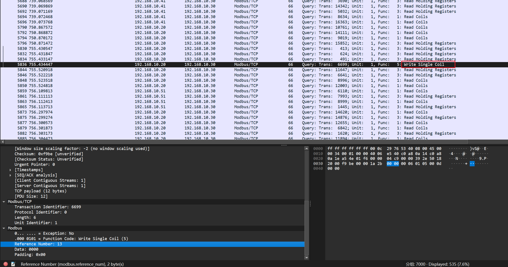

在Mobus/TCP里看到 transaction id

在Mobus里看到Function Code

然后不知道coil_address是什么

问ai说 Coil Adress通常位于FunctionCode之后(4位)，这里就是这个Reference Number

最后将其转为16进制，得到flag

```plain
flag{0x1a2b_0x05_0x000d}
```

### Q2
```plain
被写入的 NodeId
```

尝试字节流搜索NodeId，能看到很多TCP记录

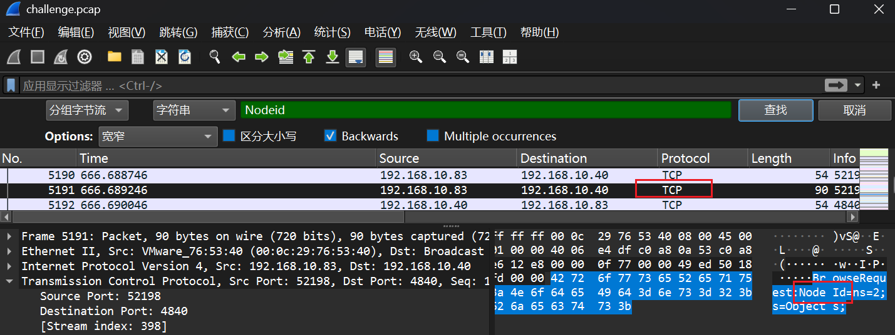

这里注意到字段Node Id多为`BrowseRequest`，结合题目我们需要找写入的NodeID

因此搜索`WriteRequest`

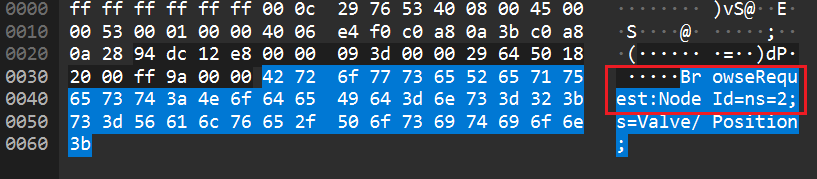

只找到一条符合要求的记录

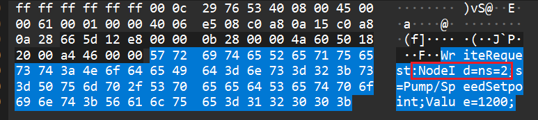

注意到第二个封号前的内容都是NodeId字段的内容

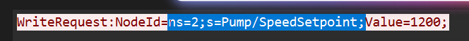

```plain
flag{ns=2;s=Pump/SpeedSetpoint}
```

### Q3
```plain
工程站域名解析结果 找出工程站域名 engws.plant.local 的 A 记录解析结果（目标 IP）。 flag{x.x.x.x}
```

依然搜索定位

可以看到这是一个post请求，host首部表示请求的服务器域名

从destination字段能看出该域名对应的ip

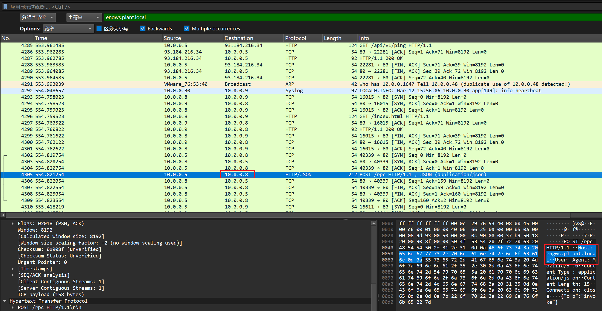

这里算取巧了吧，正常来说还是需要查看DNS来判断的

```plain
flag{10.0.0.8}
```

### Q4
```plain
确定 HMI（源：10.0.0.x）到工程站（目的：10.0.0.x）上首个成功发起的时间点。 提交格式：flag{YYYY-MM-DDTHH:MM:SSZ}（UTC，精确到秒）
```

这里通过上题分析得出工程站是10.0.0.8，HMI是10.0.0.5

根据条件进行过滤（最初使用的是 `((ip.src == 10.0.0.5) || (ip.src == 10.0.0.8)) && ((ip.dst == 10.0.0.5) || (ip.dst == 10.0.0.8))`

前面的都是 Echo 与损坏的 NBNS 流量，不算是连接发起成功；首次发起成功应在 3852~3859 号记录处，双方成功进行了 TCP 握手

抓取 **445/TCP** 的**首个 SYN（ACK=0）**HMI 源到工程站目的的第一帧时间即为答案（UTC 到秒）

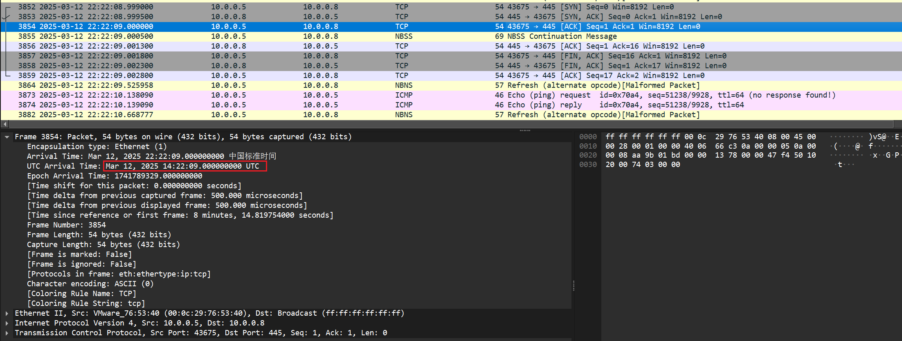

```plain
flag{2025-03-12T14:22:09Z}
```

### Q5
```plain
在横向后不久，HMI 对工程站发起了 HTTP 请求。提交请求的 Host 与 URI，用下划线连接。
```

就是之前的那条post流量，直接查看就行

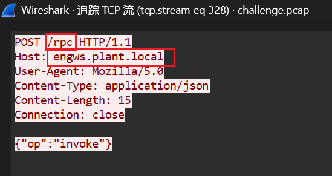

```plain
flag{engws.plant.local_/rpc}
```

## ruoyi
```plain
ruoyiapi遭到劫持 在一定条件下会触发跳转到外部链接
通过网盘分享的文件：ruoyi-admin.zip
链接: https://pan.baidu.com/s/1bR5xpsuREu35QChrFxFBfA 提取码: 316s
flag使用flag{}进行包裹
```

可能的原因：

+ 配置文件的配置有问题
+ 依赖投毒，依赖包经过了改写
+ ruoyi 中可扩展的部分被利用

说实话，本来我java就不行，还要静态分析jar包太难为我了

看看配置文件没什么问题就可以停止静态分析了


然后直接转动态分析，题目说会跳转到外部链接，那我们就复现部署，然后通过外部链接找跳转函数

根据提供配置文件（配置文件实际可以通过解压JAR提取）进行配置数据库，

可以看到需要mysql和redis

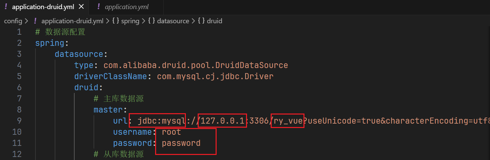

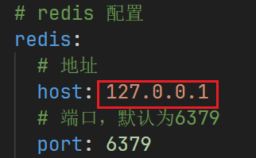

在本机上部署，因此host需要改为回环地址127.0.0.1

这里可以用docker 快速部署

```plain
docker run -d  --name mysql-dev -p 3306:3306 -e MYSQL_ROOT_PASSWORD=password   mysql:8.0
docker run -d --name my-redis -p 6379:6379 redis:latest
```

然后能从上面可以看到需要数据库ry_vue

```plain
#创建数据库
docker exec -it mysql-dev mysql -uroot -ppassword -e "CREATE DATABASE IF NOT EXISTS ry_vue DEFAULT CHARACTER SET utf8mb4;"
```

然后运行jar包，启动ruoyi api

```plain
java -jar ruoyi-admin.jar --spring.config.additional-location=./config/
```

这里出现报错，显示缺少mysql数据表

这里需要搜索官方部署文件

下载ruoyi sql文件初始化数据库后即可顺利运行ruoyi

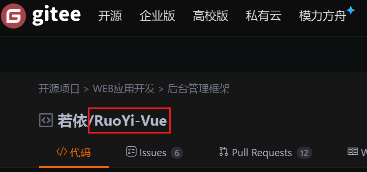

找到相同版本

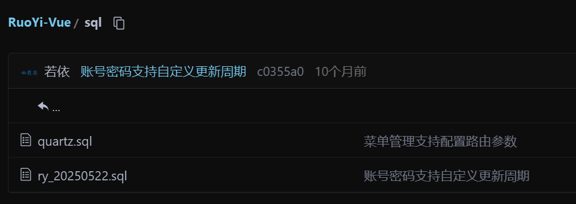

将仓库里的sql文件下载后导入

```plain
先把sql文件导入docker内部
docker cp .\ry_20250522.sql mysql-dev:/tmp/ry_20250522.sql
docker cp .\quartz.sql mysql-dev:/tmp/quartz.sql

然后进入容器
docker exec -it mysql-dev sh

将sql文件导入数据库ry_vue
mysql -uroot -ppassword ry_vue</tmp/ry_20250522.sql
mysql -uroot -ppassword ry_vue</tmp/quartz.sql

退出后查看是否导入成功
exit
docker exec -it mysql-dev mysql -uroot -ppassword -e "SHOW TABLES FROM ry_vue;"
```

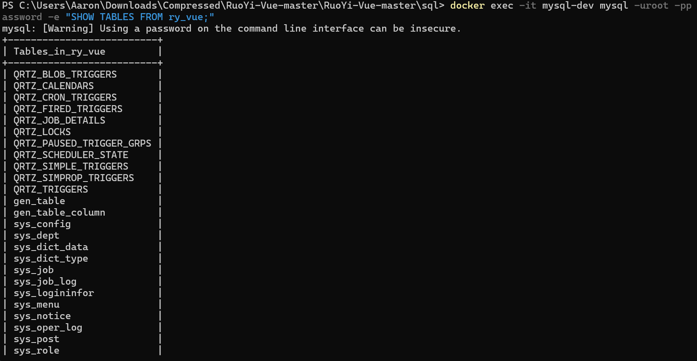

成功导入

重新运行jar包，成功启动

```plain
java -jar ruoyi-admin.jar --spring.config.additional-location=./config/
```


根据配置文件得知api端口为8080


题目说在一定条件下会跳转到外部链接，使用curl进行测试

修改useragent模仿各种情况

发现在手机访问或者使用chrome浏览器访问时发生跳转

```plain
curl -I -A "Mozilla/5.0 (Linux; Android 10; Mobile) Chrome/120.0.0.0 Mobile" http://127.0.0.1:8080/captchaImage
```

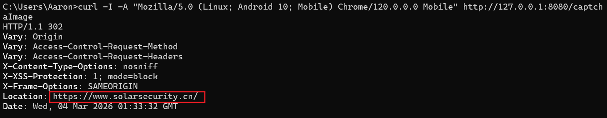

找到跳转位置和外部链接 https://www.solarsecurity.cn/

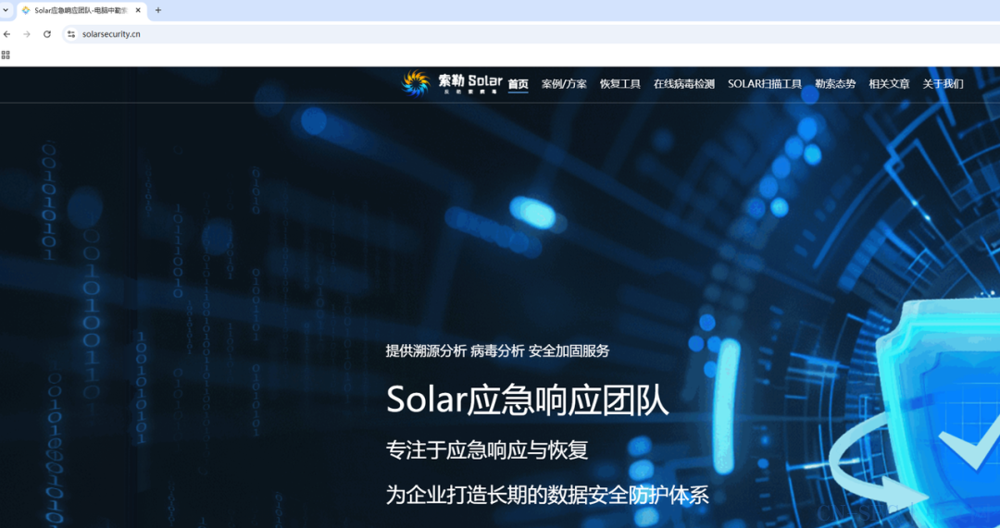

这里正常应该通过java的调试器查找劫持触发的函数

但我菜，而且没有java调试器捏


所以通过jadx分析该jar包，全局搜索https://www.solarsecurity.cn/ ，即可发现导致跳转的相关方法

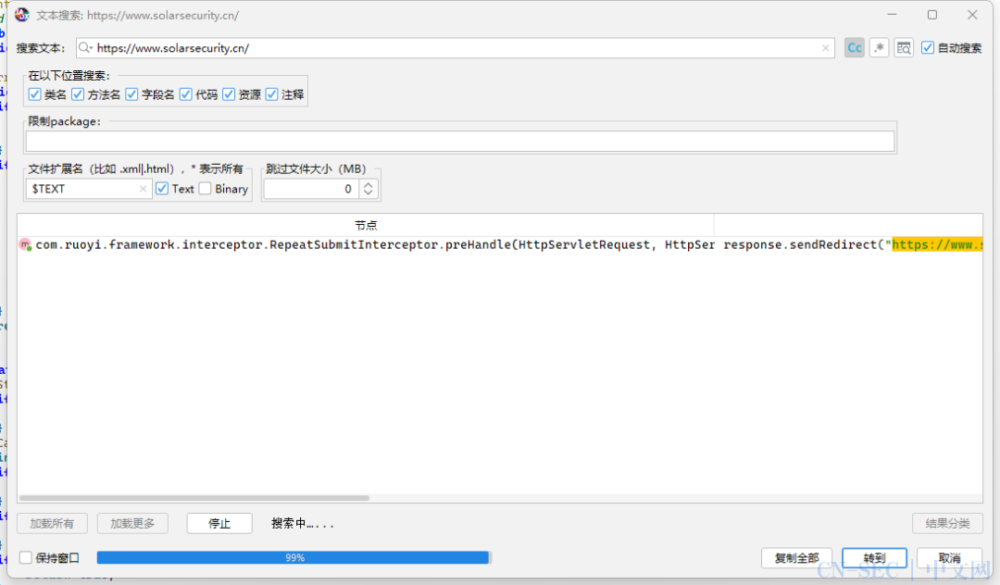

经过测试最终preRedirect方法名是最后的答案

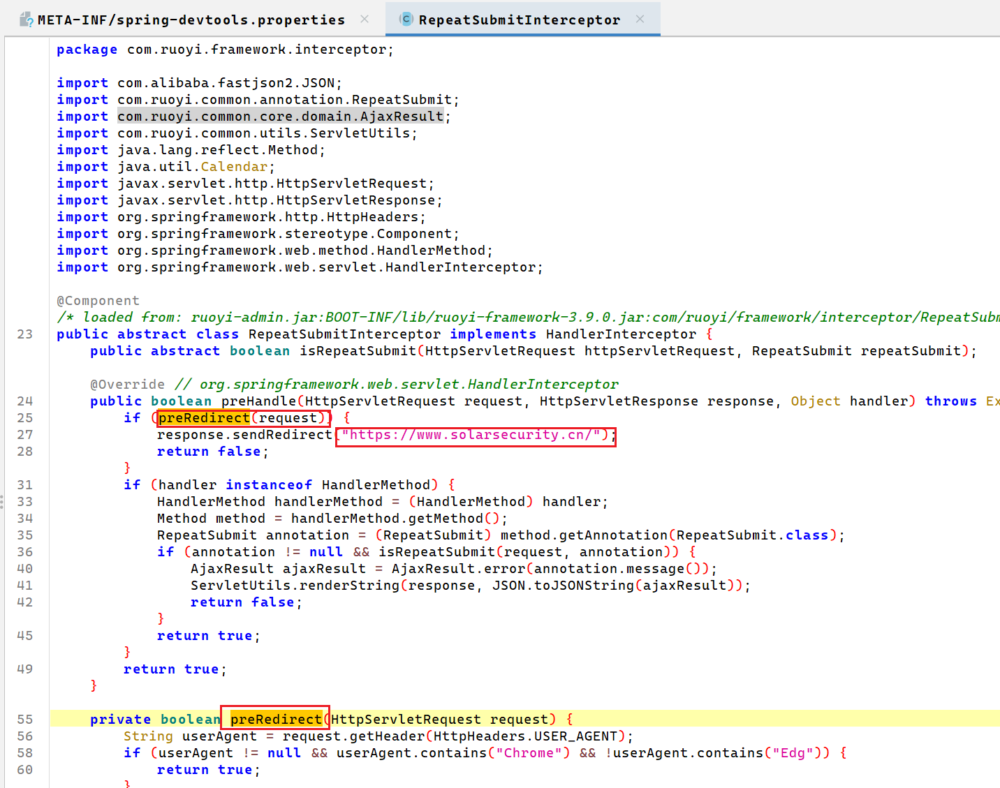

```plain
flag{preRedirect}
```

官方wp说

假设我们仅通过静态分析，则推荐的方法是和官方版本的ruoyi进行代码比对，即可发现异常的代码

