<!-- generated-by: obsidian_git_blog_pipeline -->

## vmdk修复
```plain
请修复该VMDK文件，使虚拟机能够成功启动。
虚拟机版本：17.5
镜像版本：ubuntu-24.04.1-live-server-amd64
```

vmdk的descripter文件损坏（也可能是被加密），extent磁盘数据区正常

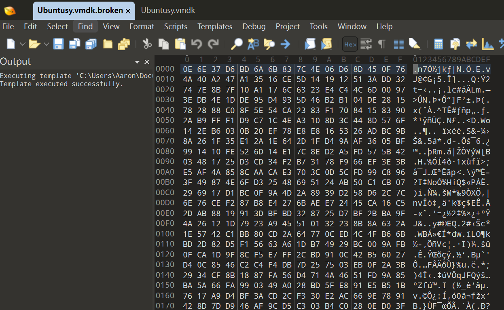

因此使用脚本重新生成vmdk的descirptor文件

```plain
#!/usr/bin/env python3
# -*- coding: utf-8 -*-

"""
vmdk_repair.py
- Rebuild a missing/corrupted VMware VMDK descriptor file from extents.
- Safe: reads headers/sizes only; never modifies extent data.
- Supports:
  1) twoGbMaxExtentSparse split extents: <base>-s001.vmdk ... <base>-sNNN.vmdk
  2) monolithicFlat (descriptor + <base>-flat.vmdk)
"""

import argparse
import glob
import os
import random
import re
import struct
from typing import List, Tuple, Optional


def is_text_descriptor(path: str) -> bool:
    try:
        with open(path, "rb") as f:
            head = f.read(4096)
        # Descriptor usually starts with "# Disk DescriptorFile"
        return b"# Disk DescriptorFile" in head[:200]
    except Exception:
        return False


def read_sparse_capacity_sectors(vmdk_path: str) -> int:
    """
    Read sparse VMDK header capacity.
    Typical sparse extent starts with b'KDMV' and stores capacity (sectors) at offset 0x0C as uint64 little-endian.
    """
    with open(vmdk_path, "rb") as f:
        hdr = f.read(64)

    if len(hdr) < 20:
        raise ValueError(f"{vmdk_path}: header too small")

    if hdr[:4] != b"KDMV":
        raise ValueError(f"{vmdk_path}: not a sparse extent (missing KDMV magic)")

    cap = struct.unpack("<Q", hdr[0x0C:0x14])[0]
    if cap <= 0:
        raise ValueError(f"{vmdk_path}: invalid capacity sectors: {cap}")
    return cap


def file_size_sectors(flat_path: str) -> int:
    size = os.path.getsize(flat_path)
    if size % 512 != 0:
        # Still generate, but warn by rounding down (VMware expects sector alignment)
        return size // 512
    return size // 512


def guess_adapter_type(vmx_path: Optional[str]) -> str:
    """
    Best-effort guess from .vmx:
      - scsi0.virtualDev = "lsilogic" / "pvscsi" / "buslogic"
      - ide: descriptor usually not critical; VMware often ignores.
    Default: lsilogic
    """
    if not vmx_path or not os.path.exists(vmx_path):
        return "lsilogic"

    try:
        with open(vmx_path, "r", encoding="utf-8", errors="ignore") as f:
            txt = f.read()
    except Exception:
        return "lsilogic"

    m = re.search(r'^\s*scsi0\.virtualDev\s*=\s*"([^"]+)"', txt, re.MULTILINE)
    if not m:
        return "lsilogic"

    v = m.group(1).strip().lower()
    if "pvscsi" in v:
        # VMware descriptor ddb.adapterType sometimes uses "pvscsi"
        return "pvscsi"
    if "buslogic" in v:
        return "buslogic"
    # Treat everything else as lsilogic family
    return "lsilogic"


def build_split_sparse_descriptor(base: str, parts: List[str], vmx_path: Optional[str]) -> str:
    # Ensure sequential parts
    nums = []
    for p in parts:
        mm = re.search(r"-s(\d{3})\.vmdk$", p, re.IGNORECASE)
        if not mm:
            raise ValueError(f"Unexpected part name: {p}")
        nums.append(int(mm.group(1)))
    nums_sorted = sorted(nums)
    expected = list(range(nums_sorted[0], nums_sorted[-1] + 1))
    missing = sorted(set(expected) - set(nums_sorted))
    if missing:
        raise ValueError(f"Missing split extents: {missing} (cannot rebuild a complete disk)")

    # Read capacity of each part
    caps = []
    for p in parts:
        caps.append(read_sparse_capacity_sectors(p))

    cid = f"{random.randint(0, 0xFFFFFFFF):08x}"
    adapter = guess_adapter_type(vmx_path)

    out = []
    out.append("# Disk DescriptorFile")
    out.append("version=1")
    out.append('encoding="UTF-8"')
    out.append(f"CID={cid}")
    out.append("parentCID=ffffffff")
    out.append('createType="twoGbMaxExtentSparse"')
    out.append("")
    out.append("# Extent description")
    for p, s in zip(parts, caps):
        out.append(f'RW {s} SPARSE "{p}"')
    out.append("")
    out.append("# The Disk Data Base")
    out.append(f'ddb.adapterType = "{adapter}"')
    out.append("")
    return "\n".join(out)


def build_flat_descriptor(base: str, flat_path: str, vmx_path: Optional[str]) -> str:
    sectors = file_size_sectors(flat_path)
    cid = f"{random.randint(0, 0xFFFFFFFF):08x}"
    adapter = guess_adapter_type(vmx_path)

    out = []
    out.append("# Disk DescriptorFile")
    out.append("version=1")
    out.append('encoding="UTF-8"')
    out.append(f"CID={cid}")
    out.append("parentCID=ffffffff")
    # For Workstation/Fusion local files, monolithicFlat is typically accepted for descriptor+flat pair
    out.append('createType="monolithicFlat"')
    out.append("")
    out.append("# Extent description")
    out.append(f'RW {sectors} FLAT "{os.path.basename(flat_path)}" 0')
    out.append("")
    out.append("# The Disk Data Base")
    out.append(f'ddb.adapterType = "{adapter}"')
    out.append("")
    return "\n".join(out)


def detect_base_names() -> List[str]:
    """
    Detect candidates:
      - <base>.vmx indicates base
      - or split parts <base>-s001.vmdk indicates base
      - or <base>-flat.vmdk indicates base
    """
    bases = set()

    for vmx in glob.glob("*.vmx"):
        bases.add(os.path.splitext(os.path.basename(vmx))[0])

    for p in glob.glob("*-s[0-9][0-9][0-9].vmdk"):
        m = re.match(r"^(.*)-s\d{3}\.vmdk$", os.path.basename(p), re.IGNORECASE)
        if m:
            bases.add(m.group(1))

    for f in glob.glob("*-flat.vmdk"):
        m = re.match(r"^(.*)-flat\.vmdk$", os.path.basename(f), re.IGNORECASE)
        if m:
            bases.add(m.group(1))

    return sorted(bases)


def main():
    ap = argparse.ArgumentParser(description="Rebuild VMware VMDK descriptor from extents (safe, read-only for extents).")
    ap.add_argument("--base", help="Base name (e.g. Ubuntusy). If omitted, auto-detect.")
    ap.add_argument("--out", help="Output descriptor filename. Default: <base>.vmdk")
    ap.add_argument("--vmx", help="Optional .vmx to infer adapter type. Default: <base>.vmx if exists.")
    ap.add_argument("--force", action="store_true", help="Rebuild even if <base>.vmdk looks like a valid text descriptor.")
    ap.add_argument("--dry-run", action="store_true", help="Only print what would be done; do not write files.")
    args = ap.parse_args()

    base = args.base
    if not base:
        candidates = detect_base_names()
        if not candidates:
            raise SystemExit("Cannot auto-detect base name. Use --base <name>.")
        if len(candidates) > 1:
            raise SystemExit("Multiple base candidates found: " + ", ".join(candidates) + ". Use --base.")
        base = candidates[0]

    descriptor = args.out or f"{base}.vmdk"
    vmx_path = args.vmx or (f"{base}.vmx" if os.path.exists(f"{base}.vmx") else None)

    # Decide mode: split sparse vs flat
    split_parts = sorted(glob.glob(f"{base}-s[0-9][0-9][0-9].vmdk"))
    flat_path = f"{base}-flat.vmdk" if os.path.exists(f"{base}-flat.vmdk") else None

    if os.path.exists(descriptor) and is_text_descriptor(descriptor) and not args.force:
        print(f"[OK] {descriptor} looks like a valid text descriptor. Use --force to rebuild anyway.")
        return

    if split_parts:
        print(f"[INFO] Detected split sparse extents: {len(split_parts)} parts")
        content = build_split_sparse_descriptor(base, [os.path.basename(p) for p in split_parts], vmx_path)
    elif flat_path:
        print(f"[INFO] Detected flat extent: {flat_path}")
        content = build_flat_descriptor(base, flat_path, vmx_path)
    else:
        raise SystemExit("No supported extents found. Expected either <base>-s###.vmdk or <base>-flat.vmdk.")

    # Backup existing descriptor (if any)
    if os.path.exists(descriptor):
        bak = descriptor + ".broken"
        print(f"[INFO] Existing descriptor will be backed up to: {bak}")
        if not args.dry_run:
            os.replace(descriptor, bak)

    print(f"[INFO] Writing new descriptor: {descriptor}")
    if args.dry_run:
        print("----- BEGIN DESCRIPTOR (dry-run) -----")
        print(content)
        print("----- END DESCRIPTOR (dry-run) -----")
        return

    with open(descriptor, "w", encoding="utf-8", newline="\n") as f:
        f.write(content)

    print("[DONE] Descriptor rebuilt.")
    print("Next steps (recommended):")
    print(f'  - VMware: vmware-vdiskmanager -R "{descriptor}"')
    print(f'  - Or convert to a fresh disk: vmware-vdiskmanager -r "{descriptor}" -t 0 "{base}_fixed.vmdk"')


if __name__ == "__main__":
    main()

```

成功修复后使用vmware打开，发现需要账密

因为这个镜像存在多个vmdk文件

所以这里使用vmware自带功能导出镜像，将多个vmdk合并为一个vmdk的单镜像文件


然后导入火眼仿真进行密码重置

然后登录root 密码123456

拿到flag

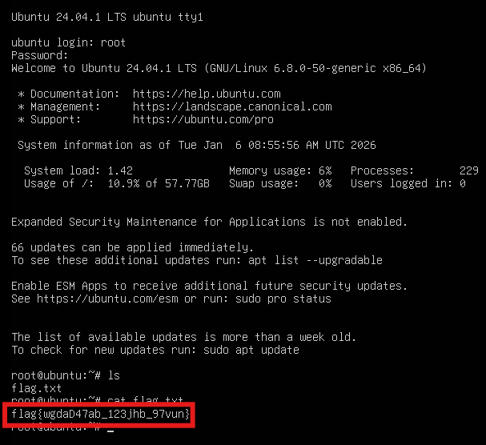

```plain
flag{wgdaD47ab_123jhb_97vun}
```

## 单机取证
### 单机取证1
```plain
起因：某某文化有限公司的服务器被攻击了，领导说找不出来原因就炒小王鱿鱼，请你拯救小王的运维生涯。
帮助小王找到是什么漏洞导致了小王的运维生涯受到了打击？（回答攻击者利用的漏洞编号）
服务器密码：Admin!@#45lko
flag格式为：flag{CNVD-20xx-12xxx}
```

先找本机部署的web服务网站

在火狐浏览器找到访问本机8080端口网站的历史记录

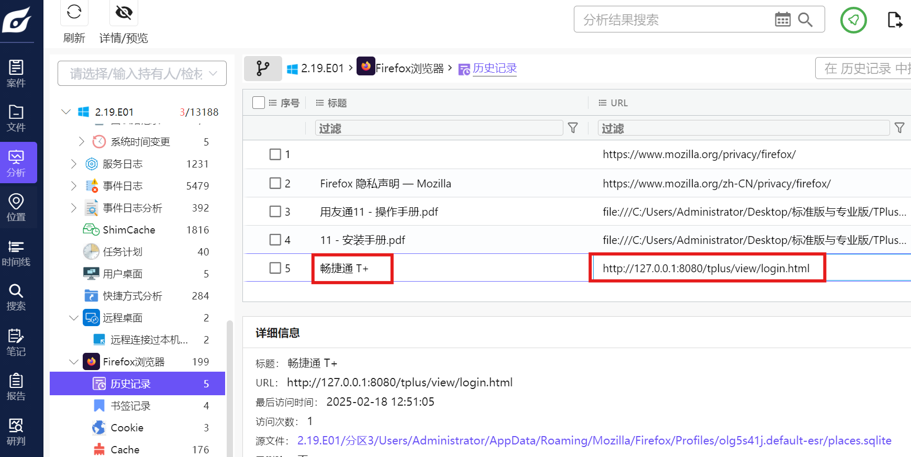

这个网站就是本机部署的web网站


可以看到产品名称是 畅捷通 T+，直接搜索漏洞

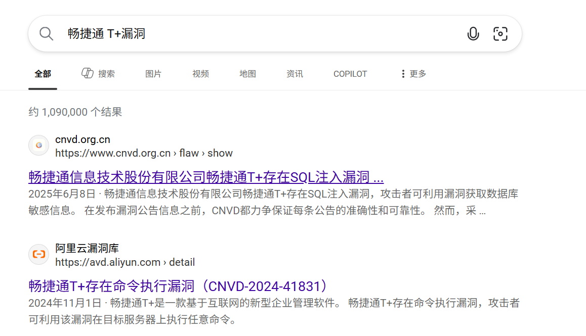

漏洞不少啊，试出来是2022的漏洞

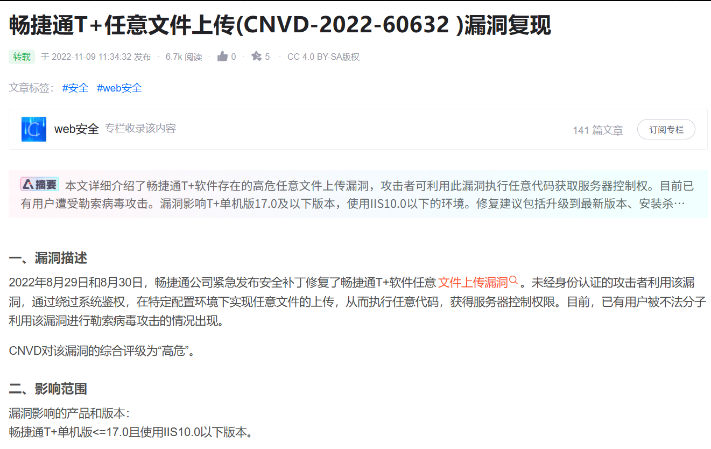

```plain
flag{CNVD-2022-60632}
```

### 单机取证2
```plain
请你帮助小王找到攻击者使用的信息收集工具。（回答工具名称）
flag格式为：flag{xxxx.exe}
```

火眼仿真后能得到utrs$隐藏账户的密码

登录进去就看到猕猴桃，内网渗透必备工具mimikatz.exe


```plain
flag{mimikatz.exe}
```

### 单机取证3
```plain
帮助小王找到攻击者创建的隐藏账户的密码。
flag格式为：flag{xxxxxxxxxx}
```

windows系统里$结尾的是隐藏用户

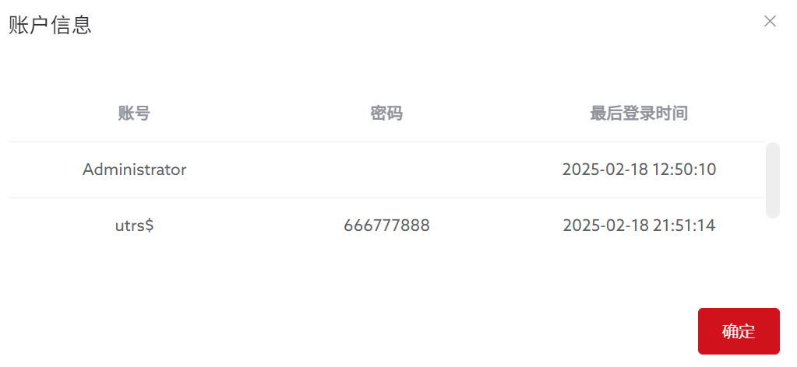

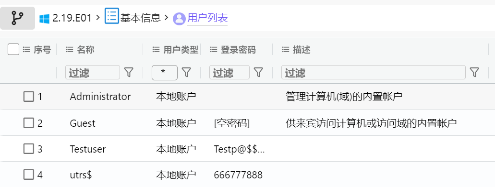

```plain
flag{666777888}
```

### 单机取证4
```plain
小王发现系统中有什么文件一直被删除，你能找出来原因吗？（请回答包含的可疑域名）
flag格式为：flag{xxx.xxx.xxx}
```

环境没装 Sysmon

按照 Security.evtx, System.evtx, Application.evtx的顺序翻日志

但是如果翻到过Administor用户的桌面内容，能看到文件 运维王小明留.txt ，内容是sql账密，那就直接定位到application找sql相关的

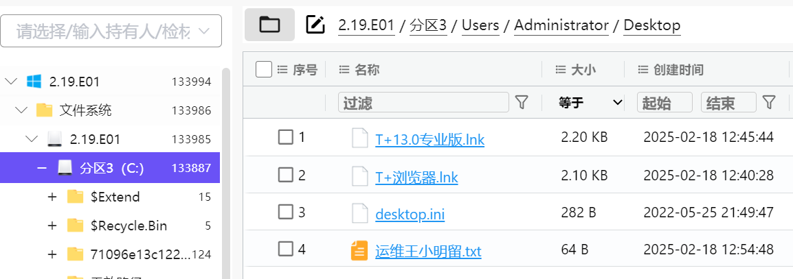

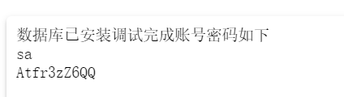

在Application.evtx找到 攻击者将“Ole Automation Procedures”已从 0 更改为1 启动了OLE自动化过程 

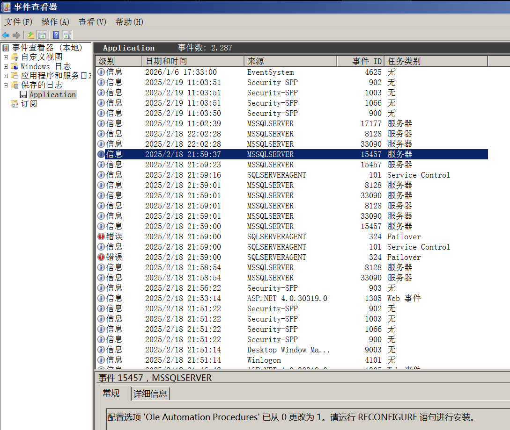

 sp_OACreate是SQL Server的扩展存储过程，用于创建OLE对象实例。odsole70.dll则是支持OLE自动化操作的组件，怀疑攻击者对数据库进行了操作 

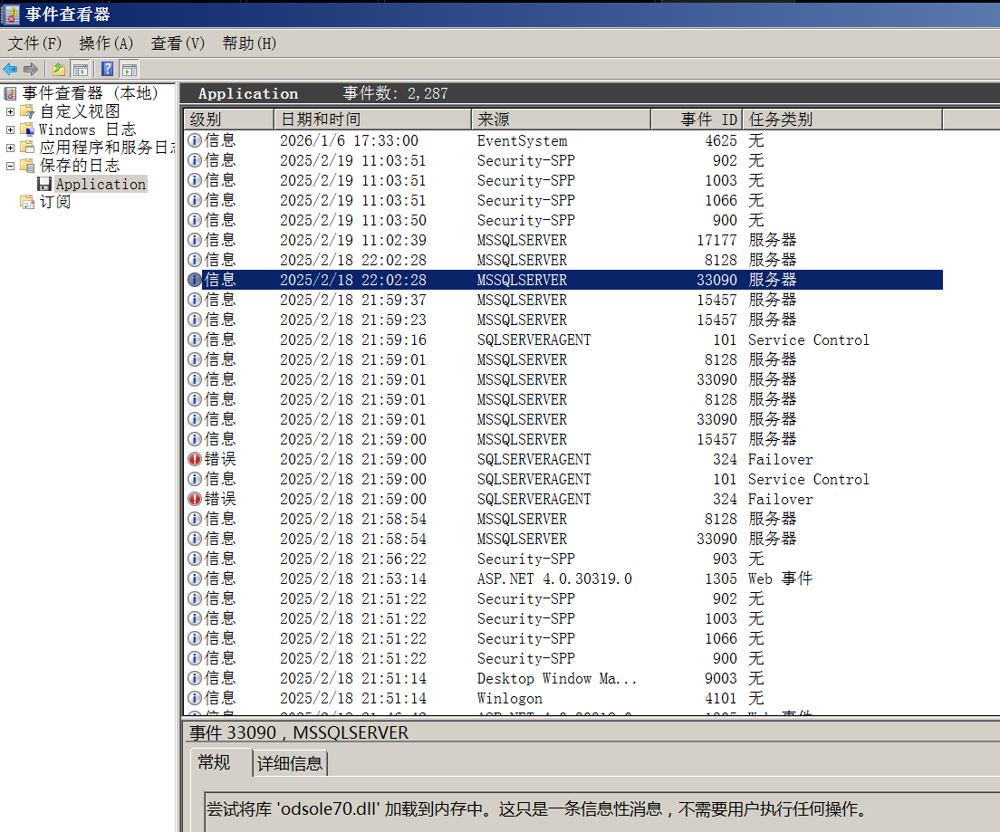

这时候也能看出来来源是mysqlserver

对于mssql来说

**MSDBData.mdf / MSDBLog.ldf**：是 **msdb 数据库的物理文件**（数据文件/日志文件）  

 数据库作业信息存储在 ` msdb `  数据库中（下面的都是表或者视图） 

 如： 

+ ` msdb.dbo.sysjobs `  存储所有作业的基本信息（如作业名称、所有者、启用状态等） 
+ ` msdb.dbo.sysjobsteps `  存储作业的步骤（Step）信息（如执行的命令、类型、成功/失败后的操作） 
+ ` msdb.dbo.sysschedules `  存储作业的计划（Schedule）信息（如执行频率、时间） 
+ ` msdb.dbo.sysjobschedules `  关联作业与计划（Job 和 Schedule 的对应关系） 
+ ` msdb.dbo.sysobhistory `  存储作业的执行历史记录（如开始时间、结束时间、执行状态） 

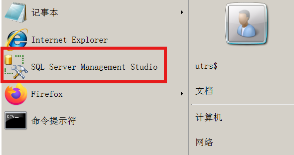

直接通过镜像自带的sql server management studio（SSMS）登录ms数据库

如果宿主机装过SSMS，也可以导出后附加查看

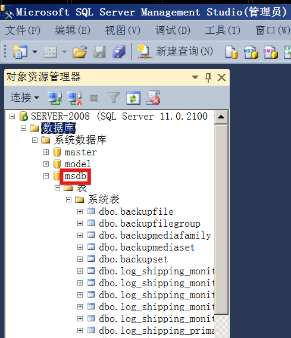

然后找到msdb数据库

sql命令查询作业详情

```plain
USE msdb;
SELECT * FROM dbo.sysjobsteps;
```

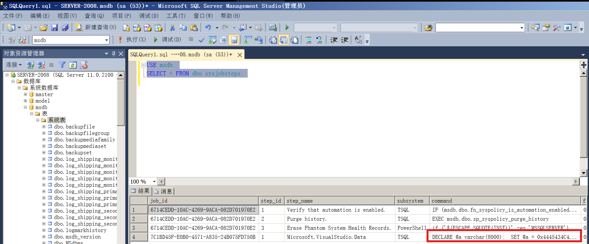

在 SQL Agent 作业里，常见的 step_name 是“备份”“清理”“同步”“报表”“ETL”等维护语义；  
突然出现 “VisualStudio.Data” 这种像 .NET/组件名的命名，**非常像伪装**

查看其command内容，其中看到16进制

```plain
DECLARE @a varchar(8000);
SET @a = 0x4445434C4152452040526573756C7420696E743B4445434C415245204046534F5F546F6B656E20696E743B455845432040526573756C74203D2073705F4F4143726561746520277B30777777772e637967323031362e7879797D272C204046534F5F546F6B656E204F55545055543B455845432040526573756C74203D2073705F4F414D6574686F64204046534F5F546F6B656E2C202744656C657465466F6C646572272C204E554C4C2C2027633A5C446F63756D656E747320616E642053657474696E67735C44656661756C7420557365725C4C6F63616C2053657474696E67735C54656D706F7261727920496E7465726E65742046696C65735C436F6E74656E742E4945355C2A273B455845432040526573756C74203D2073705F4F414D6574686F64204046534F5F546F6B656E2C202744656C657465466F6C646572272C204E554C4C2C2027633A5C446F63756D656E747320616E642053657474696E67735C4C6F63616C536572766963655C4C6F63616C2053657474696E67735C54656D706F7261727920496E7465726E65742046696C65735C436F6E74656E742E4945355C2A273B
EXEC(@a);
```

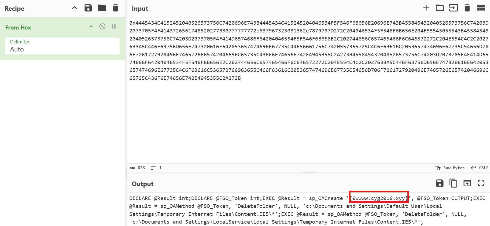

转换后再查看，可以看到可疑域名

```plain
flag{0wwww.cyg2016.xyy}
```

### 单机取证5
```plain
请你帮助小王找到攻击者隐藏的webshell后门，（请回答shell的md5值）
flag格式为：flag{xxxxxxxxx}
```

webshell用d盾扫，能在c盘扫出来已知后门

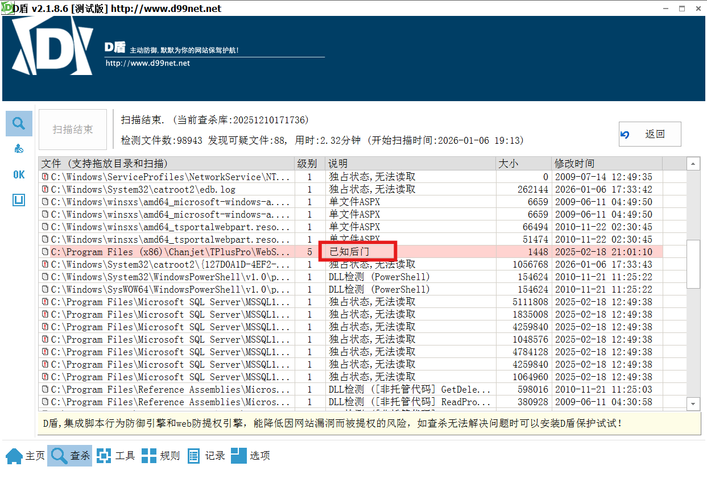

不过试下来这个是错的，那只能一个个看了


后面还有一个已知后门，是这个config.aspx

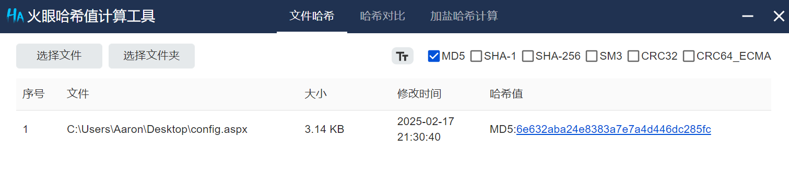

```plain
flag{6e632aba24e8383a7e7a4d446dc285fc}
```

## 暗链排查
### 暗链排查1
```plain
网站被劫持，被跳转到外部网站，请分析外部原因。
本题提供两个端口:
第一个端口为ssh端口默认密码为solar@202502
第二个端口为被劫持的web服务，路径为 /projectA/index.jsp
```


很明显外部原因需要使用第二个端口查看被劫持的web服务，内部原因需要用ssh查看内因

但这道题的环境有问题

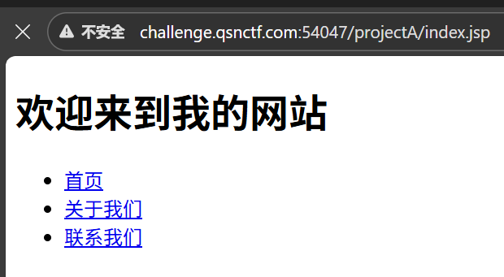

正常来说进入web网站后应该访问这些超链接，但是我一个都进不去，全部显示504


正常应该是有回显能抓包的，然后抓包排查可发现响应中有一个js，大概率通过该js实现跳转

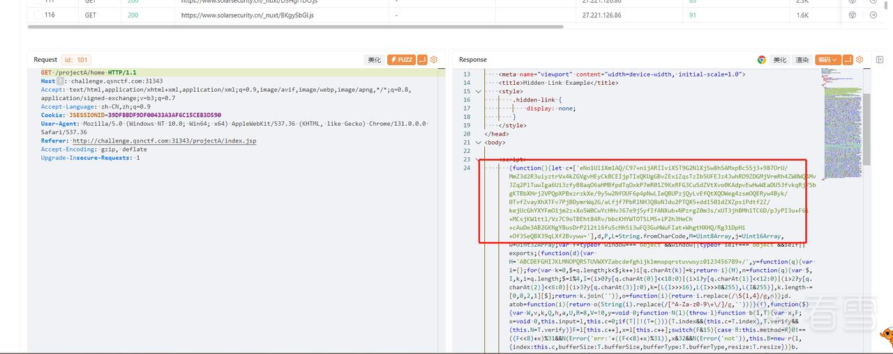

然后把这段内容解码就能拿到flag

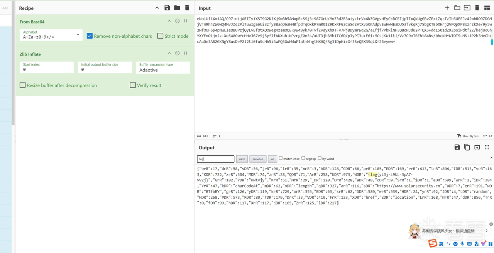

```plain
flag{yL3j-L9bL-3pA7-vV2j}
```

### 暗链排查2
```plain
网站被劫持，被跳转到外部网站，请分析内部原因。
本题提供两个端口:
第一个端口为ssh端口默认密码为solar@202502
第二个端口为被劫持的web服务，路径为 /projectA/index.jsp
```

先ssh

```plain
ssh -p 54046 root@27.221.126.87
密码已给出solar@202502
```

然后排查apache tomcat和nginx

```plain
cd /usr/local/tomcat
cat ./webapps/projectA/WEB-INF/web.xml
cat ./webapps/projectA/WEB-INF/jsp/about.jsp
```

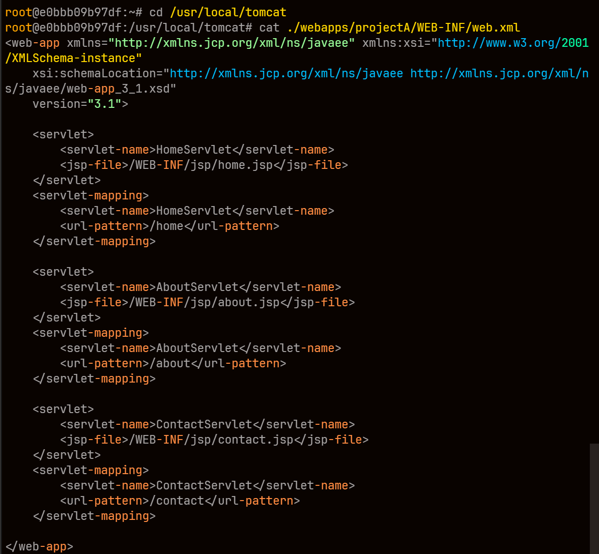

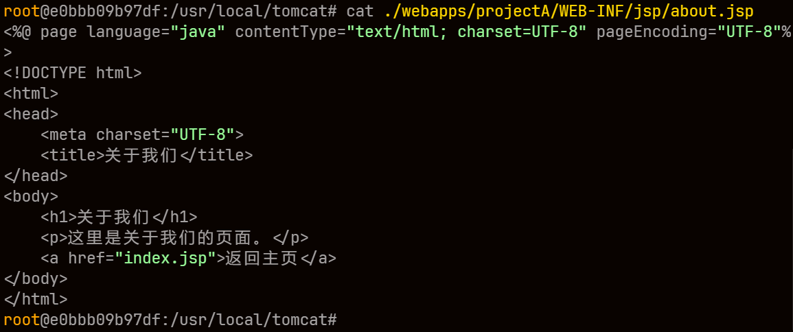

未发现异常，然后检查当前进程，能看到启动了两个nginx

```plain
ps -aux | grep nginx
```

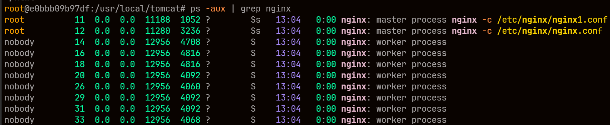

检查当前nginx配置文件发现并没有相关的代码，且未找到对应的nginx1.conf，推测nginx1.conf应该就是最终导致被劫持的原因

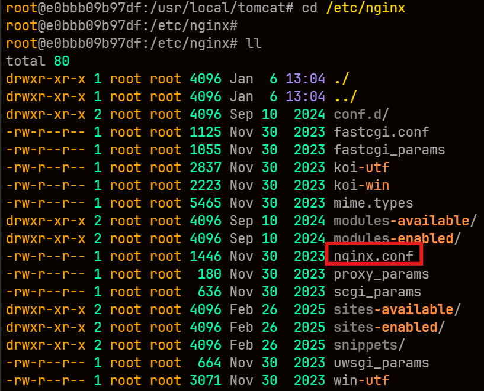

导出该进程还原nginx1.conf

 导出方法： 

```plain
确认主进程pid
ps -ef |grep nginx

检查内存映射
cat /proc/<pid>/maps |grep heap
将返回结果：
562cebcef000-562cebd53000 rw-p 00000000 00:00 0     [heap]

使用gdb转储堆

仅 root 可执行，临时允许所有进程被 ptrace 调试
echo 0 > /proc/sys/kernel/yama/ptrace_scope

gdb -p <master_pid>
(gdb)dump memory /target/file  0x562cebcef000 0x562cebd53000

或者
导出进程内存
gcore -o /tmp/11output 11

查找flag

strings 11output.11 | grep flag
```

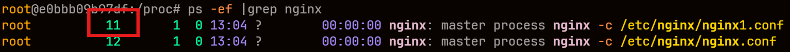

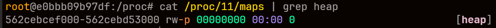

这环境不对啊，怎么文件系统是只读的，各种修复后无果

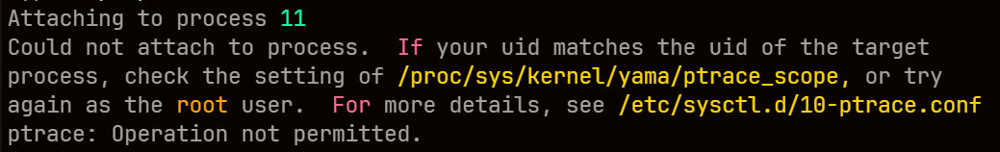

这我能说啥呢

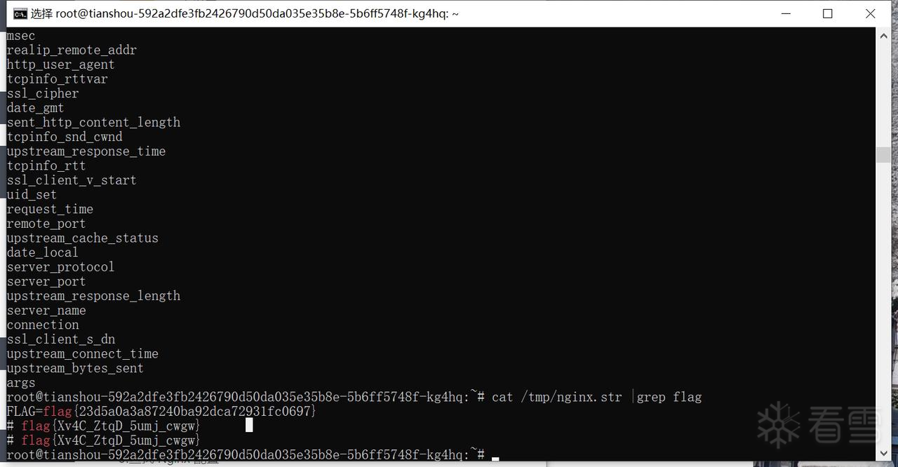

```plain
flag{Xv4C_ZtqD_5umj_cwgw}
```

## 逆向
```plain
附件被加密，请逆向分析该可执行程序。
```

idamcp+ai一把梭


📊 程序分析总结

我已经完成了对这个AES加密程序的详细分析。以下是关键发现：

🔍 程序基本信息

+ 文件类型: .NET程序集 (C#编写)
+ 主要功能: AES文件加密工具
+ 类名: `AesEncryptionApp.AesEncryption`

🎯 关键发现

1. 输入/输出文件:
    - 输入: `flag.txt`
    - 输出: `encrypted_file.txt`
2. 加密参数:
    - 算法: AES
    - 模式: CBC
    - 填充: PKCS7
    - 密钥长度: 32字节 (256位)
    - IV长度: 16字节
3. 重要字符串:
    - `12346578` - 文件末尾标识符
    - `flag.txt` - 输入文件名
    - `encrypted_file.txt` - 输出文件名

🔑 加密流程

程序执行以下步骤：

1. 创建AES实例
2. 生成随机Key和IV (注意: 不是硬编码的!)
3. 读取flag.txt
4. 加密数据
5. 写入encrypted_file.txt
6. 追加Key (32字节)
7. 追加IV (16字节)
8. 追加标识符 '12346578'

💡 解题方案

方案1: 分析加密文件

```plain
encrypted_file.txt结构:
[加密的flag内容][Key(32字节)][IV(16字节)][标识符"12346578"]
```

+ 运行程序生成文件
+ 从末尾提取Key和IV
+ 解密获得flag

方案2: 修改程序

+ 修改Main函数直接输出明文
+ 或修改EncryptFile跳过加密

方案3: 动态调试

+ Hook EncryptFile函数
+ 拦截Key和IV
+ 解密数据

直接用ai的解密脚本

```plain
import os

# 读取文件
try:
    with open('encrypted_file.txt', 'rb') as f:
        data = f.read()
    
    print(f"文件大小: {len(data)} 字节")
    
    # 查找标识符
    marker = b'12346578'
    pos = data.find(marker)
    
    if pos != -1:
        print(f"标识符位置: {pos}")
        
        # 提取Key和IV
        key = data[pos-32-16:pos-16]  # 32字节Key
        iv = data[pos-16:pos]         # 16字节IV
        
        print(f"\nKey: {key.hex()}")
        print(f"IV: {iv.hex()}")
        
        # 输出格式
        print(f"\nKey (hex): {key.hex()}")
        print(f"IV (hex): {iv.hex()}")
        
        # 尝试解密
        encrypted_data = data[:pos-32-16]
        print(f"加密数据长度: {len(encrypted_data)}")
        
        # 如果有Crypto库
        try:
            from Crypto.Cipher import AES
            cipher = AES.new(key, AES.MODE_CBC, iv)
            decrypted = cipher.decrypt(encrypted_data)
            
            # PKCS7去填充
            pad_len = decrypted[-1]
            if pad_len <= 16:
                flag = decrypted[:-pad_len]
                print(f"\nFlag: {flag}")
            else:
                print(f"\n可能的Flag: {decrypted}")
        except:
            print("\n安装pycryptodome以自动解密")
            
except Exception as e:
    print(f"错误: {e}")
```

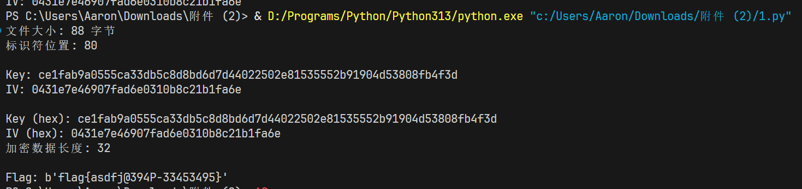

```plain
flag{asdfj@394P-33453495}
```

