<!-- generated-by: obsidian_git_blog_pipeline -->

## 可疑文件
```plain
在排查被勒索加密的机器的过程中，发现了一个可疑的dll，试着来分析看看吧！
```

dll里一堆函数，直接查看导出函数

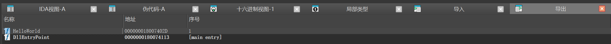

跟进HelloWorld，在里面发现f.txt和f.enc，判断是加密函数

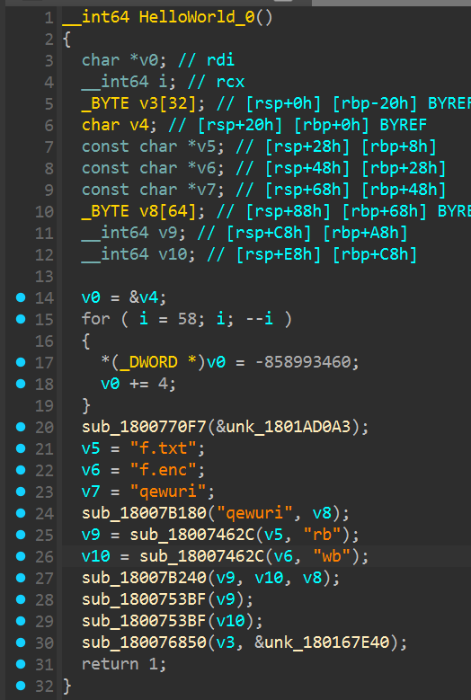

 加密算法为chacha20，并且在加密结束的时候对加密的字节进行了加一的操作 

 密钥来自  ` build_key_from_string("qewuri", out32) `   
  也就是： ` b"qewuri" + b"\x00"*26 `

```plain
import struct

def rotl32(x, n):
    return ((x << n) & 0xffffffff) | (x >> (32 - n))

def quarter_round(a, b, c, d):
    a = (a + b) & 0xffffffff; d ^= a; d = rotl32(d, 16)
    c = (c + d) & 0xffffffff; b ^= c; b = rotl32(b, 12)
    a = (a + b) & 0xffffffff; d ^= a; d = rotl32(d, 8)
    c = (c + d) & 0xffffffff; b ^= c; b = rotl32(b, 7)
    return a, b, c, d

def chacha20_block(key32: bytes, counter: int, nonce12: bytes) -> bytes:
    assert len(key32) == 32
    assert len(nonce12) == 12

    constants = b"expand 32-byte k"
    state = list(struct.unpack("<4I", constants)) \
          + list(struct.unpack("<8I", key32)) \
          + [counter & 0xffffffff] \
          + list(struct.unpack("<3I", nonce12))

    working = state[:]
    for _ in range(10):  # 20 rounds = 10 double-rounds
        # column rounds
        working[0], working[4], working[8],  working[12] = quarter_round(working[0], working[4], working[8],  working[12])
        working[1], working[5], working[9],  working[13] = quarter_round(working[1], working[5], working[9],  working[13])
        working[2], working[6], working[10], working[14] = quarter_round(working[2], working[6], working[10], working[14])
        working[3], working[7], working[11], working[15] = quarter_round(working[3], working[7], working[11], working[15])
        # diagonal rounds
        working[0], working[5], working[10], working[15] = quarter_round(working[0], working[5], working[10], working[15])
        working[1], working[6], working[11], working[12] = quarter_round(working[1], working[6], working[11], working[12])
        working[2], working[7], working[8],  working[13] = quarter_round(working[2], working[7], working[8],  working[13])
        working[3], working[4], working[9],  working[14] = quarter_round(working[3], working[4], working[9],  working[14])

    out = [(working[i] + state[i]) & 0xffffffff for i in range(16)]
    return struct.pack("<16I", *out)

def decrypt_fenc_to_plain(in_path="f.enc", out_path="f.txt.dec"):
    key = b"qewuri" + b"\x00" * (32 - len(b"qewuri"))   # 与 DLL 一致
    nonce = b"\x00" * 12                                # 与 DLL 一致
    counter = 0

    with open(in_path, "rb") as f_in, open(out_path, "wb") as f_out:
        while True:
            chunk = f_in.read(64)
            if not chunk:
                break
            ks = chacha20_block(key, counter, nonce)
            counter = (counter + 1) & 0xffffffff

            out = bytearray(len(chunk))
            for i, cb in enumerate(chunk):
                out[i] = ((cb - 1) & 0xff) ^ ks[i]
            f_out.write(out)

if __name__ == "__main__":
    decrypt_fenc_to_plain()

```

```plain
flag{sierting_666_fpdsajf[psdfljnwqrlqwhperhqwoeiurhqweourhp}
```

## 应急行动
### 应急行动1
```plain
你是一名网络安全工程师。早上10点，客户说自己被勒索了，十万火急
你需要：6 小时内查明攻击路径，对系统安全加固，提交最终的报告。
刻不容缓，请开始你的溯源任务吧！
Aministrator密码：Server.2012

来到现场后，通过上机初步检查，细心的你发现了一些线索，请分析一下攻击者IP 地址和入侵时间。
flag{IP DD/MM/YYYY}
```

先找本地服务器，能看到装了Rap Server


由题意提及服务器被侵入，则需要找到服务器的网络请求日志或流量信息

找到其日志文件 `RealFriend/Rap Server/Logs`，在其中发现了 PHP 任意命令执行的请求

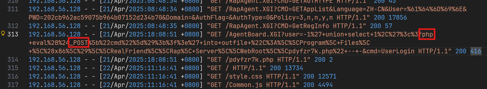

```plain
flag{192.168.56.128 21/04/2025}
```

### 应急行动2
```plain
在溯源的过程中，现场的运维告诉你，服务器不知道为什么多了个浏览器，并且这段时间服务器的流量有些异常，你决定一探究竟找找攻击者做了什么，配置了什么东西？
格式：flag{一大串字母}
```

考虑到流量异常，则先在用户目录范围内寻找浏览器、网盘等类应用，先是在用户的下载目录找到了 `rclone`，是一个 Mega 网盘工具

由此在用户目录寻找配置文件，可在 `AppData/Roaming/rclone` 下找到含有 Flag 的配置文件：

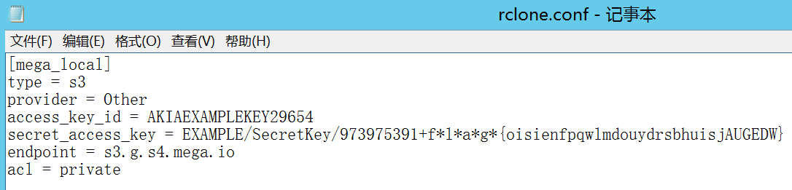

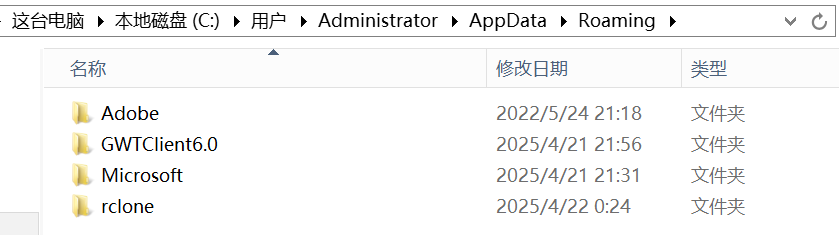

```plain
flag{oisienfpqwlmdouydrsbhuisjAUGEDW}
```

### 应急行动3
```plain
现场的运维说软件的某个跳转地址被恶意的修改了，但是却不知道啥时候被修改的，请你找到文件（C:\Program Files (x86)\RealFriend\Rap Server\WebRoot\casweb\Home\View\Index\index.html ） 最后被动手脚的时间
格式：flag{YYYY-MM-DD HH:MM:SS}
```

在资源管理器中直接看到的修改时间是被篡改的，尝试后发现并不准确；转而使用 Autopsy 扫描文件系统，可得到正确的修改时间

使用火眼看到的是错误时间，显示的修改时间是

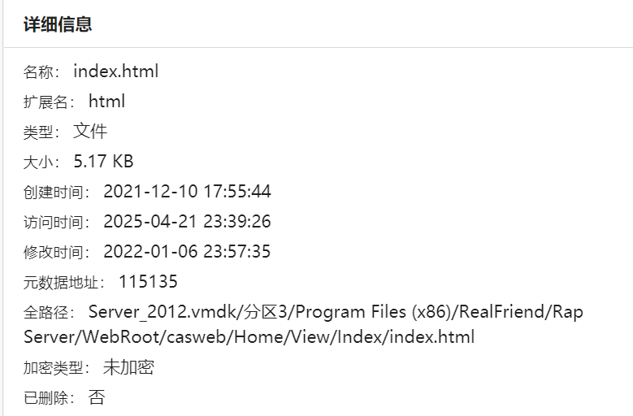

使用autopsy能看到正确文件

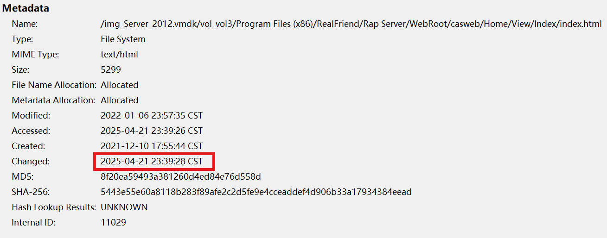

```plain
flag{2025-04-21 23:39:28}
```

```plain
思考：
为何会出现 Modified Time 与 Change Time 这两个意义近似但完全独立的字段？它们的区别又在哪里？
不同平台上的“修改时间”使用的都是什么时间？
既然一个文件被修改过了，那它的修改时间为何如此奇怪？
```

### 应急行动4
```plain
一顿分析后，你决定掏出你的Windows安全加固手册对服务器做一次全面的排查，果然你发现了攻击者漏出的鸡脚(四只)
flag格式为：flag{part1+part2+part3+part4}

你是一名网络安全工程师。早上10点，客户说自己被勒索了，十万火急
你需要：6 小时内查明攻击路径，对系统安全加固，提交最终的报告。
刻不容缓，请开始你的溯源任务吧！
```

题目中讲到的 `Windows 安全加固手册`，是很明显的提示，可以引导我们寻找 Flag 的方向。探索系统初期，考虑到 Windows 的系统管理配置存储不是那么简单（不是浅显集中、类似 Unix 的文件存储形式），如果有条件还是可以进行仿真的，做起来会很轻松。

```plain
此虚拟机的处理器所支持的功能不同于保存虚拟机状态的虚拟机的处理器所支持的功能
从文件“E:\solar应急响应\Server_2012-Snapshot2.vmsn”还原 CPU 状态时出错
错误导致还原操作失败。请取消还原操作并纠正错误，或者放弃快照状态并关闭虚拟机。已保存的快照不会受到影响
```

出现这种提示不用太担心，只要保证你手边有这个状态的快照就行。取消恢复之后，先给这个状态**创建一份快照**，然后在启动时**放弃**挂起状态，就可以继续使用，做你想做的事情了~


通过排查启动项、计划任务、账号排查、系统服务分别获得flag片段，最终组成完整的flag

1. 计划任务

 首先检查计划任务，找到可疑任务并查看详情信息，发现指向C:\Windows\Temp\update.ps1 

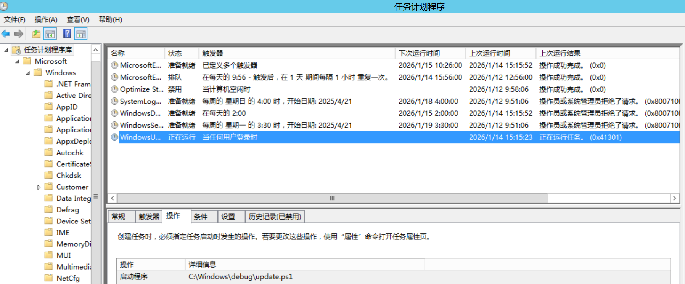

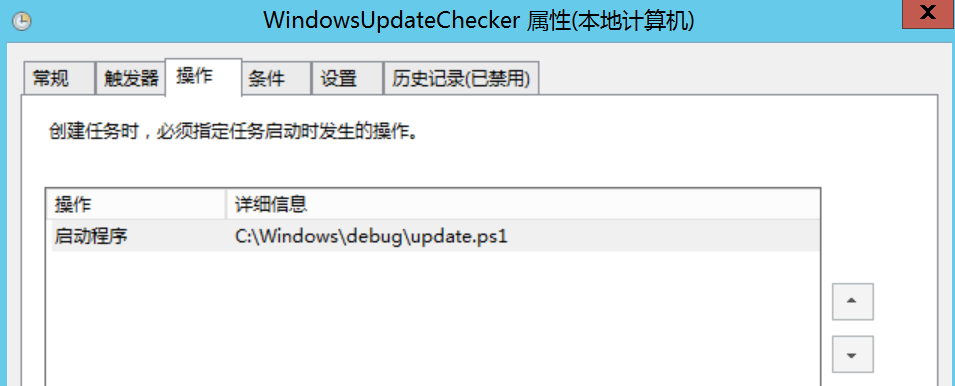

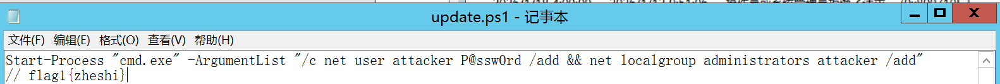

```plain
flag1{zheshi}
```

2. 系统服务

按描述排序，随便翻翻就能看到

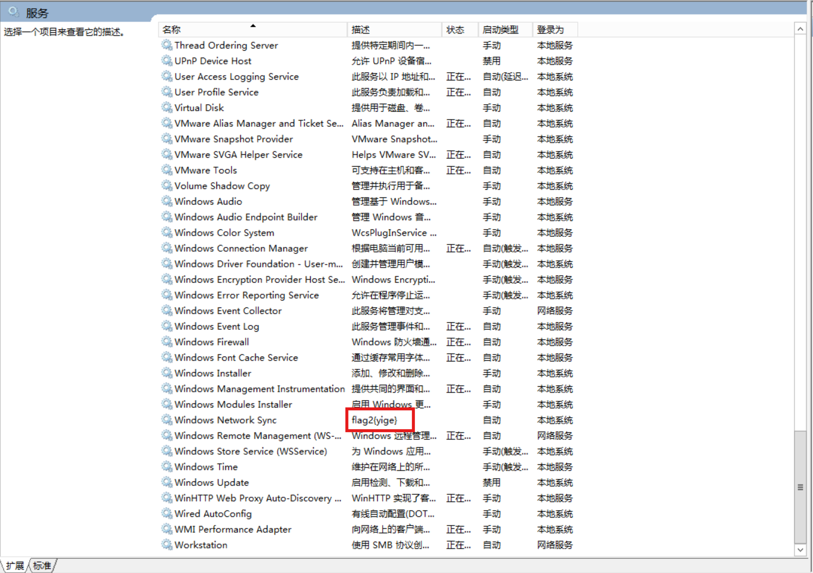

```plain
flag2{yige}
```

3. 账号排查

注册表中，本地用户和组管理器均可查看，可以看到多个用户名，通过一一排查，可以得知Admin为可疑用户，右键查看属性可以得知flag

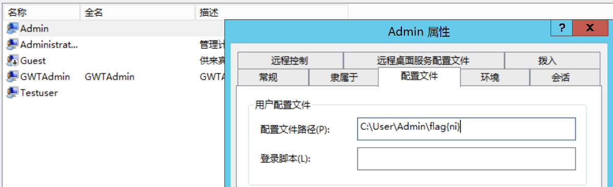

```plain
flag{ni}
```

4. 可疑进程

我对照了两篇wp，都说在`svchost.exe`的描述里，这个真的有点难找了

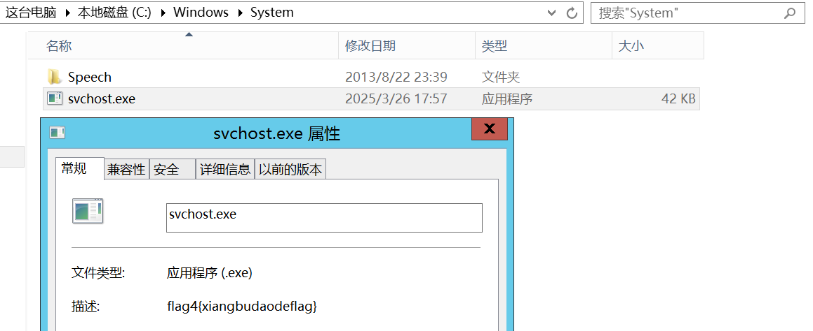

```plain
flag4{xiangbudaodeflag}
```

最后拼起来

```plain
flag{zheshiyigenixiangbudaodeflag}
```

### 应急行动5
```plain
轻轻松松的加固后，你需要写一份溯源分析报告，但是缺少了加密电脑文件的凶手(某加密程序)，这份报告客户是不会感到满意的，请你想方法让客户认可这份报告吧
flag格式为：flag{名称}
```

这反而是最先找到的，随便翻一翻就能看到这个可以加密程序

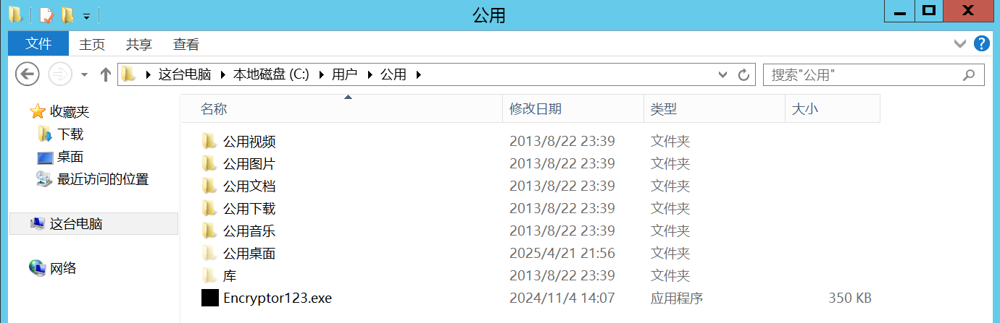

应该需要搜索用户目录下的可执行文件，然后找到该文件

```plain
flag{Encryptor123.exe}
```

