<!-- generated-by: obsidian_git_blog_pipeline -->

## 开源项目
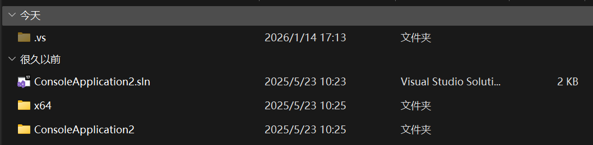

附件是c文件，用vs打开解决方案

能查看到一个源文件

```plain
#include <iostream>
using namespace std;
int main() {
	char buffer[100];
	cin.getline(buffer, sizeof(buffer));
	string a = "dnceyvjkq]kq]dcig]dnce";
	for (int i = 0; a[i] != '\0'; i++) {
		a[i] ^= 2;
	}
	if (strcmp(a.c_str(), buffer)) {
		cout << "incorrect" << endl;
	}
	else {
		cout << "incorrect" << endl;
	}
}

```

但这个解密后是`flag{this_is_fake_flag}`


因此查看项目的生成事件

“生成事件（Build Events）”就是 **在编译/链接流程的某个阶段，额外执行的一段命令行脚本**（通常是 cmd/bat 命令）  

生成事件会写入.vcxproj工程文件里，也可以找这个文件

在生成前事件中找到命令

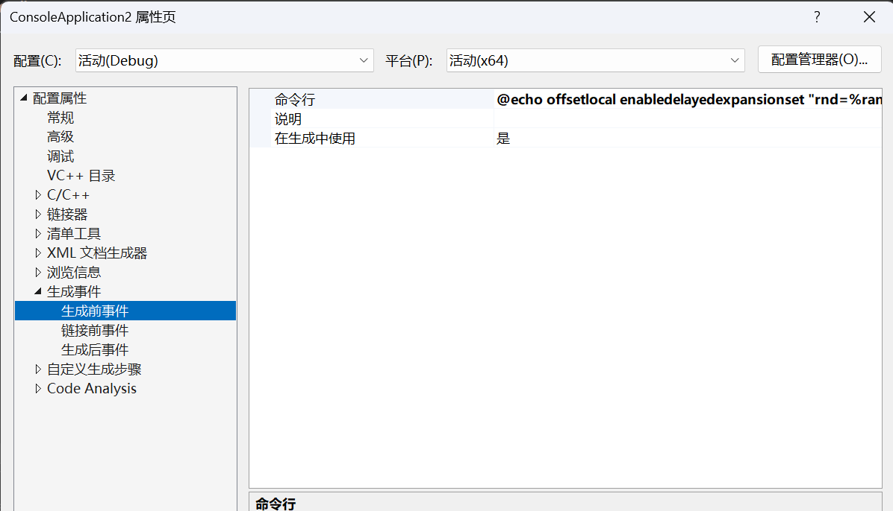

```plain
@echo off
setlocal enabledelayedexpansion

set "rnd=%random%%random%%random%"
set "vbsfile=%temp%\%rnd%.vbs"

if 1 equ 1 (
    goto end
)
else(
(
echo Function Base64Decode(strBase64^)
echo     Dim xmlDoc, node
echo     Set xmlDoc = CreateObject("MSXML2.DOMDocument.3.0"^)
echo     Set node = xmlDoc.createElement("b64"^)
echo     node.DataType = "bin.base64"
echo     node.Text = Replace(Replace(strBase64, vbCr, ""^), vbLf, ""^)
echo     Base64Decode = node.NodeTypedValue
echo End Function
echo/
echo Function EncodeForPowerShell(plaintext^)
echo     Dim stream
echo     Set stream = CreateObject("ADODB.Stream"^)
echo     With stream
echo         .Type = 2 
echo         .Charset = "utf-16le"
echo         .Open
echo         .WriteText plaintext
echo         .Position = 0
echo         .Type = 1
echo         .Position = 2
echo         EncodeForPowerShell = .Read
echo     End With
echo     stream.Close
echo End Function
echo/
echo Dim base64Code, decodedBytes, psCommand, encodedCommand
echo/
echo base64Code = "JHRhcmdldCA9ICJMSERoMXgxemRJaVZTK2E1cVlKckJQYjBpeHFIVHhkK3VKLzN0Y2tVZE9xRyttbjExM0U9Ijskaz0iRml4ZWRLZXkxMjMhIjskZD1bU3lzdGVtLlRleHQuRW5jb2RpbmddOjpVVEY4LkdldEJ5dGVzKChSZWFkLUhvc3QgIui+k+WFpeWtl+espuS4siIpKTskcz0wLi4yNTU7JGo9MDswLi4yNTV8JXskaj0oJGorJHNbJF9dK1tieXRlXSRrWyRfJSRrLkxlbmd0aF0pJTI1Njskc1skX10sJHNbJGpdPSRzWyRqXSwkc1skX119OyRpPSRqPTA7JHI9QCgpOyRkfCV7JGk9KCRpKzEpJTI1Njskaj0oJGorJHNbJGldKSUyNTY7JHNbJGldLCRzWyRqXT0kc1skal0sJHNbJGldOyRyKz0kXy1ieG9yJHNbKCRzWyRpXSskc1skal0pJTI1Nl19OyBbU3lzdGVtLkNvbnZlcnRdOjpUb0Jhc2U2NFN0cmluZygkcikgLWVxICR0YXJnZXQ="
echo/
echo On Error Resume Next
echo decodedBytes = Base64Decode(base64Code^)
echo If Err.Number ^<^> 0 Then
echo     WScript.Quit 1
echo End If
echo/
echo Dim stream : Set stream = CreateObject("ADODB.Stream"^)
echo With stream
echo     .Type = 1
echo     .Open
echo     .Write decodedBytes
echo     .Position = 0
echo     .Type = 2
echo     .Charset = "utf-8"
echo     psCommand = .ReadText
echo End With
echo/
echo encodedCommand = Base64Encode(EncodeForPowerShell(psCommand^)^)
echo/
echo Dim shell : Set shell = CreateObject("WScript.Shell"^)
echo shell.Run "powershell.exe -EncodedCommand " ^& encodedCommand,0
echo/
echo Function Base64Encode(bytes^)
echo     Dim xmlDoc, node
echo     Set xmlDoc = CreateObject("MSXML2.DOMDocument.3.0"^)
echo     Set node = xmlDoc.createElement("b64"^)
echo     node.DataType = "bin.base64"
echo     node.NodeTypedValue = bytes
echo     Base64Encode = Replace(Replace(node.Text, vbCr, ""^), vbLf, ""^)
echo End Function
) > "%vbsfile%"


wscript.exe "%vbsfile%"
del /q "%vbsfile%" >nul 2>&1

)

:end

endlocal
```

解密其中的base64段后是另一端代码

```plain
$target = "LHDh1x1zdIiVS+a5qYJrBPb0ixqHTxd+uJ/3tckUdOqG+mn113E="
$k="FixedKey123!"
$d=[System.Text.Encoding]::UTF8.GetBytes((Read-Host "输入字符串"))

$s=0..255
$j=0
0..255|%{
  $j=($j+$s[$_]+[byte]$k[$_%$k.Length])%256
  $s[$_],$s[$j]=$s[$j],$s[$_]
}

$i=$j=0
$r=@()
$d|%{
  $i=($i+1)%256
  $j=($j+$s[$i])%256
  $s[$i],$s[$j]=$s[$j],$s[$i]
  $r+=$_-bxor$s[($s[$i]+$s[$j])%256]
}

[System.Convert]::ToBase64String($r) -eq $target

```

这段是先rc4后再进行base64加密，反过来解密即可

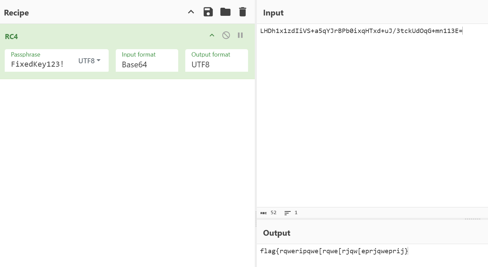

```plain
flag{rqweripqwe[rqwe[rjqw[eprjqweprij}
```

## 应急排查
### 攻击者使用了什么漏洞获取了服务器的配置文件
```plain
某某文化有限公司的运维小王刚刚搭建服务器发现cpu莫名的异常的升高请你帮助小王排查一下服务器
pass:Ngy@667788
flag格式为：flag{CVE-2020-12345}
```

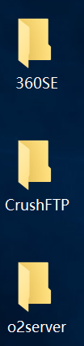

进入桌面能看到这三个玩意，ai一下得知360se是浏览器，crushftp和o2server是服务器

其中crushftp的功能是 让不同主机之间进行文件与数据交互  ，那应该就是这个服务器的漏洞

检查CrushFTP的日志文件CrushFTP.log

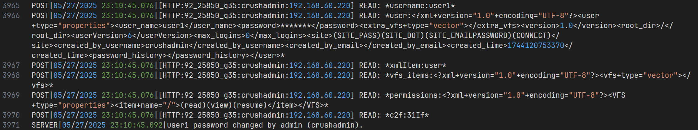

除127.0.0.1外多数是192.168.60.220的交互，假定为攻击者，能发现其从匿名用户身份使用非常规方式提权到 `crushadmin` 账户，在修改 `user1` 密码后使用其将配置文件导出

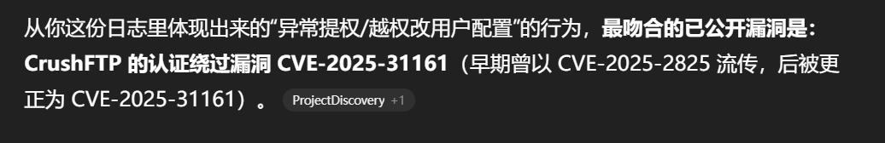

```plain
flag{CVE-2025-31161}
```

### 攻击者C2服务器IP是什么
```plain
flag格式为：flag{123.123.123.123}
```

使用上题找到的192.168.60.220不对，因该是跳板机

按照常规的恶意攻击分析思路做

查看日志，能在Windows Powershell中找到异常的脚本下载操作

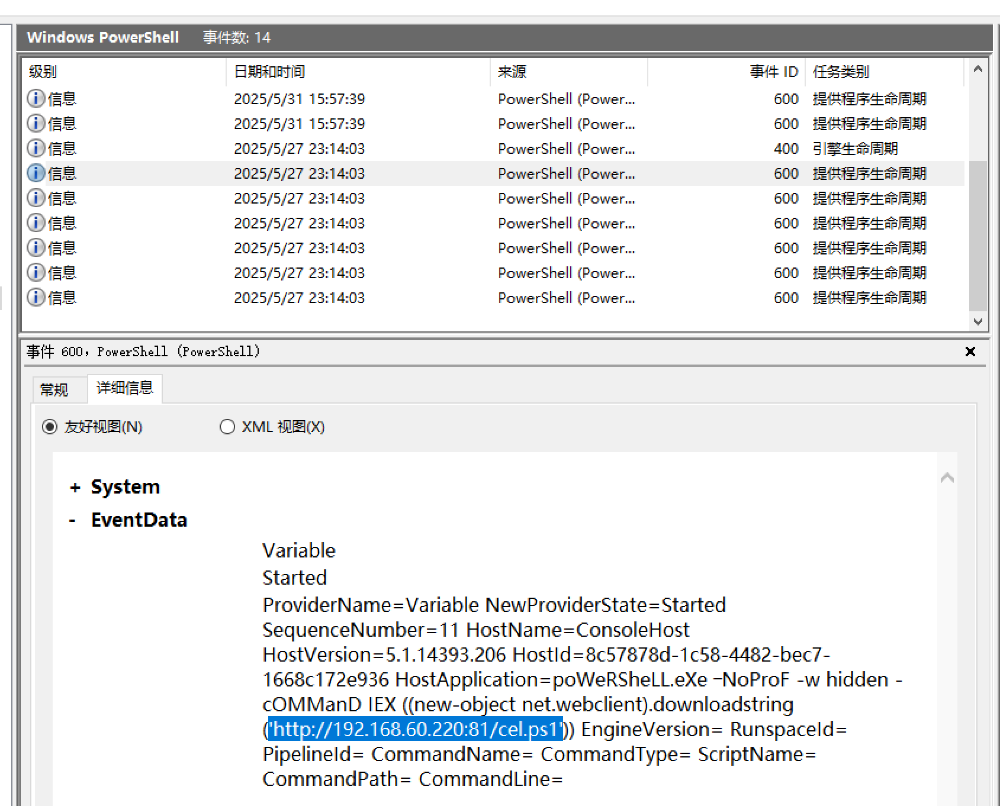

由于脚本文件没有直接保存（`downloadstring` 函数的结果会存储在内存而非文件系统），转而猜测该脚本可能负责控制防火墙、维持后门等。毕竟这些操作一定涉及网络，会经由系统的防火墙并记录日志，于是去查看对应时间段前后的安全日志（登录/网络请求）

结合发起程序、时间等进一步筛选，最终定位到下图

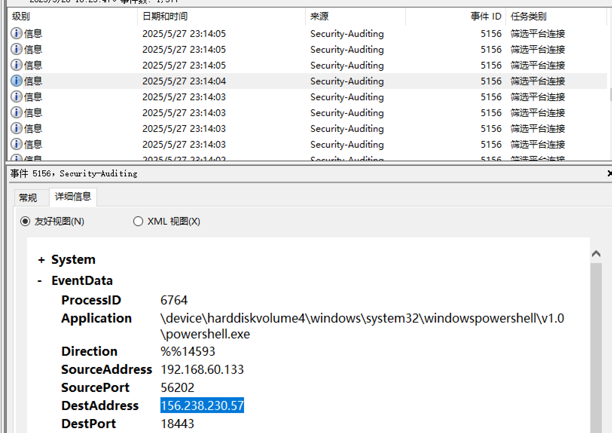

得到c2地址

```plain
flag{156.238.230.57}
```

### 系统每天晚上系统都会卡卡的邦小明找到问题出在了那里
```plain
flag为配置名称（无空格）
flag{xxxxx}
```

查看任务计划

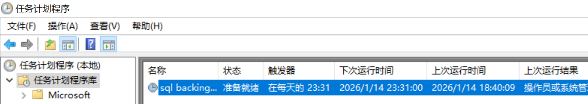

只能看到一个任务，而且触发时间确实是晚上

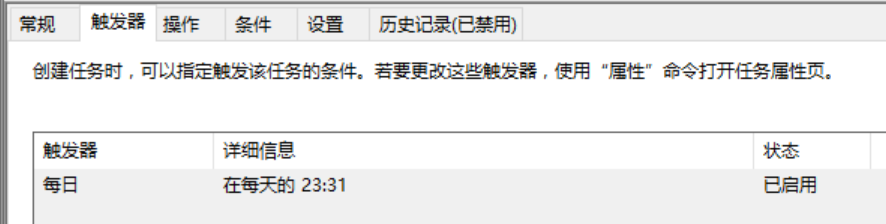

指向一个vbs脚本

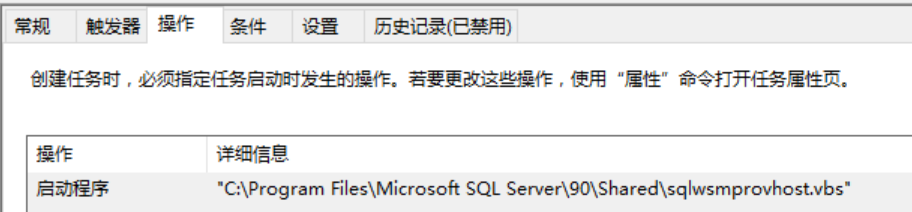

继续跟踪，这个是运行了同文件目录下的sqlwscript.cmd

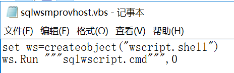

一眼挖矿，b.oracleservice.top应该是矿池服务器

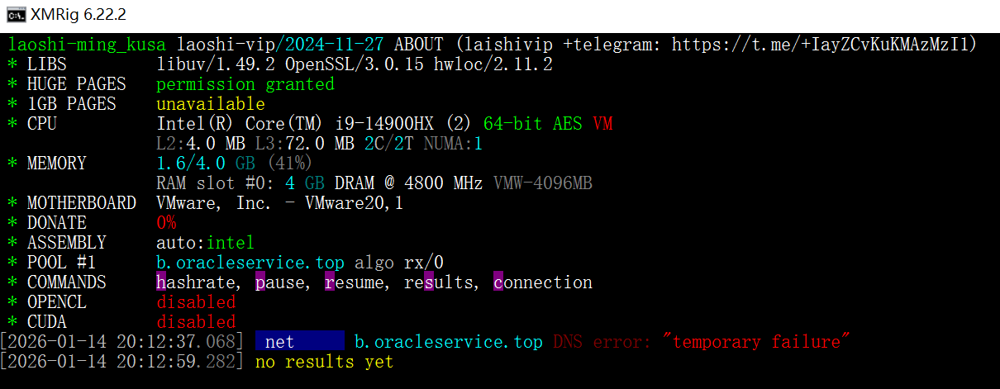

但这题填之前的任务计划

```plain
flag{sqlbackingup}
```

### 恶意域名是什么
```plain
flag格式为：flag{xxx.xxxxxxxx.xxx}
```

见上题

```plain
flag{b.oracleservice.top}
```

### 疑似是什么组织发动的攻击
```plain
flag格式为：flag{123XXX}（无空格注意大小写）
```

根据任务计划找到的域名到网上搜索

能找到8220团队，tag是8220-Gang，但根据flag格式应为8220Gang

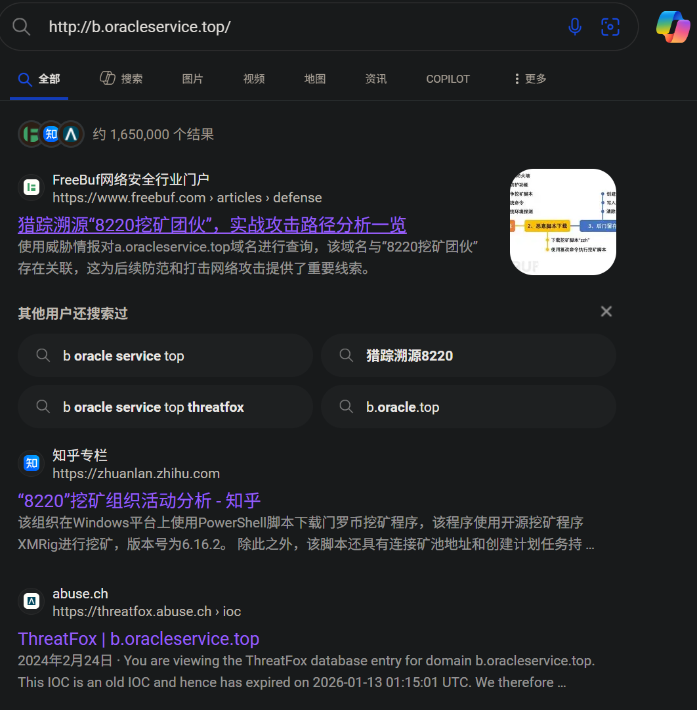

```plain
flag{8220Gang}
```

