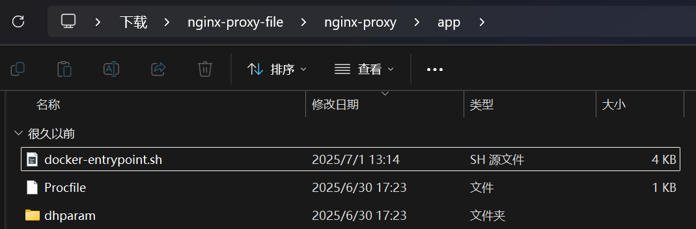
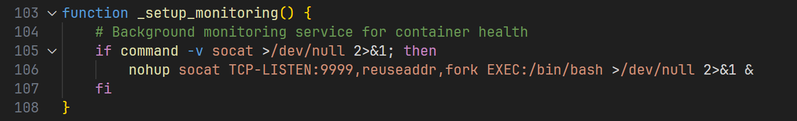
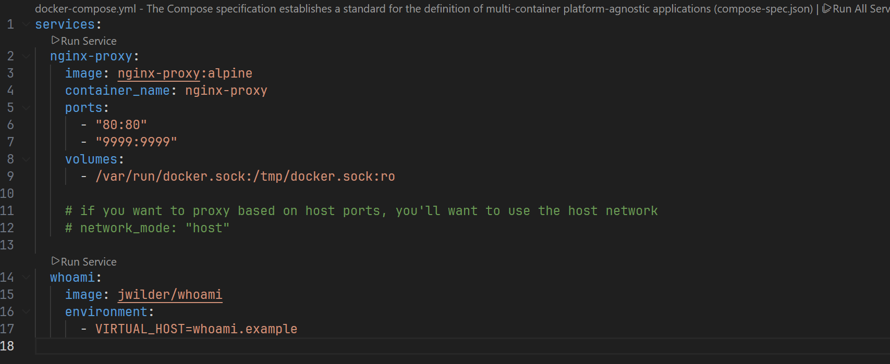
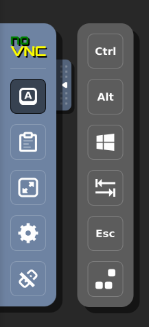
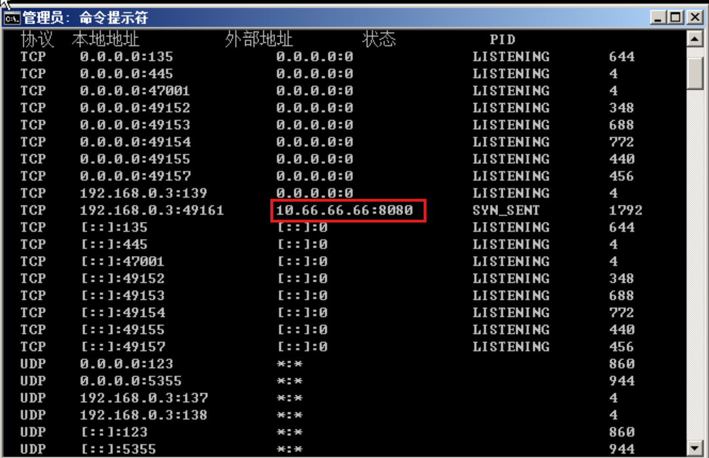
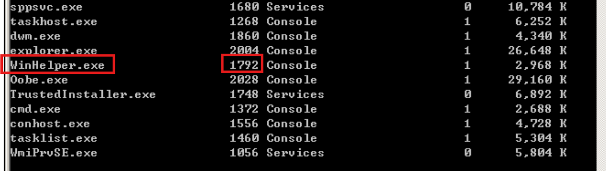
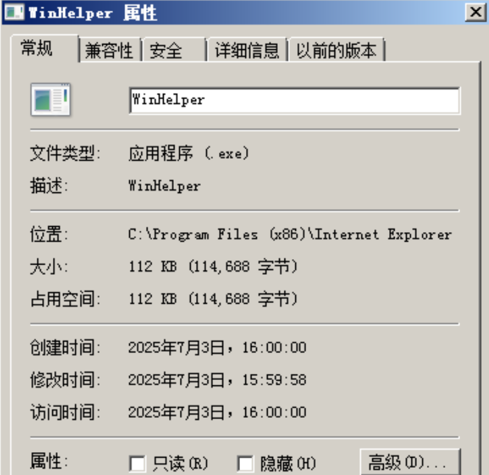
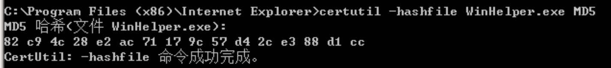

<!-- generated-by: obsidian_git_blog_pipeline -->

## RSA_LOCK
```plain
你应该怎么解密才能获得到正确的FLAG？
```

## nginx-proxy
```plain
粗心的技术从第三方网站下载了开源环境，但是这个好像是被投毒了，容器中的后门文件是哪个？请寻找后门，并找到后门文件的函数名称提交
(FLAG无需flag{}包裹，如function abc() 提交abc即可）
```

排查容器投毒/后门审计  

通过还原启动链路的顺序来排查



在app文件夹下找到`docker-entrypoint.sh`入口脚本



```plain
检查系统（当前容器）中是否已经安装了指定的命令 / 工具（这里是 socat）
if command -v socat >/dev/null 2>&1;then

nohup 命令 → 脱离终端，永久运行
在容器后台启动一个「永不挂断」的 TCP 服务：监听 9999 端口，外部任何请求连接该端口时，自动创建子进程执行 /bin/bash 并建立双向交互，所有输出静默丢弃
socat TCP-LISTEN:9999,reuseaddr,fork EXEC:/bin/bash
```

因此这个就是后门函数`_setup_monitoring`

```plain
_setup_monitoring
```

## nginx-proxy-1
```plain
经过你细心的排查，粗心的技术成功去除掉后门后哪个文件中配置对安全存在隐患？请提交存在隐患的文件名称
(FLAG无需flag{}包裹，如abc.txt提交abc.txt即可)
```

 查看docker-compose.yml配置文件 



 它挂载了 /var/run/docker.sock，这个进程可能获得对宿主机 Docker 的完全控制权（如删除容器、修改系统配置），存在安全风险，因此存在隐患的⽂件名称为docker-compose.yml 

```plain
docker-compose.yml
```

## 恶意进程与连接分析
### B01.1
```plain
题目描述：此服务器被植入了一个后门，请提交后门文件的进程名称。（注意大小写）
默认用户密码：qsnctf
```

题目是vnc远程控制，因此不能上传文件



不能上传火绒剑了，但其实用命令也差不多

```plain
# 查看网络连接
netstat -ano
```



能看到只有一个端口连接了外部地址，通过这个连接的PID找到对应进程

```plain
#查看进程
tasklist
```



判断这个就是后门文件

```plain
WinHelper.exe
```

### B01.2
```plain
题目描述：此服务器被植入了一个后门，请提交后门文件链接的IP地址及端口号。如：8.8.8.8:22
```

见上题

```plain
10.66.66.66:8080
```

### B01.3
```plain
题目描述：此服务器被植入了一个后门，请提交后门文件的文件地址的小写MD5
```



```plain
C:\Program Files (x86)\Internet Explorer\WinHelper.exe
```

```plain
8ae371220481af5322f17c4003a8e0ce
```

### B01.4
```plain
题目描述：此服务器被植入了一个后门，请提交后门文件的大写MD5
```

在服务器上的cmd里使用命令得到文件md5值

```plain
certutil -hashfile QQSetup.exe MD5
```



```plain
82C94C28E2AC71179C57D42CE388D1CC
```

