<!-- generated-by: obsidian_git_blog_pipeline -->

## 勒索环境溯源排查
```plain
本环境来源于勒索病毒应急响应案例
此环境中涉及的勒索家族全版本加密器，思而听(山东)网络科技有限公司、solar应急响应团队已破解
在环境中已给出步骤提示，请您一步步完成每一道题目，最终复盘为什么要这么做
主要在其中黑客怎么关闭的Windows杀毒软件？可以仔细思考一下
排好时间线后可以根据桌面已有的 训练环境介绍-必读 中的溯源报告进行输出相关报告

Administrator 密码为 Sierting789@

注意：如在环境启动后的一分钟没有看到3306端口开放，可手动启动phpstudy
注意：勒索加密原则上会加密所有可读、可运行文件等，但为了提高学习效率和简易程度，所以恢复了一部分文件作为线索，你可以仔细找找哦
防勒索官网：http://应急响应.com
```

### 任务1
```plain
上机排查提交病毒家族的名称，可访问应急响应.com确定家族名称，以flag{xxx}提交(大小写敏感)
```

上机查看被勒索文件后缀

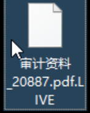

确认勒索团队

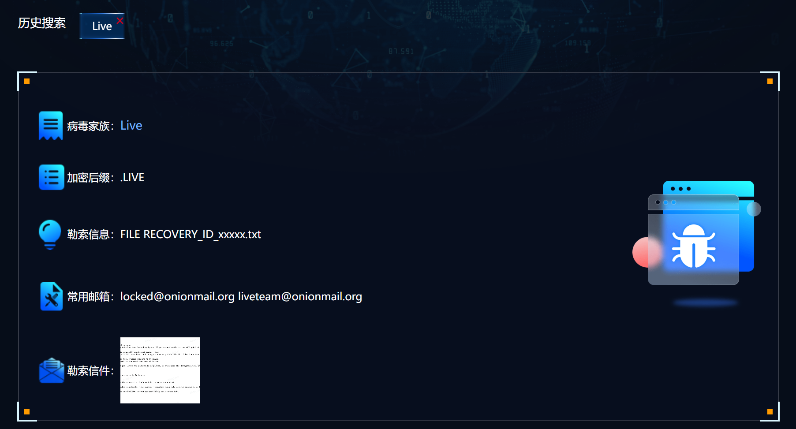

勒索邮件完全相同

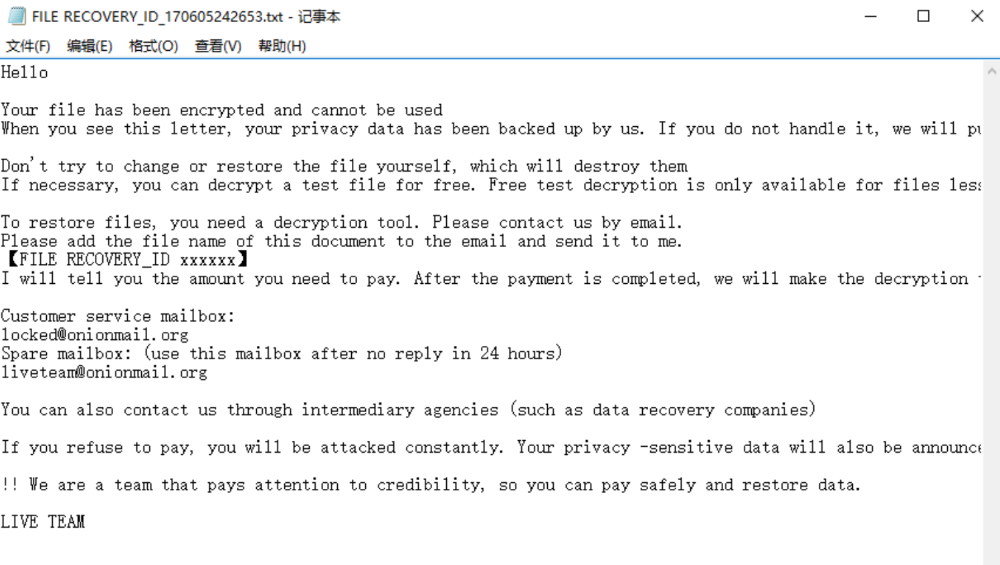

```plain
flag{Live}
```

### 任务2
```plain
提交勒索病毒预留的ID，以flag{xxxxxx}进行提交
```

在上题勒索文件的文件名里

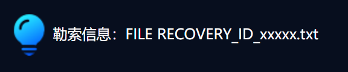

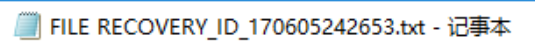

```plain
flag{170605242653}
```

### 任务3
```plain
解密并提交桌面中flag.txt.LIVE的flag，以flag{xxxx}提交
```

由于原本赛题有nas服务器可以进行sftp文件传输，而nas服务器在赛后关闭了

导致复盘最大的问题是如何下载文件或者上传文件


简而言之，最终我没有找到任何方法上传或下载文件

远程服务器是首先连接`vm.qsnctf.com`然后用novnc连接内网的机子，没有可用外部映射

novnc的剪切板无效，至少我用不了，无法转换文件以文本形式导出


艹了，反正这题也很简单，直接到`www.solar.com`找Live的恢复工具就行

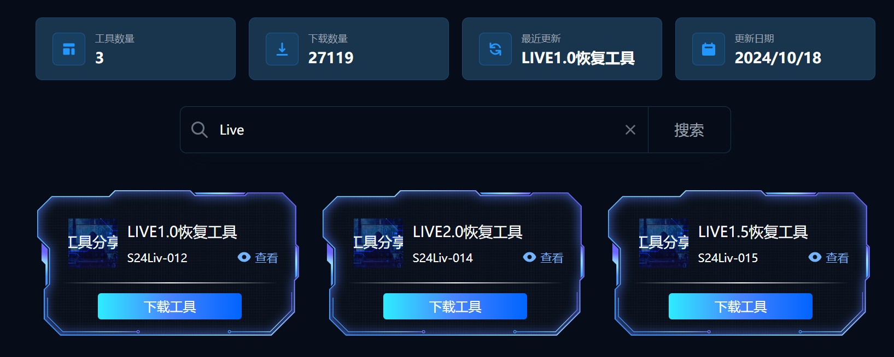

LIVE1.0恢复工具就行

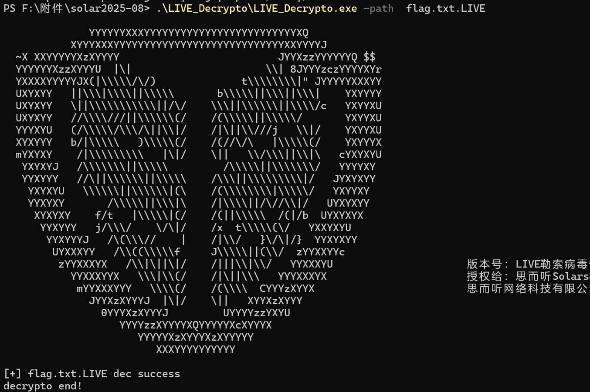

```plain
flag{cf0971c1d17a03823c3db541ea3b4ec2}
```

### 任务4
```plain
提交Windows Defender删除攻击者C2的时间，以flag{2025.1.1_1:10}格式提交
```

这题我一开始没看懂，这个删除攻击者C2的时间是什么意思

因为C2一般指**Command & Control（命令与控制）**，通常指恶意程序会去连接的**远程控制端**（IP / 域名 / URL）  

但在 **应急响应/取证/CTF** 语境里，题面写“删除攻击者C2”经常是**口语化写法**，真正被 Defender “删除”的一定是**本机上的恶意载荷/后门组件（implant）或其落地文件**（里面包含 C2 配置，或用于连 C2）  

那就有明确方向了，到Windows Defender日志里找

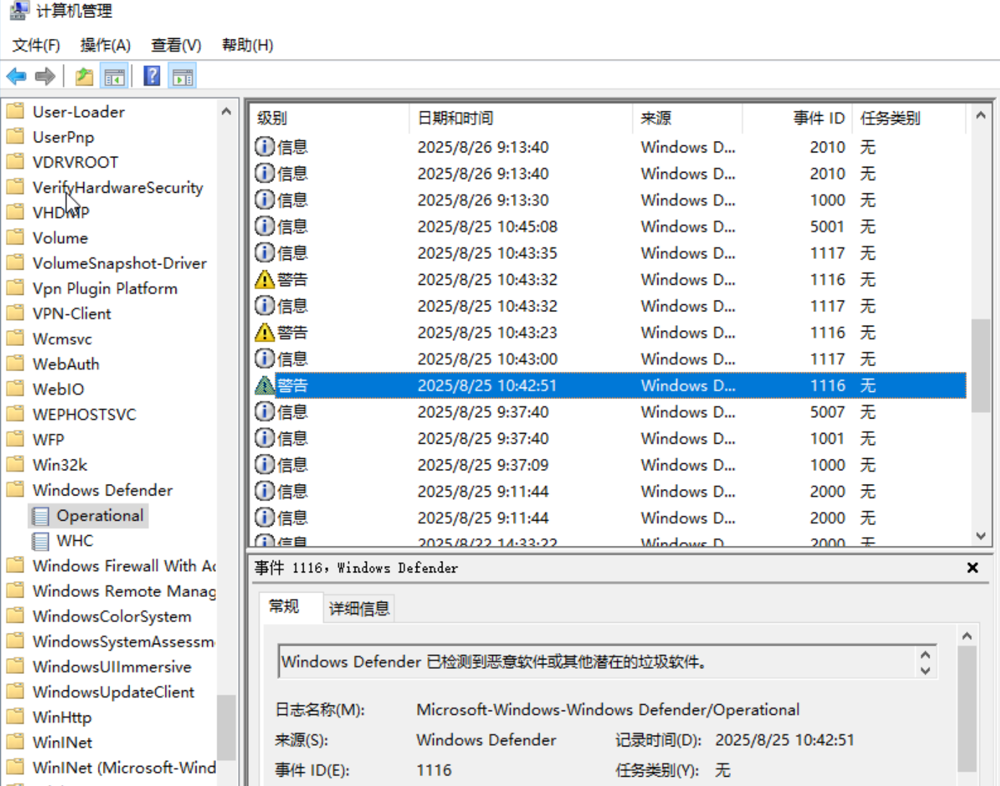

详细信息里能看到检测到了一个后门程序

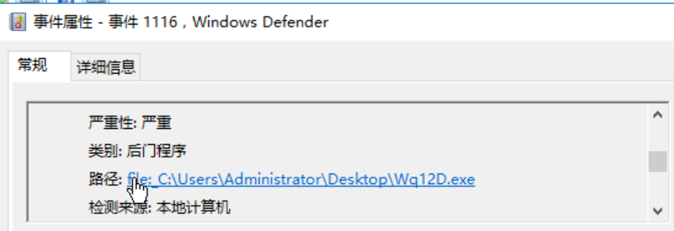

删除在后一个日志里，对其进行了隔离

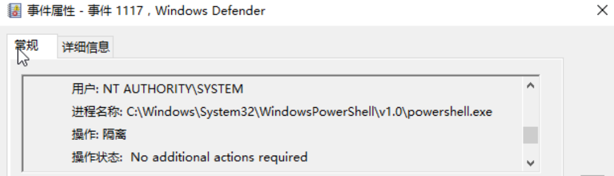

时间是`2025.8.25 10:43`

```plain
flag{2025.8.25_10:43}
```

### 任务5
```plain
提交攻击者关闭Windows Defender的时间，以flag{2025.1.1_1:10}格式提交
```

禁用Windows Defender的日志就在上题附近，可以看到事件id是5001

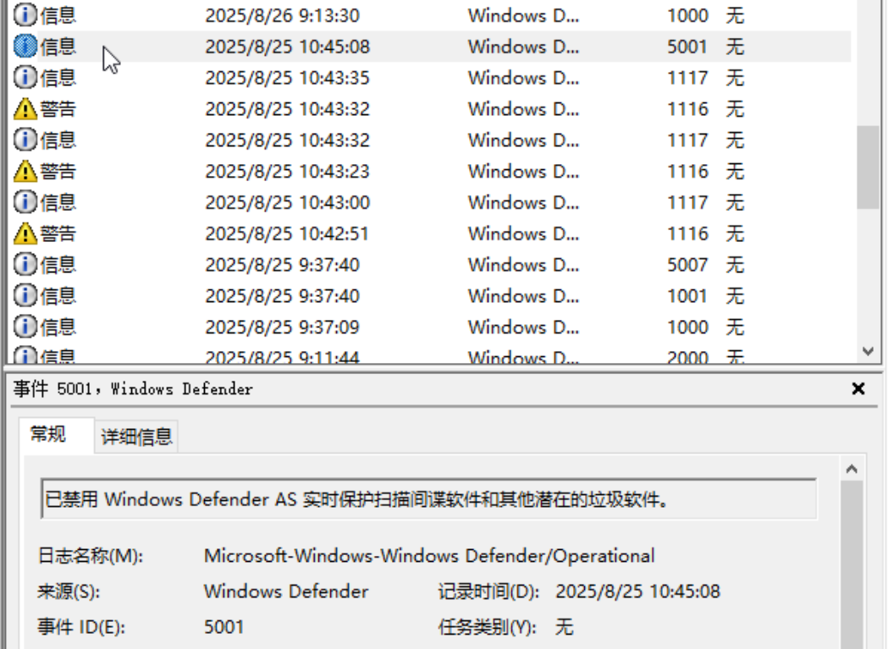

```plain
flag{2025.8.25_10:45}
```

### 任务6
```plain
提交攻击者上传C2的绝对路径，格式以flag{C:\xxx\xxx}提交
```

见任务4

```plain
flag{C:\Users\Administrator\Downloads\Wq12D.exe}
```

### 任务7
```plain
提交攻击者C2的IP外联地址，格式以flag{xx.x.x.x}提交
```

思路是把上传的后门弄下来然后沙箱分析，因为环境问题实现不了了

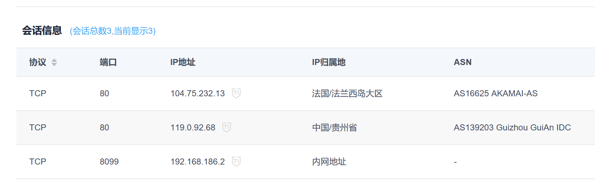

外链地址为`192.168.186.2`

```plain
flag{192.168.186.2}
```

### 任务8
```plain
提交攻击者加密器绝对路径，格式以flag{C:\xxx\xxx}提交
```

找exe文件，先在Administrator用户里找

找完后一个个看，一般这种加密器不会放在AppData文件夹里，具体需要下载后放到ida里看

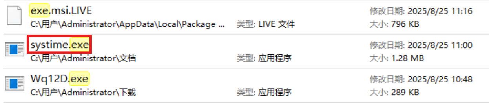

最后找到是这个

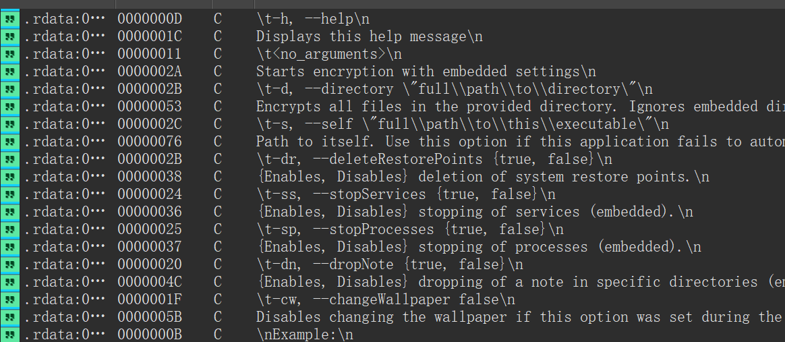

```plain
flag{C:\Users\Administrator\Documents\systime.exe}
```

### 任务9
```plain
溯源黑客攻击路径，利用的哪个漏洞并推测验证，提交起运行文件绝对路径，如：flag{C:\xxx\xxx\xxx}
```

找webshell，直接上D盾

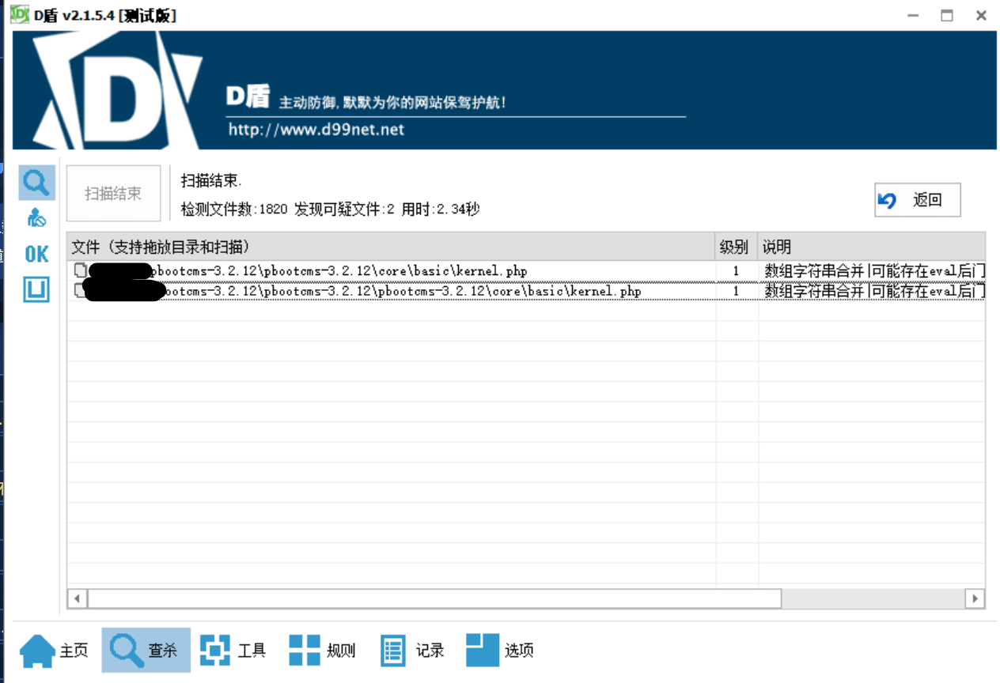

一个pbootcms，一个ruoyi，pbootcms在phpstudy启动，ruoyi bat启动

木马文件

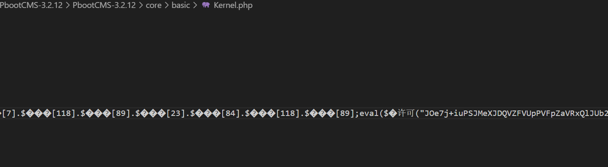

打开phpstudy时数据库语法报错，mysql中有ruoyi的数据库，可以猜到是从ruoyi打进来的，同时ruoyi-4.7.1也存在漏洞

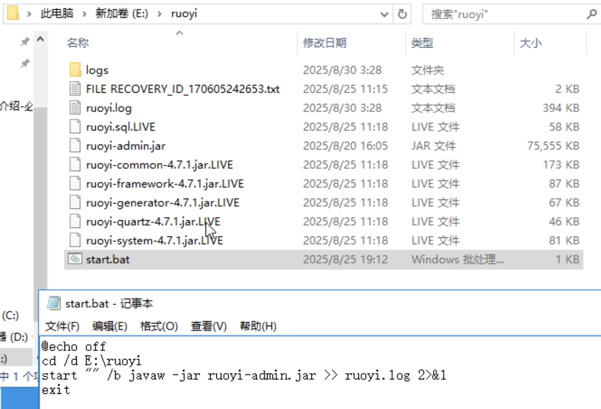

```plain
flag{E:\ruoyi\ruoyi-admin.jar}
```

## strange_downloader
```plain
strange_downloader 你能获得FLAG吗？
```

