<!-- generated-by: obsidian_git_blog_pipeline -->

## 查看用户TargetSid（目标账户安全ID）

win11以下可以直接在cmd用wmic命令查看用户的TargetSid

```plain
wmic useraccount where name="solar$" get name,sid
```

## cmd命令获取文件md5值
```plain
certutil -hashfile <filename> MD5
```
## windows安全加固手册
[https://blog.csdn.net/tinmax/article/details/151998682](https://blog.csdn.net/tinmax/article/details/151998682)

## windows web服务排查

### 查进程

- `w3wp.exe` → IIS 工作进程
- `httpd.exe` → Apache
- `nginx.exe` → Nginx
- `tomcat*.exe` / `java.exe` → Tomcat、Spring Boot、Jenkins、WebLogic、JBoss 等
- `dotnet.exe` → ASP.NET Core / Kestrel
- `node.exe` → Node Web 服务
- `python.exe` → 临时 Web 服务或恶意简易 HTTP 服务
- `php-cgi.exe` / `php.exe`
- `javaw.exe` → 某些 Java Web 程序伪装运行
### 查端口服务
1. **80**
    
    HTTP 明文网页服务，普通网站默认访问端口
    
2. **443**
    
    HTTPS 加密安全网页服务，SSL/TLS 加密网站默认端口
    
3. **8080**
    

- 备用 HTTP 代理 / 网页端口
- Tomcat、Jetty 等 Java Web 容器默认 HTTP 端口
- 内网后台、代理服务常用

4. **8443**
    
    HTTPS 加密备用端口

- Tomcat 加密访问默认端口
- 防火墙 / 后台管理 SSL 登录常用

5. **8000**

- Django Python Web 开发默认运行端口
- 流媒体、音频转发、部分 ERP / 监控后台常用

6. **8009**
    
    AJP 协议端口，**Tomcat AJP 连接器默认端口**
    
    Apache 与 Tomcat 反向代理通信专用（常见 Ghostcat 漏洞利用端口）
    
7. **7001**
    
    WebLogic Server 默认 HTTP 访问端口（Java 中间件，高危漏洞频发）
    
8. **7002**
    
    WebLogic SSL 加密通信默认端口
    
9. **8888**
    

- 宝塔面板默认管理端口
- PHPStudy / 集成环境后台、代理、网盘、监控系统常用备用 HTTP 端口

10. **9090**

- Openfire 即时通讯、Prometheus 监控服务端口
- 部分 Web 后台、穿透代理、Cockpit 管理面板常用


## 周期性文件删除搜索思路
持续/周期性删除，最常见来源就这几类（按命中率排序）：

1. **计划任务（Task Scheduler）**
    - 典型特征：固定间隔、固定触发点、系统权限运行。
    - 查：
        * `Microsoft-Windows-TaskScheduler/Operational` 日志（任务启动/结束/失败）
        * `schtasks /query /fo LIST /v` 或 PowerShell `Get-ScheduledTask`
2. **服务（Service）/ 守护进程**
    - 典型特征：常驻、随开机、可能带定时逻辑。
    - 查：
        * System 日志 7045（新服务安装）
        * `sc query`、服务二进制路径、启动类型
3. **SQL Server Agent 作业（如果主机上有 SQL）**
    - 典型特征：数据库环境里“定时执行某段脚本/命令”，且经常被用来做持久化。
    - 查（这一步就是你题目里的关键）：
        * `msdb.dbo.sysjobs`（作业）
        * `msdb.dbo.sysjobsteps`（步骤：命令/子系统/0x 混淆）
        * `msdb.dbo.sysschedules + sysjobschedules`（调度）
        * `msdb.dbo.sysjobhistory`（执行历史：把“删除时间线”对齐）
4. **WMI 事件订阅（WMI persistence）**
    - 典型特征：隐蔽、被很多题用作“持续执行”。
    - 查：`root\subscription` 下 `__EventFilter / CommandLineEventConsumer / __FilterToConsumerBinding`
5. **启动项 / 注册表 Run 键 / GPO 脚本**
    - 典型特征：每次登录/开机触发。
    - 查：Run/RunOnce、Startup 文件夹、域环境 GPO logon script
6. **应用自带清理机制**
    - 例如某些“清理缓存”的软件、日志轮转脚本、备份脚本写错路径。
    - 这类通常能在程序日志/配置里找到“清理策略”。

## 后门进程查找
后门进程通常会连接恶意服务器，或者开启接受端口

使用命令查询端口情况，找到后门进程的PID，再通过进程查看找到后门

```plain
# 查看网络连接
netstat -ano   	 # Windows
ss -lnp					 # Linux

# 查看进程
tasklist         # Windows 
ps aux					 # MacOS
ps aux					 # Linux
```

## 守护进程查找
1. 行为特征
+ 存在`kill -9 <pid>`后，短时间内同名进程再次出现，且PID变化
+ 删除可执行文件后进程依然运行
2. rm无法删除的常见原因与判断路径
    1.  不是“被占用”，而是“被保护/限制”  

`rm: Operation not permitted`（root 也不行）优先怀疑：

+ **immutable/append-only 属性**：`chattr +i` / `+a`
    - 判定：`lsattr <file>`
    - 处置：`chattr -i -a <file> && rm -f <file>`
+ **挂载/只读/overlay 限制**（容器里常见）
    - 判定：`findmnt -T <file>`、`mount | grep ' /tmp '`
+ **SELinux/AppArmor**（某些环境会限制）
    - 判定：`getenforce`、`aa-status`（不一定有）
+ **被替换为目录/特殊文件**（比如 bind mount 到别处）
    - 判定：`stat <file>`、`ls -l`、`findmnt -T`
    2.  “命令被感染”的判断 

如果怀疑 `rm/ps/ls/kill` 等被替换（用户态 rootkit/alias）：

+ **对比路径与哈希**：`type rm`、`which rm`、`ls -l $(which rm)`、`sha256sum`
+ **绕过 shell alias/function**：`command rm ...`、`\rm ...`
+ **使用静态可信工具集**：** busybox(推荐使用) **/静态编译的 ps/ls/netstat
+ **直接读 /proc**：很多信息不依赖系统命令（如 `cat /proc/<pid>/cmdline`）

应急里常用原则：**怀疑工具不可信时，尽量用 /proc + 静态工具**

3. 若依然“存活”， 权限维持/持久化点排查清单

常见的有计划任务，用户级自启动与用户后门等

    1. 计划任务排查
+ `crontab -l`（root 与可疑用户都要看）
+ `/etc/crontab`, `/etc/cron.*/*`, `/var/spool/cron/*`
+ `atq`（若 at 可用）
+ 特征：每分钟/固定周期拉起一个 `sh -c ...` 或脚本
4. 处置策略
+ **先断拉起机制**：stop/disable unit 或清掉 cron，`systemctl stop cron`
+ **再处理不可删除文件**：lsattr/findmnt/权限链
+ **再查命令可信性**：必要时 busybox + /proc
+ **最后做溯源与清理残留**：脚本、下载器、隐藏目录、外联地址、日志痕迹

## vmware导出镜像 火眼仿真重置密码
使用vmware自带功能导出镜像，主要作用是将多个vmdk合并为 1个vmdk的单文件镜像  

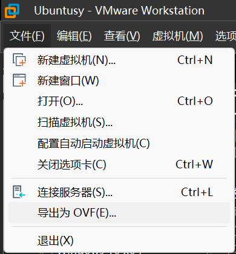

生成vmdk，ovf和mf文件


+ **OVF 描述文件（**`**.ovf**`**）**：告诉导入方“这台虚拟机长什么样、需要哪些资源、磁盘文件叫什么”
+ **磁盘文件（**`**.vmdk**`**）**：真正的数据
+ **清单/校验文件（**`**.mf**`**）**：告诉导入方“这些文件的哈希值是多少，用来验证完整性和未被篡改


其中vmdk文件本身是“自包含”的单文件镜像

有些 VMDK 的创建类型是 **monolithic**（单体），也就是：

+ **同一个文件里同时包含**
    - 磁盘的元数据（descriptor 信息）
    - 磁盘的数据（extent：扇区内容）

因此可以直接使用火眼仿真进行密码重置

## 浏览器分析
### 浏览器自带任务管理器

Shift+Esc呼出浏览器自带任务管理器
用于查看浏览器网路服务等


## PE
### 火眼仿真重置密码vsPE登录绕密
**A. 虚拟磁盘映射（VMDK/虚拟机磁盘挂载到宿主机）**

+ **执行位置**：在宿主机/管理端操作，把目标 VM 的虚拟磁盘当作一个离线盘来读/写。
+ **目标对象**：离线系统盘上的配置文件、注册表蜂巢、账号数据库等。
+ **典型用途**：
    - **只读取证**：扫描配置痕迹（可能包含明文口令的文件/键值）。
    - **离线修改**：重置本地口令、注入本地管理员、修改某些登录相关设置（本质都是改盘上数据）。

**B. PE 启动介质（在目标机器/目标 VM 控制台启动到另一套系统）**

+ **执行位置**：在目标机器（物理机）或目标 VM 的控制台，通过“引导到 PE”进入一个临时 OS，再去挂载并处理本机系统盘。
+ **目标对象**：同样是离线系统盘上的那些文件/注册表/账号数据库。
+ **典型用途**：
    - 离线重置/绕过本地登录（仍然是对系统盘做离线改动，只是载体是 PE）。

**结论**：两者不是“技术原理完全不同”，而是**同一种离线思路**在不同载体下实现：

+ 虚拟化场景更常见“磁盘映射/挂载”。
+ 物理机更常见“PE 启动介质”。

### PE作为启动介质，绕过登陆密码（能火眼仿真就火眼，不能再考虑这个）
VMware虚拟机进入pe系统： pe镜像下载地址

[https://www.hotpe.top/download/](https://www.hotpe.top/download/)


 在虚拟机编辑设置CD/DVD处选择pe镜像，替换导入的镜像 


 选择电源-->打开电源时进入固件 

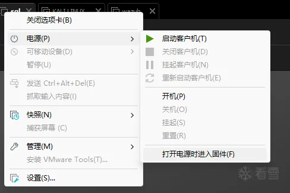

在 boot选项中调整启动顺位 

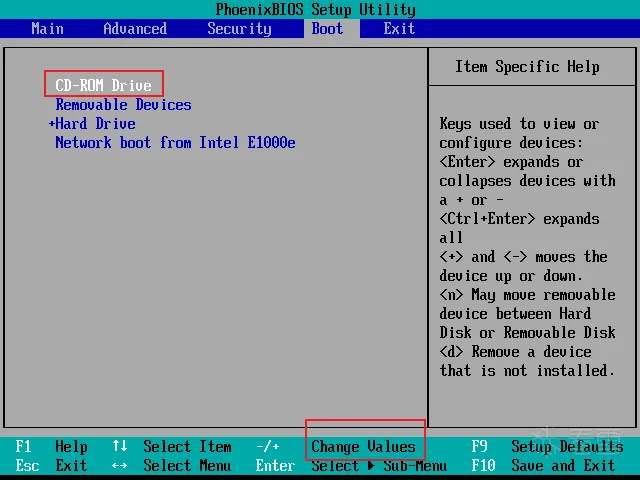

进入后无需登录

+ `Boot (X:)`：这是 WinPE 常见的**内存盘/临时系统盘**，PE 自己运行在这里
+ `DVD 驱动器 (E:)`：挂载的 **HotPE ISO**
+ `本地磁盘 (D:) / 系统保留 (C:)` 等：这是虚拟硬盘里的分区被 PE 挂载后的盘符，能直接浏览目标 Windows 的文件系统

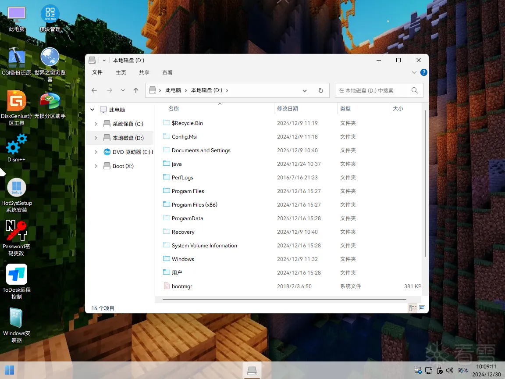

## VMDK修复
**VMDK（Virtual Machine Disk）**是 VMware 虚拟磁盘的文件格式，本质上是“虚拟硬盘”的封装。它通常由两类内容构成：

1. **Descriptor（描述符/元数据）**
    - 往往很小（几 KB），是**可读文本**（以 `# Disk DescriptorFile` 开头）
    - 里面记录了：磁盘创建类型（`createType`）、容量、控制器类型、以及最关键的——**磁盘数据放在哪些 extent 文件里**。
2. **Extent（磁盘数据区）**
    - 这才是真正的“硬盘扇区数据”，通常是 GB 级
    - 可能是一个大文件（如 `*-flat.vmdk`），也可能是**多个分片**（如 `*-s001.vmdk …`），甚至还有快照差分（`*-delta.vmdk`）。

你截图这种 `Ubuntusy-s001.vmdk … Ubuntusy-s031.vmdk`，典型就是 **2GB 分片的 sparse extent**（VMware 常称 `twoGbMaxExtentSparse`）：

+ 每个 `-s###.vmdk` 都是一个独立的稀疏 extent 文件（开头通常有 `KDMV` 标识）。
+ 小的 `Ubuntusy.vmdk` 只是“目录/清单”，告诉 VMware：这些分片按什么顺序、每片多少扇区，共同组成一块磁盘。

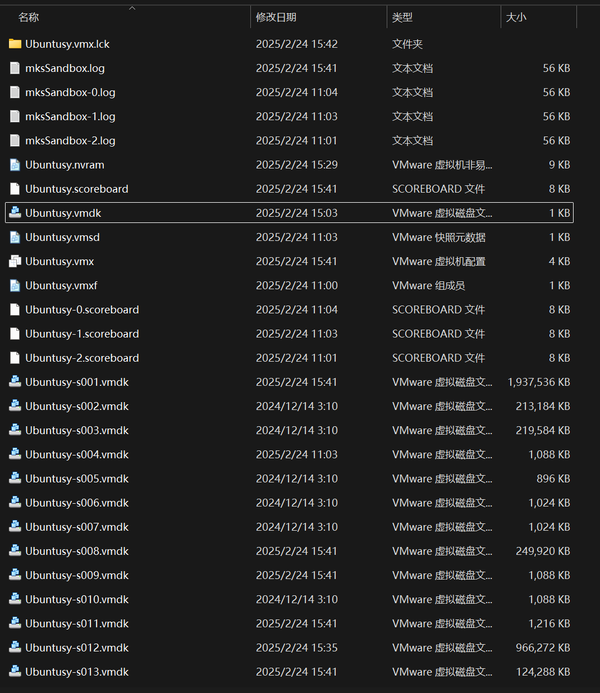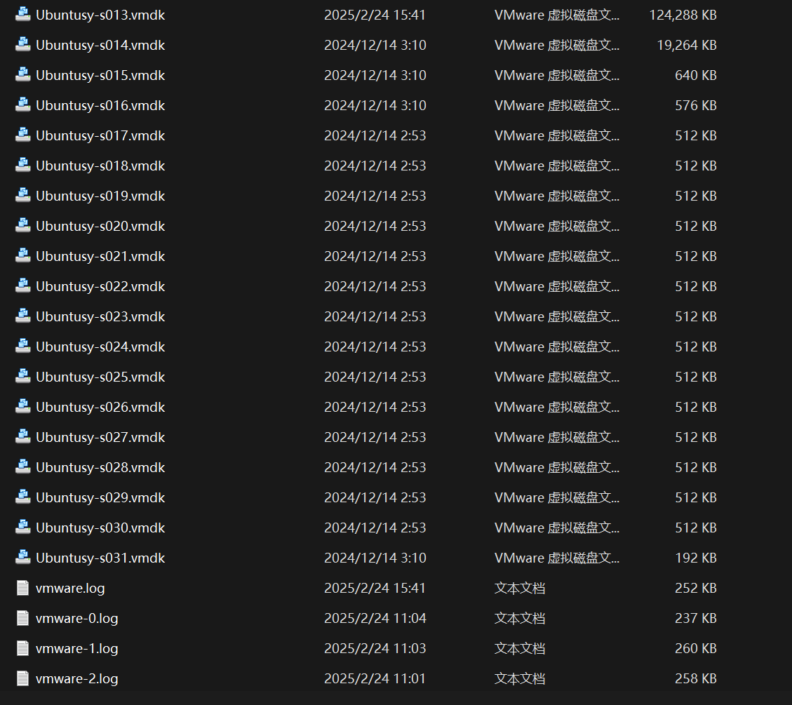

常见情形是：

+ **分片 extent 还在（数据还在）**
+ 但**descriptor 丢了/损坏/被截断**（所以 VMware 不知道怎么把分片拼回一块盘）

“修复”的核心并不是去改动磁盘数据，而是：

+ **从每个 extent 的头部读取它的容量信息（扇区数）**
+ 然后重新生成一个正确的 descriptor，把所有 extent 重新列出来

只要：

+ 分片文件**齐全且顺序完整**（不能缺 s00X）
+ 分片本身头部可读（能读出容量）  
那么重建 descriptor 后，VMware 就能再次把这些分片识别为同一块磁盘。

不能修复的典型情况也很明确：

+ **缺任何一个分片**：磁盘中间出现“洞”，无法拼成一致的线性扇区空间
+ **extent 本身损坏**：头部不对或关键结构损坏
+ **快照链不完整**：descriptor 可能还原了，但 parent/child 链断了，需要按快照链修复


以下是修复脚本， 放到虚拟机磁盘文件同目录运行，会备份损坏vmdk为vmdk.broken

```plain
#!/usr/bin/env python3
# -*- coding: utf-8 -*-

"""
vmdk_repair.py
- Rebuild a missing/corrupted VMware VMDK descriptor file from extents.
- Safe: reads headers/sizes only; never modifies extent data.
- Supports:
  1) twoGbMaxExtentSparse split extents: <base>-s001.vmdk ... <base>-sNNN.vmdk
  2) monolithicFlat (descriptor + <base>-flat.vmdk)
"""

import argparse
import glob
import os
import random
import re
import struct
from typing import List, Tuple, Optional


def is_text_descriptor(path: str) -> bool:
    try:
        with open(path, "rb") as f:
            head = f.read(4096)
        # Descriptor usually starts with "# Disk DescriptorFile"
        return b"# Disk DescriptorFile" in head[:200]
    except Exception:
        return False


def read_sparse_capacity_sectors(vmdk_path: str) -> int:
    """
    Read sparse VMDK header capacity.
    Typical sparse extent starts with b'KDMV' and stores capacity (sectors) at offset 0x0C as uint64 little-endian.
    """
    with open(vmdk_path, "rb") as f:
        hdr = f.read(64)

    if len(hdr) < 20:
        raise ValueError(f"{vmdk_path}: header too small")

    if hdr[:4] != b"KDMV":
        raise ValueError(f"{vmdk_path}: not a sparse extent (missing KDMV magic)")

    cap = struct.unpack("<Q", hdr[0x0C:0x14])[0]
    if cap <= 0:
        raise ValueError(f"{vmdk_path}: invalid capacity sectors: {cap}")
    return cap


def file_size_sectors(flat_path: str) -> int:
    size = os.path.getsize(flat_path)
    if size % 512 != 0:
        # Still generate, but warn by rounding down (VMware expects sector alignment)
        return size // 512
    return size // 512


def guess_adapter_type(vmx_path: Optional[str]) -> str:
    """
    Best-effort guess from .vmx:
      - scsi0.virtualDev = "lsilogic" / "pvscsi" / "buslogic"
      - ide: descriptor usually not critical; VMware often ignores.
    Default: lsilogic
    """
    if not vmx_path or not os.path.exists(vmx_path):
        return "lsilogic"

    try:
        with open(vmx_path, "r", encoding="utf-8", errors="ignore") as f:
            txt = f.read()
    except Exception:
        return "lsilogic"

    m = re.search(r'^\s*scsi0\.virtualDev\s*=\s*"([^"]+)"', txt, re.MULTILINE)
    if not m:
        return "lsilogic"

    v = m.group(1).strip().lower()
    if "pvscsi" in v:
        # VMware descriptor ddb.adapterType sometimes uses "pvscsi"
        return "pvscsi"
    if "buslogic" in v:
        return "buslogic"
    # Treat everything else as lsilogic family
    return "lsilogic"


def build_split_sparse_descriptor(base: str, parts: List[str], vmx_path: Optional[str]) -> str:
    # Ensure sequential parts
    nums = []
    for p in parts:
        mm = re.search(r"-s(\d{3})\.vmdk$", p, re.IGNORECASE)
        if not mm:
            raise ValueError(f"Unexpected part name: {p}")
        nums.append(int(mm.group(1)))
    nums_sorted = sorted(nums)
    expected = list(range(nums_sorted[0], nums_sorted[-1] + 1))
    missing = sorted(set(expected) - set(nums_sorted))
    if missing:
        raise ValueError(f"Missing split extents: {missing} (cannot rebuild a complete disk)")

    # Read capacity of each part
    caps = []
    for p in parts:
        caps.append(read_sparse_capacity_sectors(p))

    cid = f"{random.randint(0, 0xFFFFFFFF):08x}"
    adapter = guess_adapter_type(vmx_path)

    out = []
    out.append("# Disk DescriptorFile")
    out.append("version=1")
    out.append('encoding="UTF-8"')
    out.append(f"CID={cid}")
    out.append("parentCID=ffffffff")
    out.append('createType="twoGbMaxExtentSparse"')
    out.append("")
    out.append("# Extent description")
    for p, s in zip(parts, caps):
        out.append(f'RW {s} SPARSE "{p}"')
    out.append("")
    out.append("# The Disk Data Base")
    out.append(f'ddb.adapterType = "{adapter}"')
    out.append("")
    return "\n".join(out)


def build_flat_descriptor(base: str, flat_path: str, vmx_path: Optional[str]) -> str:
    sectors = file_size_sectors(flat_path)
    cid = f"{random.randint(0, 0xFFFFFFFF):08x}"
    adapter = guess_adapter_type(vmx_path)

    out = []
    out.append("# Disk DescriptorFile")
    out.append("version=1")
    out.append('encoding="UTF-8"')
    out.append(f"CID={cid}")
    out.append("parentCID=ffffffff")
    # For Workstation/Fusion local files, monolithicFlat is typically accepted for descriptor+flat pair
    out.append('createType="monolithicFlat"')
    out.append("")
    out.append("# Extent description")
    out.append(f'RW {sectors} FLAT "{os.path.basename(flat_path)}" 0')
    out.append("")
    out.append("# The Disk Data Base")
    out.append(f'ddb.adapterType = "{adapter}"')
    out.append("")
    return "\n".join(out)


def detect_base_names() -> List[str]:
    """
    Detect candidates:
      - <base>.vmx indicates base
      - or split parts <base>-s001.vmdk indicates base
      - or <base>-flat.vmdk indicates base
    """
    bases = set()

    for vmx in glob.glob("*.vmx"):
        bases.add(os.path.splitext(os.path.basename(vmx))[0])

    for p in glob.glob("*-s[0-9][0-9][0-9].vmdk"):
        m = re.match(r"^(.*)-s\d{3}\.vmdk$", os.path.basename(p), re.IGNORECASE)
        if m:
            bases.add(m.group(1))

    for f in glob.glob("*-flat.vmdk"):
        m = re.match(r"^(.*)-flat\.vmdk$", os.path.basename(f), re.IGNORECASE)
        if m:
            bases.add(m.group(1))

    return sorted(bases)


def main():
    ap = argparse.ArgumentParser(description="Rebuild VMware VMDK descriptor from extents (safe, read-only for extents).")
    ap.add_argument("--base", help="Base name (e.g. Ubuntusy). If omitted, auto-detect.")
    ap.add_argument("--out", help="Output descriptor filename. Default: <base>.vmdk")
    ap.add_argument("--vmx", help="Optional .vmx to infer adapter type. Default: <base>.vmx if exists.")
    ap.add_argument("--force", action="store_true", help="Rebuild even if <base>.vmdk looks like a valid text descriptor.")
    ap.add_argument("--dry-run", action="store_true", help="Only print what would be done; do not write files.")
    args = ap.parse_args()

    base = args.base
    if not base:
        candidates = detect_base_names()
        if not candidates:
            raise SystemExit("Cannot auto-detect base name. Use --base <name>.")
        if len(candidates) > 1:
            raise SystemExit("Multiple base candidates found: " + ", ".join(candidates) + ". Use --base.")
        base = candidates[0]

    descriptor = args.out or f"{base}.vmdk"
    vmx_path = args.vmx or (f"{base}.vmx" if os.path.exists(f"{base}.vmx") else None)

    # Decide mode: split sparse vs flat
    split_parts = sorted(glob.glob(f"{base}-s[0-9][0-9][0-9].vmdk"))
    flat_path = f"{base}-flat.vmdk" if os.path.exists(f"{base}-flat.vmdk") else None

    if os.path.exists(descriptor) and is_text_descriptor(descriptor) and not args.force:
        print(f"[OK] {descriptor} looks like a valid text descriptor. Use --force to rebuild anyway.")
        return

    if split_parts:
        print(f"[INFO] Detected split sparse extents: {len(split_parts)} parts")
        content = build_split_sparse_descriptor(base, [os.path.basename(p) for p in split_parts], vmx_path)
    elif flat_path:
        print(f"[INFO] Detected flat extent: {flat_path}")
        content = build_flat_descriptor(base, flat_path, vmx_path)
    else:
        raise SystemExit("No supported extents found. Expected either <base>-s###.vmdk or <base>-flat.vmdk.")

    # Backup existing descriptor (if any)
    if os.path.exists(descriptor):
        bak = descriptor + ".broken"
        print(f"[INFO] Existing descriptor will be backed up to: {bak}")
        if not args.dry_run:
            os.replace(descriptor, bak)

    print(f"[INFO] Writing new descriptor: {descriptor}")
    if args.dry_run:
        print("----- BEGIN DESCRIPTOR (dry-run) -----")
        print(content)
        print("----- END DESCRIPTOR (dry-run) -----")
        return

    with open(descriptor, "w", encoding="utf-8", newline="\n") as f:
        f.write(content)

    print("[DONE] Descriptor rebuilt.")
    print("Next steps (recommended):")
    print(f'  - VMware: vmware-vdiskmanager -R "{descriptor}"')
    print(f'  - Or convert to a fresh disk: vmware-vdiskmanager -r "{descriptor}" -t 0 "{base}_fixed.vmdk"')


if __name__ == "__main__":
    main()

```

使用方法（在磁盘目录里执行）

+ 自动检测并修复（目录里只有一个 VM 时最方便）：

```plain
python vmdk_repair.py
```

+ 指定 base 名称（推荐，更明确）：

```plain
python vmdk_repair.py --base Ubuntusy
```

+ 只预览不写文件：

```plain
python vmdk_repair.py --base Ubuntusy --dry-run
```

+ 强制重建（即便 `Ubuntusy.vmdk` 看起来像正常 descriptor）：

```plain
python vmdk_repair.py --base Ubuntusy --force
```

## 勒索病毒
根据文件后缀查看病毒家族

## api劫持跳转外部链接
可能的原因：

+ 配置文件的配置有问题
+ 依赖投毒，依赖包经过了改写
+ ruoyi 中可扩展的部分被利用

<br/>tips
说实话，本来我java就不行，还要静态分析jar包太难为我了

看看配置文件没什么问题就可以停止静态分析了

然后直接转动态分析，题目说会跳转到外部链接，那我们就复现部署，然后通过外部链接找跳转函数

服务直接用docker拉，然后具体数据库到官网看复现文章

api启动后访问，用不同ua测试，找外部链接


这里正常应该通过java的调试器查找劫持触发的函数

但我菜，而且没有java调试器捏

所以通过jadx分析该jar包，全局搜索https://www.solarsecurity.cn/ ，即可发现导致跳转的相关方法

<br/>

# 工具
## D 盾 · 应急响应 — WebShell 查杀
## 火绒剑——查找后门进程
# 流量分析
## 判断哥斯拉流量特征
[https://feifeitan.cn/index.php/archives/280/](https://feifeitan.cn/index.php/archives/280/)

[https://blog.csdn.net/sinat_31884905/article/details/132548617](https://blog.csdn.net/sinat_31884905/article/details/132548617)

根据Cookie值最后出现了分号可以判断它是哥斯拉流量

## 工控ctf流量题
题目不多，碰到过几次，一次没做出来

[https://www.freebuf.com/articles/ics-articles/363196.html](https://www.freebuf.com/articles/ics-articles/363196.html)


<br/>tips
常见的工控协议有：Modbus、MMS、MQTT、COTP、IEC104、IEC61850、S7COMM、OMRON等。由于工控技术起步较早但是统一的协议规范制定较晚，所以许多工业设备都有自己的协议  
题目考点主要以工控流量和恶意流量为主，主要考察Wireshark使用和找规律，部分难度较高的题目主要考察协议定义和特征

<br/>

### Modbus
<br/>tips
Modbus协议是工控领域最常见的协议之一，也算是工控CTF中最常见题型

<br/>

1. Modbus/RTU

```plain
从机地址1B+功能码1B+数据字段xB+CRC值2B
最大长度256B，所以数据字段最大长度252B
```

2. Modbus/ASCII

```plain
由Modbus/RTU衍生，采用`0123456789ABCDEF`表示原本的从机地址、功能码、数据字段，并添加开始结束标记，所以长度翻倍
开始标记`:`1B+从机地址2B+功能码2B+数据字段xB+LRC值2B+结束标记`\r\n`2B
最大长度513B，因为数据字段在RTU中是最大252B，所以在ASCII中最大504B
```

3. Modbus/TCP

```plain
不再需要从机地址，改用UnitID；不再需要CRC/LRC，因为TCP自带校验
传输标识符2B+协议标识符2B+长度2B+从机ID 1B+功能码1B+数据字段xB
```

题目中最常见的是Modbus/TCP协议，主要原因是抓包方便

做过几次题，感觉最重要的就是看功能码，找不同的功能码  
Modbus常见功能码：

```plain
1：读线圈
2：读离散输入
3：读保持
4：读输入
5：写单个线圈
6：写单个保持
15：写多个线圈
16：写多个保持
```

**IISC河南省赛2022初赛《HNGK-Modbus协议分析》**

题目要求：分析文件找出flag

1. 首先依次筛选常见功能码，筛选到功能码为3的返回包：可以选择筛选返回包中的来源ip地址，来筛选出response包

```plain
((modbus) && (modbus.func_code == 3)) && (ip.src == 192.168.161.2)
```

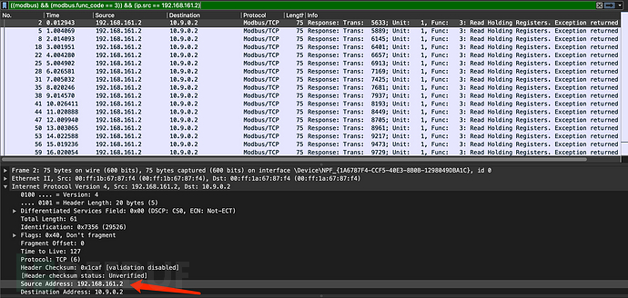

1. 因为功能码显示read，所以判断看返回包，发现有报错的数据包。  
通过筛选byte count字段，筛选出有数据的响应包

```plain
(((modbus) && (modbus.func_code == 3)) && (ip.src == 192.168.161.2)) && (modbus.byte_cnt)
```

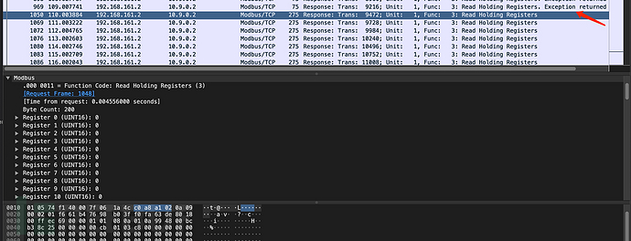

1. 查看响应包数据，发现响应包每条会增加一些字符

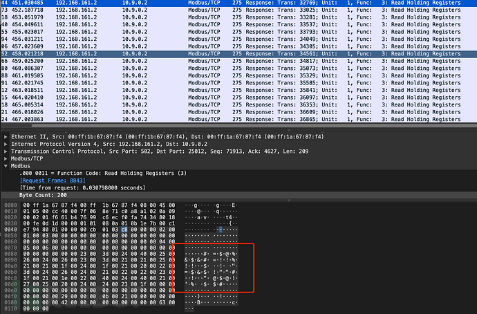

1. 将值复制出来

```plain
#=$@%&$&#=!!%!!$! "=$&$!""#!"@$@!'% $$#
```

但是发现复制的值中间有欠缺，所以复制hex16进制，然后找过字符的开头和结尾进行去除，然后转码

```plain
0023003d0024004000250026002400260023003d00210021002500210021001f0024001f002100200022003d0024002600240021002200220023001f0021001e00220040002400400021002700250020002400240023
```

1. 以下步骤目的是为了将00去除  
第一步：将hex转换

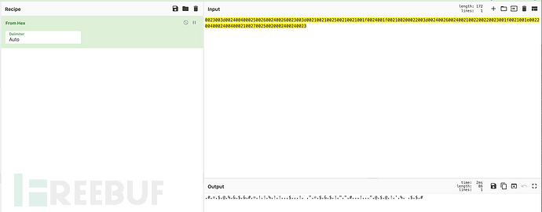  
第二步：将值转换成hex，并设置一行2个bytes  
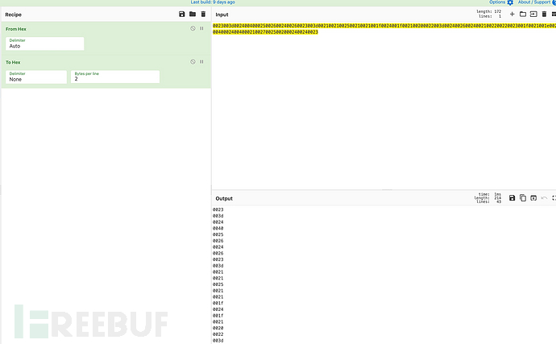  
第三步：使用take bytes将字节取不是00的第二位 并设置为一行2个  
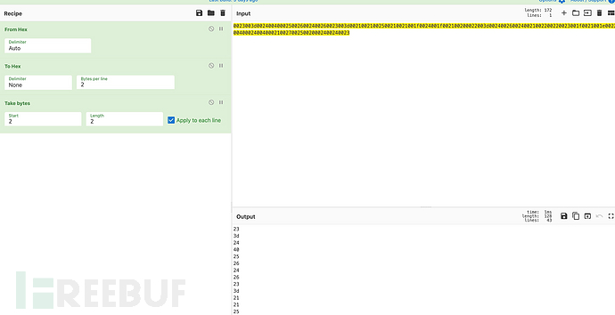  
第四步：然后再转换为hex，得出完整的字符串

```plain
#=$@%&$&#=!!%!!.$.! "=$&$!""#.!."@$@!'% $$#
```

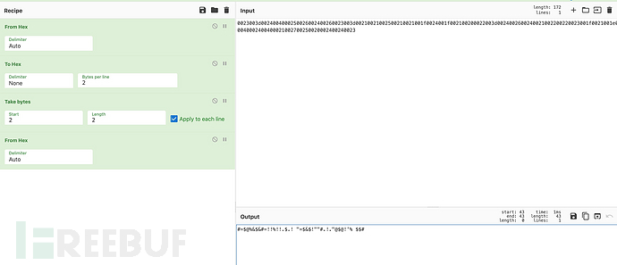  
第五步：将字符串转换为10进制，发现61 64  
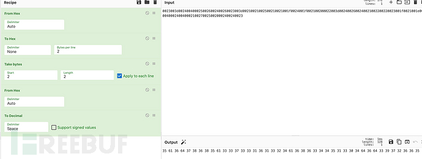  
第六步：转换为16进制  
得到5a6d78685a33733161324a68634451304d6d3972665  
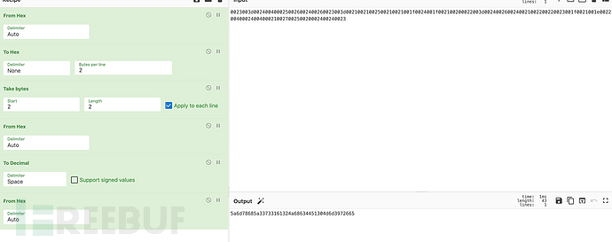  
第七步：得到的5a6d78685a33733161324a68634451304d6d3972665疑似16进制字符串，然后再进行hex解码得到ZmxhZ3s1a2JhcDQ0Mm9rf.  
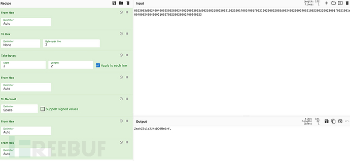  
第八步：base64解码获取flag  
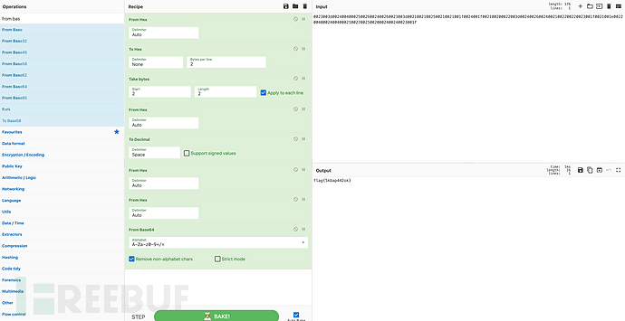

### MMS
MMS主要有2种类型：

1. initiate（可以理解为握手）

```plain
initiate-RequestPDU
initiate-ResponsePDU
```

2. confirmed（可以理解为交互）

```plain
confirmed-RequestPDU
confirmed-ResponsePDU
```

通常情况为:

1. 1轮initiate

```plain
即发送1个initiate-RequestPDU，接收1个initiate-ResponsePDU
```

2. n轮confirmed，直到会话主动关闭或被动断开

```plain
即confirmed-RequestPDU和confirmed-ResponsePDU交替发送和接收
```

交互时的指令称为confirmedService

1. 对象操作

```plain
read (4)
write (5)
getVariableAccessAttributes (6)
getNamedVariableListAttributes (12)
```

2. 文件操作

```plain
fileOpen (72)
fileRead (73)
fileClose (74)
fileDirectory (77)
```

**IISC河南省赛2022复赛《HNGK-MMS》**

题目要求：分析文件找出flag

1. 根据题目名称过滤出MMS数据包，发现前两个包为请求握手，观察第三个包发现read为4  
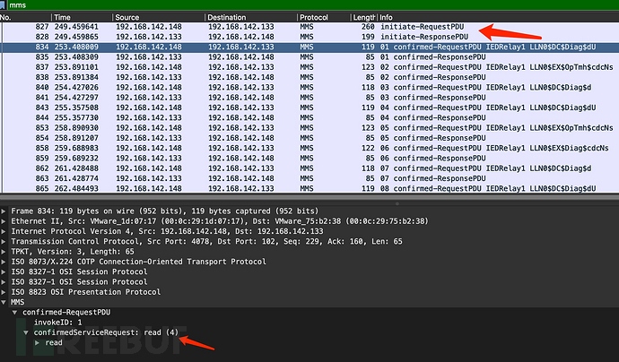
2. 过滤read不是4的包，发现没有。证明全是4

```plain
(mms) && (mms.confirmedServiceRequest != 4)
```

1. 然后再找其他数据段发现itemId数据不一样，仔细观察都是LLN0开头  
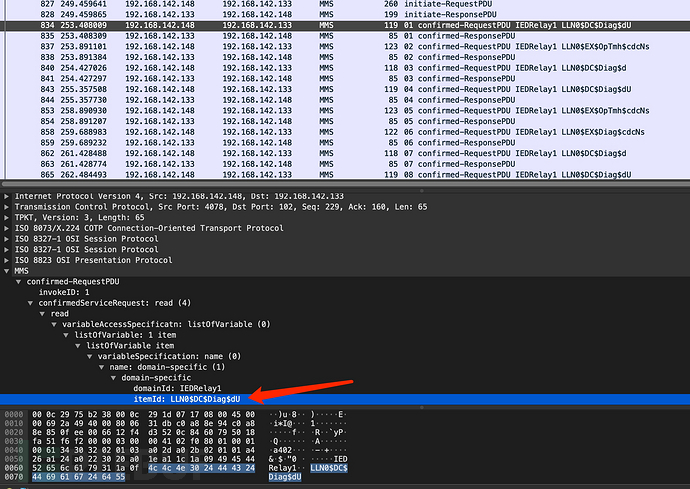
2. 过滤LLN0开头的数据

选中过滤器

```plain
(mms) && mms.itemId contains "LLN0"
```

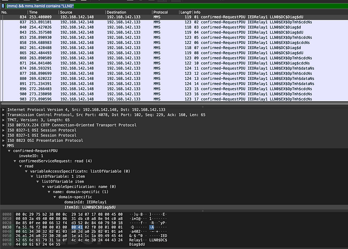

1. 然后过滤一下非FFNO的数据，发现三条数据

```plain
(mms) && mms.itemId &&!(mms.itemId contains "LLN0")
```

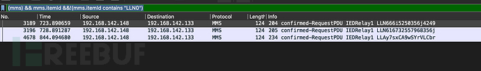

1. 通过观察比较发现数据疑似ascii码，因为ascii码中f为66、l为6c  
itemId: LLN666i5250356j4249  
itemId: LLN616732557968356j  
itemId: LLAy7sxCA9wSYrVLCbr
2. 将字符串中的字母部分转换，构建为666c为flag的fl开头
+ 所以使用正则先将字母提取出来，然后进行减法，让i变为c发现减6变成c
+ 然后使用merge合并，转成hex发现得到flRP5mBIag2Uyh5m  
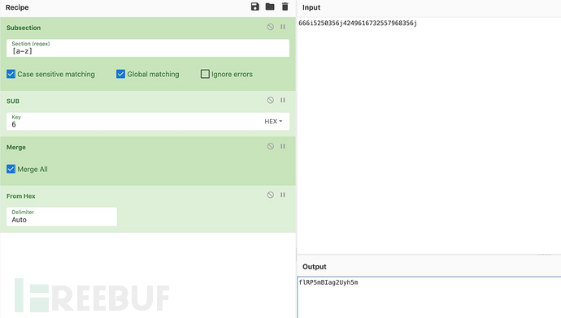
+ 观察发现应该为2个字节换了下一段  
flRP5mBI  
ag2Uyh5m
1. 拼接后flag为：  


### IEC60870
1. 子协议

```plain
IEC 101（任务相关）
IEC 102（电量相关）
IEC 103（保护相关）
IEC 104（101的网络版）
IEC ASDU（基于101/104的应用服务数据单元传输）
```

2. 主要技巧

```plain
筛选`iec60870_asdu`
关注IOA的值
可尝试用type进行分类
```

**IISC河南省赛2022复赛《HNGK-IEC协议分析》**

1. 过滤协议发现有错误的数据包，并且随便点数据包，发现分组不同  
说明建立了很多不同的连接

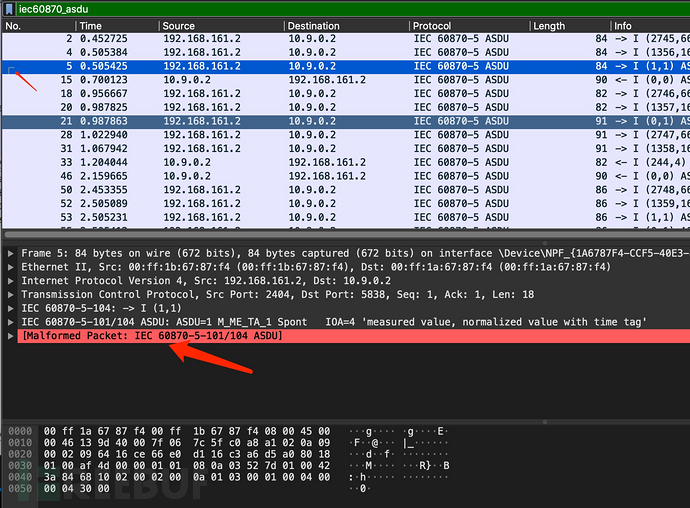

1. 过滤分组为0的数据包，这样得到的为同一个连接的数据包，数据也是连贯的

```plain
iec60870_asdu && tcp.stream == 0
```

1. 然后筛选有IOA Value值的数据
2. 再去筛选TypeId: M_ME_TD_1 (34)发现对应的ioa的值，无规则，并且右下角数据包过多

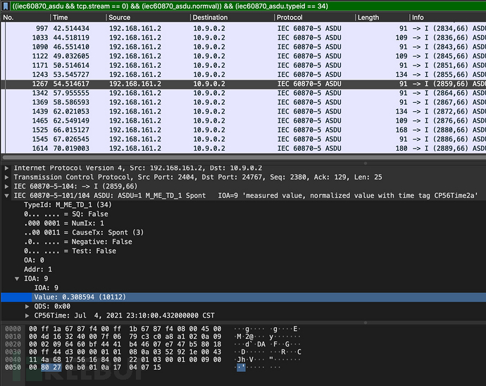

3. 继续筛选除去TypeId: M_ME_TD_1 (34)后的包，发现TypeId: M_ME_TD_1 (9)也有100多数据包，然后除去34和9，之后发现只剩18条数据

```plain
(((iec60870_asdu && tcp.stream == 0) && (iec60870_asdu.normval)) && !(iec60870_asdu.typeid == 34)&& !(iec60870_asdu.typeid == 9))
```

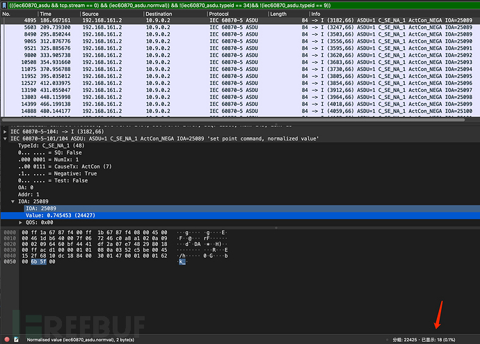

4. 将值提取，base64解码后发现为乱码

Mzhx3ZKtTOTJ0VadnNYdVSnlUUBNQf==  
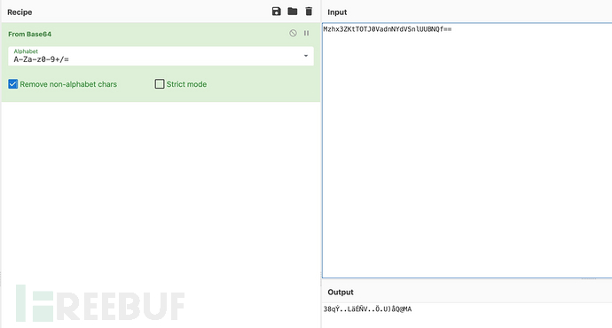

5. 分析发现两个字节组成一个数据，猜测为颠倒数据（两字节一数据有可能为颠倒的）

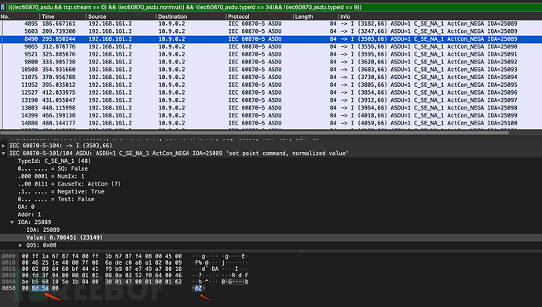

6. 调换位置获取flag

mZhx3ZKtTOTJ0VadnNYdVSnlUUBNQf==  
ZmxhZ3tKOTJTV0daNndYSVlnUUNBfQ==  
flag{J92SWGZ6wXIYgQCA}

### MQTT
主要数据交互的消息类型为PUBLISH

+ 筛选`mqtt.msgtype == 3`

服务端有若干个主题(topic)可供客户端订阅

+ 客户端订阅后可以收到来自服务端关于这个主题的消息(message)
+ 一个主题可以持续产生消息

**ICSC济南站2020《工业物联网智能网关数据分析》**

首先查看协议占比，大致判断为mqtt的题目

1. 筛选mqtt.msgtype == 3的时候有数据

```plain
(mqtt) && (mqtt.msgtype == 3)
```

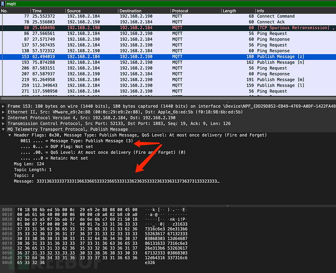

2. 依次尝试复制出明文进行hex转码，发现为无用数据

  
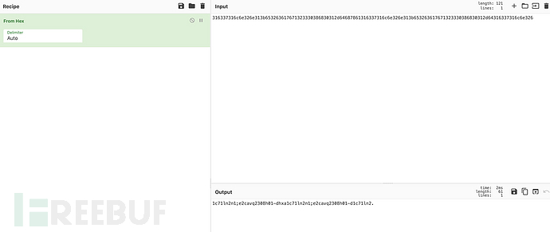

3. 直到发现504B0304的一段数据内容，hex之后为PK的头，504B0304一般为zip文件的头

  
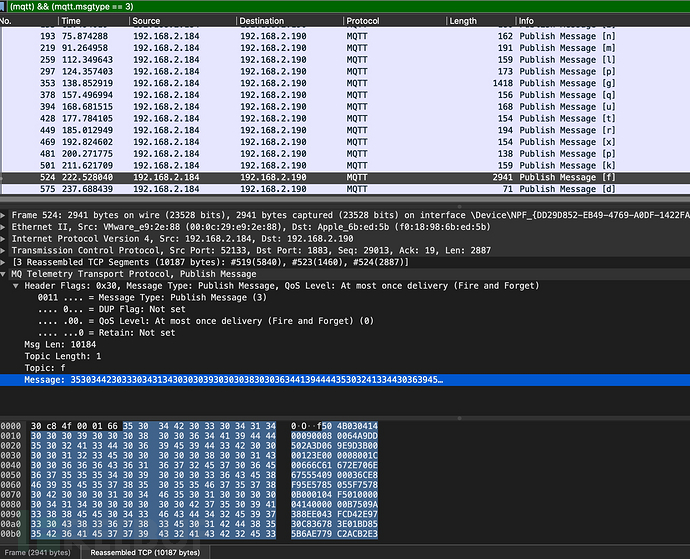

放入010粘粘hex，然后保存为rar，解压发现文件损坏  
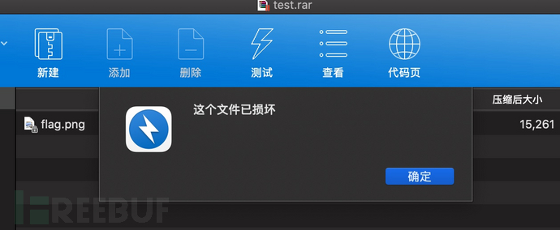

4. 猜测该rar不完整，然后发现该rar的数据是在`f`中的数据包

  
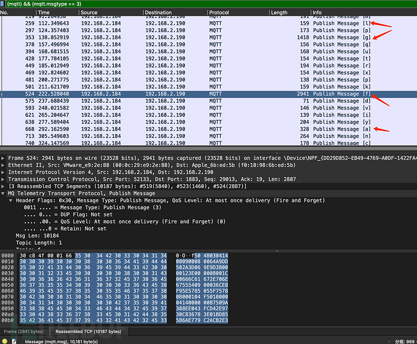

5. 拼凑为flag，依次提取数据包的内容，然后粘贴到010保存为rar，发现需要密码
6. 尝试使用数据包中的字符串当作密码，发现成功解压出flag文件  


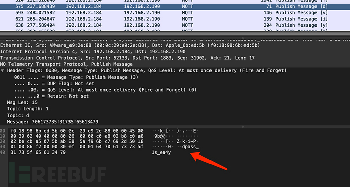

### COTP
+ COTP可以理解为基于TCP的工控TCP
+ COTP主要有五种类型：

```plain
CR Connect Request (0x0e)
CC Connect Confirm (0x0d)
DT Data (0x0f)
UD User Data (0x04)
ED Expedited Data (0x01)
```

+ CR和CC只在建立连接时由双方发送，发起方发送CR，被动方发送CC，后续数据主要走DT
+ 因为协议类似于TCP，较为底层，所以没有其他比较有用的协议字段可供解题

**ICSC济南站2020《COTP》**

题目：找到黑客流量，flag为后90字节的16进制

1. 过滤cotp流量，发现第一个流量包没有请求握手流量，反而直接是数据传输

  
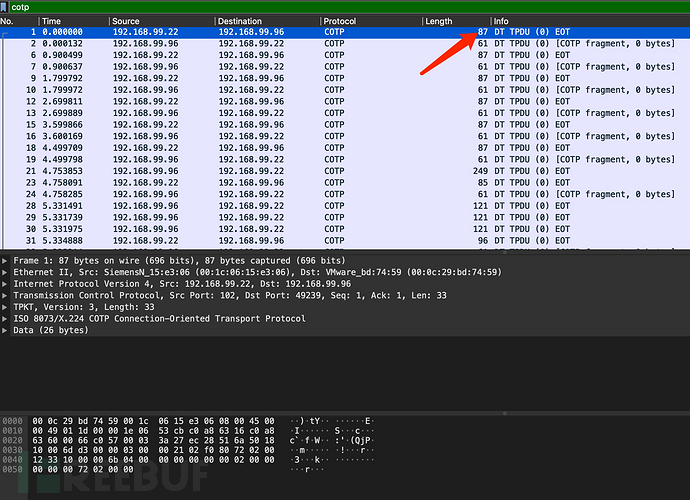

2. 过滤掉分组0，查看其他分组`cotp && tcp.stream != 0`  
发现是一个完整的请求  


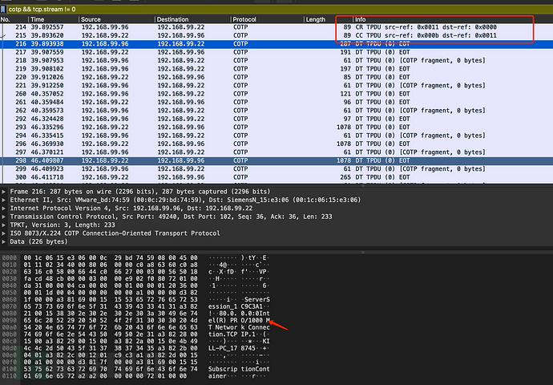

3. 然后尝试提取字节16进制，提交flag。最后发现该数据包为黑客流量  


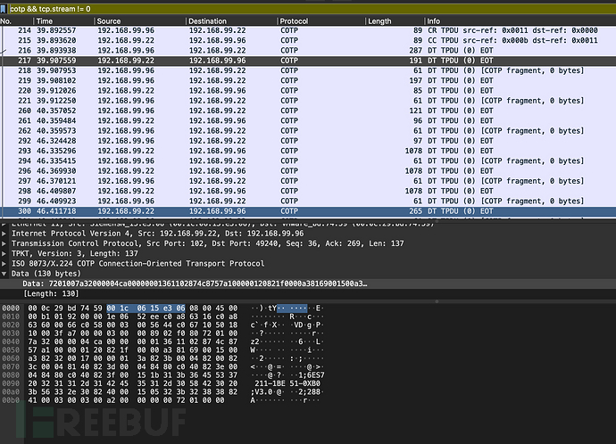

```plain
31312d31424535312d30584230203b56332e308240001505323b32383882410003000300a20000000072010000
```

### S7comm
1. S7基于COTP
2. 主要有3种类型(ROSCTR)
    - Job (1) - Ack_Data (3) / Ack (2)10种功能(Function)
        * Setup communication (0xf0)
        * Read Var (0x04)
        * Write Var (0x05)
        * 下载
            + Request download (0x1a)
            + Download block (0x1b)
            + Download ended (0x1c)
        * 上传
            + Start upload (0x1d)
            + Upload (0x1e)
            + End upload (0x1f)
        * PI-Service (0x28)
    - Userdata (7) 6种功能组(Function group)
        * Mode-transition (0)
        * Programmer commands (1)
        * Block functions (3)
        * CPU functions (4)
        * Security (5)
        * Time functions (7)

依旧是集中在读写

**ICSC湖州站2020《工控协议数据分析》**

题目：通过协议分析获取flag  
1、查看协议占比发现该题考察点为s7comm,然后通过筛选发现read中data没有flag的痕迹  
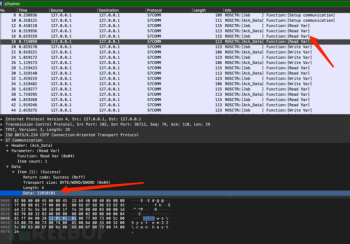  
2、发现在write中data数据为01开头  
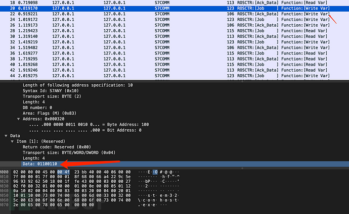  
3、提取hex并转换二进制，发现为f  
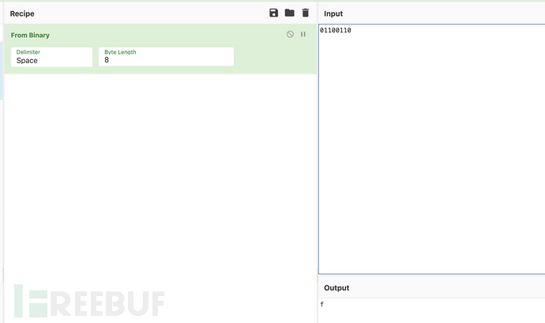  
依次提取write中的data转换为flag

```plain
011001100110110001100001011001110111101101100110011011000110000101100111010111110110100101110011010111110110100001100101011100100110010101111101
```

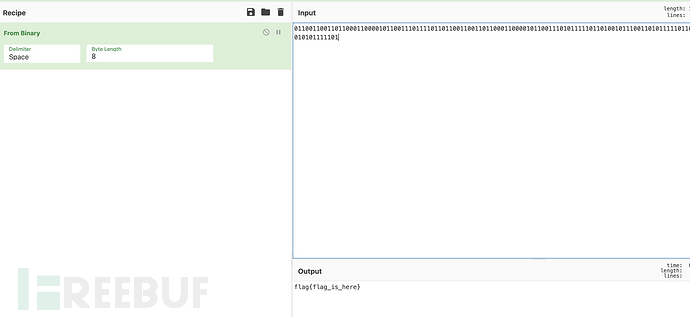  
 

### OMRON FINS
Command CODE比较多，关注点主要在读写，如：

```plain
Memory Area Read (0x0101)
Memory Area Write (0x0102)
Multiple Memory Area Read (0x0104)
Memory Area Transfer (0x0105)
Parameter Area Read (0x0201)
Parameter Area Write (0x0202)
Data Link Table Read (0x0220)
Data Link Table Write (0x0221)
Program Area Read (0x0306)
Program Area Write (0x0307)
```

**ICSC线上2021《Fins协议通讯》**

打开压缩包发现key  
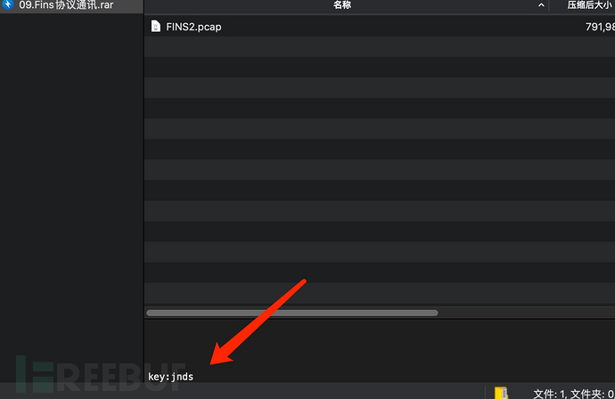  
1、打开数据包过滤command。发现全为read，没有write  
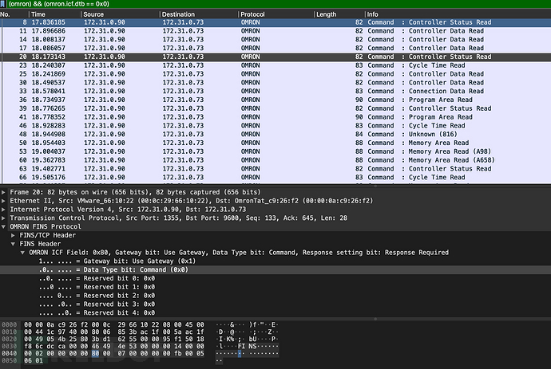  
2、然后再筛选response，发现数据包比较多  
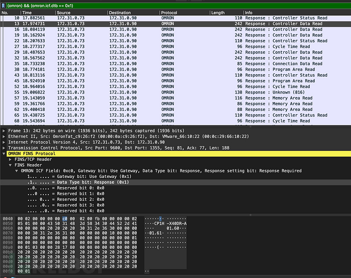  
3、通过长度排序,然后发现了加密字符串数据  
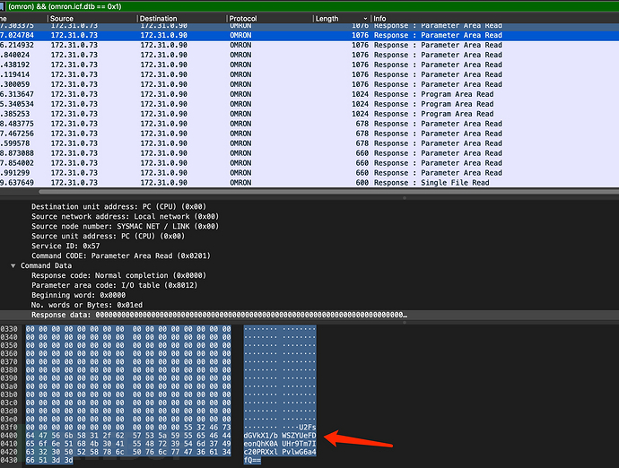  
得到U2FsdGVkX1/bWSZYUeFDeonQhK0AUHr9Tm7Ic20PRXxlPvlwG6a4fQ==  
4、观察发现开头为U2Fsd  
因U2Fsd疑似网站`https://www.sojson.com`的特征，并且压缩包里存在key:jnds  
因此使用aes算法解密，发现失败，尝试tripledes解密成功，获取flag   
 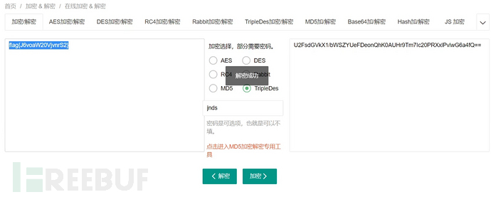

### 特殊协议
基于各类数据传输协议的数据传输功能，实现的数据传输都可以称为隧道。  
如：基于TCP的隧道、基于UDP的隧道、基于ICMP的隧道。

**CISC兰州站2021《DNS》**

1、通过大致翻阅，发现查询了奇怪的域名  
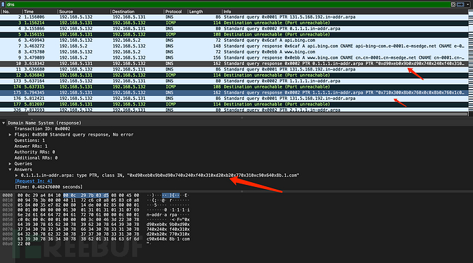  
2、筛选出所有的流量

```plain
(dns) && (dns.resp.name contains ".in-addr.arpa")
```

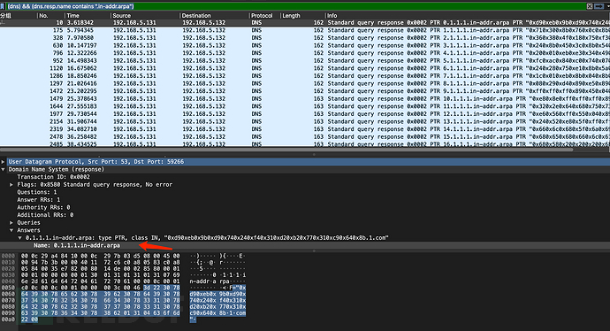3、全选该数据，使用正则提取  
然后0x去掉，得到16进制  
然后转hex发现有flag痕迹  
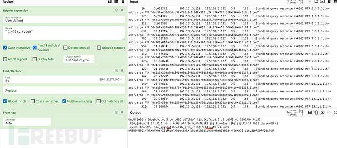  
然后猜测为shellcod，解码发现需改为32位，并且出现多处push  
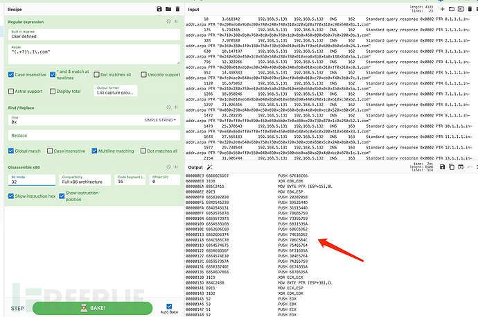  
将push数据提取出来  
from hex之后为  
X9RTM1QTMxkWYs9WYk1SZklmbtcmbplXLuFWdo1iZ0NWdz5WYnt3ZhxmZ  
将数据进行反转进行base64转码得到flag：  
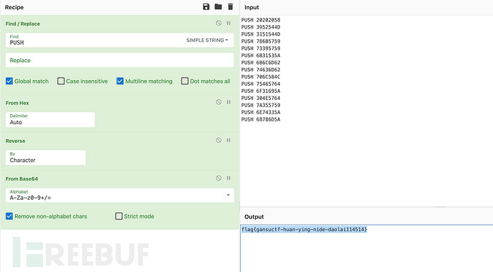

### 罕见协议
某行业特有的一些通信协议，比较少见。

**ICSC济南站2020《司机的身份》**

题目要求：找到卡车司机的身份信息  
下载文件附件t808_info，为交通运输行业标准和流量包  
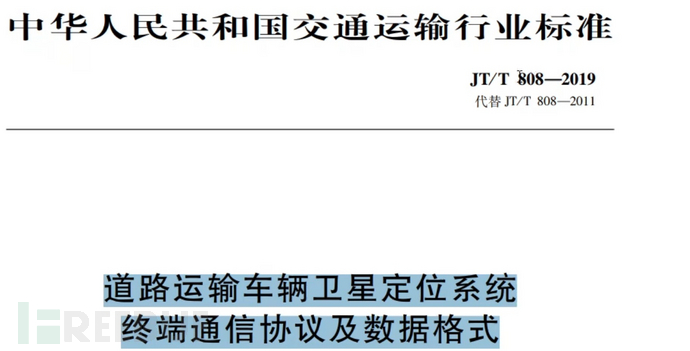  
导入流量包发现wireshark筛选不到该t808协议，但t808基于tcp  
使用wireshark筛选带有数据的tcp数据包  
规则使用长度比0大`(tcp.len > 0)`  
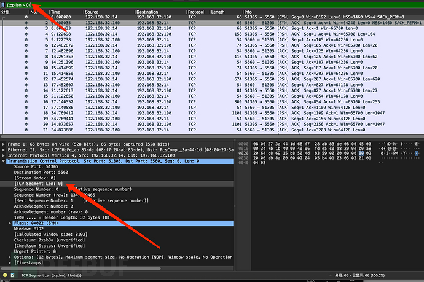  
通过查找数据包内容0702发现数据包  
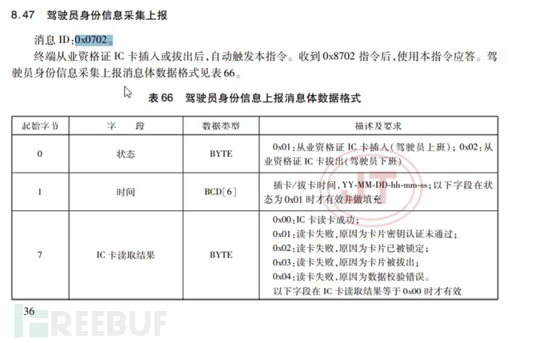  
发现驾驶员身份信息采集上报的消息ID为0702，找到该数据包  
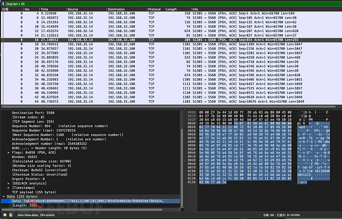  
提取hex

```plain
7e070240eb010000000001777064121100720120062709485600b48af896b850e7964d543d8af89640646996b850e77f3d85a9985876a4802876a4773e52ab963f621176a46167963f4ea676a4621154c6515c964d56a47957610d76a48fe695cd773e76a496404ea6805e5ba354a48fe652ab85a956c9610d805e980876a4585e8fe676a48ae64ea652ab4ea676a495cd985876a454a44fee95cd85a956a45ba376a4621183e983e976a48fe6805e8ae65a464ea6805e76a4963f85a96240985859827a7a5982598256d176a456d131313031303131393939303530353132313500000cb9e3b6abcaa1bdbbcda8ccfc20300505131182198502039877a67e
```

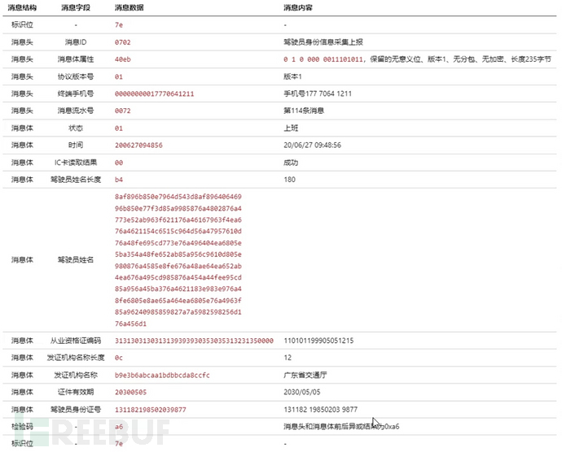  
提取出姓名的16进制  
然后from hex发现乱码。使用magic功能尝试发现得到了类似与佛论禅的编码，  
因magic显示不全，所以使用具体的utf-168e进行解码  
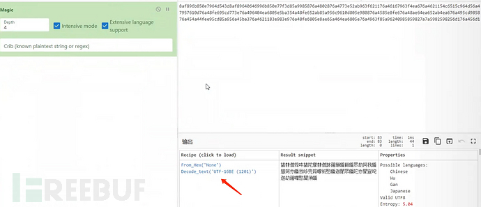  
  
然后通过base64解码，发现全是大写的。再使用base32得到flag  
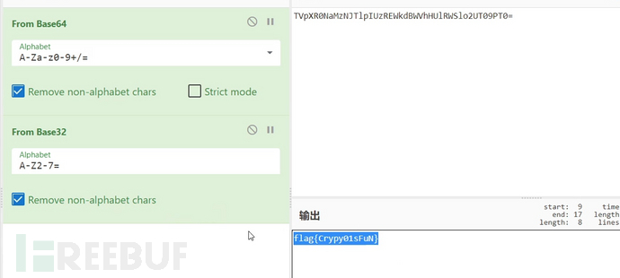

# windows日志

在filescan文件中可以找到Windows日志文件Security.evtx，注意大写

`security.evtx` 是 Windows 操作系统中的一个事件日志文件，主要记录与系统安全相关的事件信息。它是 Windows 日志文件的一部分，用于存储关于用户登录、账户管理、安全审计、系统访问控制等事件的数据。

攻击者利用跳板rdp登录受害机，那么windows日志肯定会有相关记录

## 常用日志路径及事件ID

```
应用程序和服务日志
└─ Microsoft
   └─ Windows
      └─ Windows Defender Firewall with Advanced Security
         ├─ Firewall          # 常规防火墙事件（默认启用）
         ├─ FirewallVerbose  # 详细日志（需手动启用）
         └─ ConnectionSecurity # IPsec/连接安全规则事件
      └─ Windows Defender
         └─ Operational  # 核心操作日志（扫描、检测、处理、更新）
```
防火墙相关
- **5156**：允许连接（ALLOW）
- **5157**：阻止连接（DROP）
核心操作相关
- **1000（扫描开始）
- **1001（扫描完成）
- **1116（检测到威胁）
- **1117（威胁处理）
- **2010（病毒库更新）
# 内存取证
### PID（Process ID）
+ 定义：PID 是操作系统分配给每个运行中进程的唯一标识符。每个进程在系统中都有一个唯一的 PID，用于标识进程。
+ 作用：PID 用于区分不同的进程，是系统内核跟踪和管理进程的重要方式。每当一个新的进程被创建时，操作系统会为其分配一个唯一的 PID。
+ 示例：如果你通过命令（如 `ps` 或 `top`）查看进程列表，你会看到每个进程对应的 PID。比如，PID 为 1234 的进程可能是一个正在运行的程序。

### PPID（Parent Process ID）
+ 定义：PPID 是一个进程的父进程的 PID。换句话说，PPID 指的是启动当前进程的进程的标识符。每个进程（除了初始化进程）都有一个父进程。
+ 作用：PPID 显示了当前进程与其父进程的关系。操作系统使用 PPID 来管理进程之间的层级关系，当一个进程退出时，它的子进程可能会被重新分配给另一个父进程（通常是 `init` 进程）。
+ 示例：假设进程 PID 为 1234 的进程是由 PID 为 5678 的进程启动的，那么进程 1234 的 PPID 就是 5678。

### windows
#### 进程导出

```plain
黑客创建隐藏账户的密码是多少？
```

这个要找到蚁剑的记录

直接导出蚁剑进程，然后用小工具里的字符串搜索查看

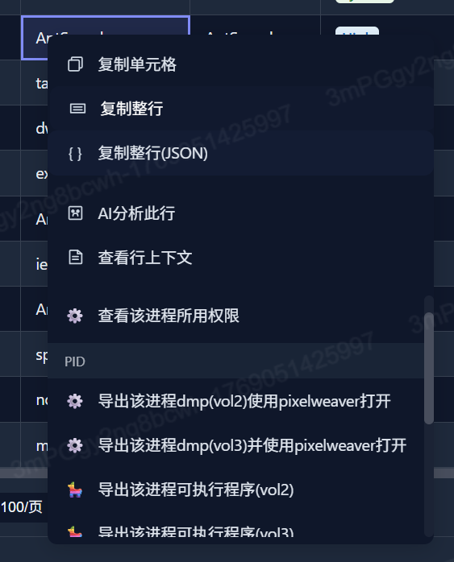

一般来说创建隐藏用户的命令需要`net user`


对其进行检索，找到详细命令


因此密码为`solar2025`
#### 常用命令

### linux

> [!NOTE] Tips
> Linux内存和Windows内存差别极大，最好使用vol3来取证，还需要准备对应内核的符号表的流程等

#### 确定linux内核
```
python vol.py -f linux.lime banners.Banners
```


```
Linux version 6.8.0-49-generic
```
#### 准备和内核完全匹配的Linux symbols(重点)
Volatility 3 分析 Linux 内存，不像 Windows 那样很多东西自动给你喂好
它需要知道：

- 内核结构体长什么样
- 偏移是多少
- 符号地址在哪里

这些信息要靠 **symbol table**

而 symbol table 通常是拿这两个东西用 `dwarf2json` 生成的：

- `System.map-6.8.0-49-generic`
- `vmlinux-6.8.0-49-generic`

其中最关键的是那个 **带调试信息的 `vmlinux`**

因此这里从 Ubuntu 的 debug symbol 仓库，下载 6.8.0-49-generic 这个内核对应的调试包
```
wget -c --content-disposition http://ddebs.ubuntu.com/pool/main/l/linux/linux-image-unsigned-6.8.0-49-generic-dbgsym_6.8.0-49.49_amd64.ddeb
```
这个 `.ddeb` 文件本质上是 Ubuntu 的 **调试符号包**，里面通常就有需要的
```
/usr/lib/debug/boot/vmlinux-6.8.0-49-generic
```
然后起docker创建一个和内核版本相同的环境用于处理调试包
```
Ubuntu 24.04 默认主线 GA 内核就是 6.8 系列
docker run -it --rm -v $PWD:/volatility ubuntu:24.04 /bin/bash
```
上面的命令会直接进入docker的/bin/bash
并且将当前目录挂载到容器的/volatility

- 宿主机当前目录里的文件
- 在容器里会出现在 `/volatility`

这样你在容器里生成的文件，宿主机也能看到
当前目录最好有dwarf2json
不然还得在docker里装
```
进入挂载目录
cd /volatility

解压 `.ddeb`
mkdir extracted
dpkg-deb -x linux-image-unsigned-6.8.0-49-generic-dbgsym_6.8.0-49.49_amd64.ddeb extracted

在类似目录中找到
/volatility/extracted/usr/lib/debug/boot/vmlinux-6.8.0-49-generic

当前目录没有dwarf2json的要先下载
wget -O dwarf2json https://github.com/volatilityfoundation/dwarf2json/releases/latest/download/dwarf2json-linux-amd64
chmod +x dwarf2json

然后用dwarf2json
./dwarf2json linux --elf /volatility/extracted/usr/lib/debug/boot/vmlinux-6.8.0-49-generic > linux-image-6.8.0-49-generic.json

只要你的调试版 `vmlinux` 里符号和 DWARF 都完整，单独用它就能产出可用的 symbol table
不一定需要system.map

最后exit退出docker
```
最后将这个json导入vol3
```
cp linux-image-6.8.0-49-generic.json volatility3/symbols/linux
这里的完整路径是~/volatility3/volatility3/symbols/linux
```
检验是否成功导入
```
python3 vol.py isfinfo | grep -i '6.8.0-49'
```


#### 常用命令分析
```
进程
python3 vol.py -f linux.lime linux.pslist
python3 vol.py -f linux.lime linux.pstree


启动命令 具体服务
python3 vol.py -f linux.lime linux.psaux | grep ""

命令
python3 vol.py -f linux.lime linux.bash

网络
python3 vol.py -f linux.lime linux.sockstat

进程打开的文件
python3 vol.py -f linux.lime linux.lsof.Lsof | grep ""
缓存中的文件（含已删除文件）
python3 vol.py -f linux.lime linux.pagecache.Files | grep ""
```
#### 攻击者进行权限维持可疑的服务路径

在Linux权限维持中，攻击者常将恶意二进制文件注册为系统服务

直接列出所有在内存文件缓存中记录的服务文件
```
python3 vol.py -f ubuntu_24_04_6_8_0.lime linux.pagecache.Files | grep "/etc/systemd/system/"
```
# 逆向
### vs生成事件
<br/>tips
**生成事件（Pre-Build / Pre-Link / Post-Build）是在“构建阶段”由 Visual Studio / MSBuild 调用 **`**cmd.exe**`** 去执行的外部命令**，它发生在你点击“生成/编译”时，而不是程序运行时  

<br/>

只会在Visual Studio的项目里出现，正常exe和elf是没有生成事件的

查看生成事件的具体操作如下

1. 打开解决方案的属性

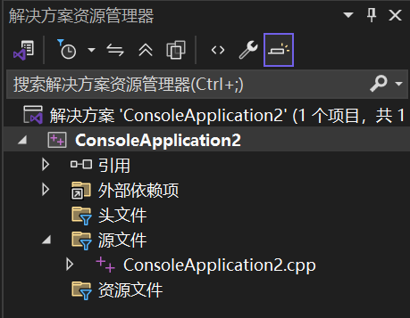

2. 查看生成事件

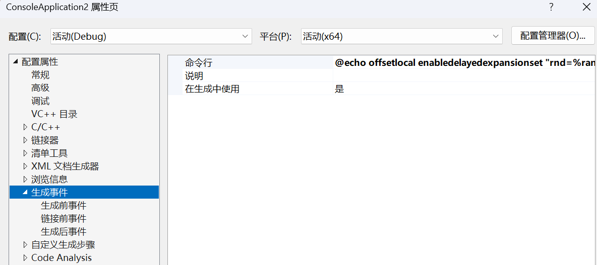

3. 选择正确的配置和平台

配置通常选`活动(Debug)`，平台看是32位还是64位

# 磁盘文件系统
## 虚拟机一些常见后缀名的含义

```
VMDK  Virtual Machine Disk  虚拟硬盘
VMX  虚拟机配置文件
OVA  Open Virtual Appliance  打包好的整台虚拟机
```

## 文件最后被修改的时间（Modified Time和Changed Time）

**各平台/工具里“修改时间/Date modified/mtime”一般默认指 内容修改时间（Modified/mtime）**
### Windows
在 **NTFS** **(New Technology File System)**上，一个文件至少有 4 个核心时间戳（取证圈常写作 **MACB**）：

+ **Modified (M)**：文件内容最后一次被写入的时间
    - 对应：`LastWriteTime`（很多工具也叫 _mtime_）
    - 典型触发：编辑/追加/截断文件内容、应用写入数据流等
+ **Accessed (A)**：文件最后一次被访问（读取/打开）的时间
    - 对应：`LastAccessTime`（_atime_）
    - 注意：Windows 可能关闭/延迟更新它（后面解释）
+ **Created (B)**：文件在该卷上“出生”的时间
    - 对应：`CreationTime`（_btime/birth time_）
+ **Changed (C)**：**文件元数据**最后一次变化的时间（不是内容）
    - 对应：`MFT Entry Modified Time` / `ChangedTime`
    - 在类 Unix 语境里非常像 `ctime`（inode change time）
    - 典型触发：改名、移动、改 ACL/权限、改属性（只读/隐藏）、修改任一时间戳本身、更新 LastAccessTime 等


+ **Modified**：看“内容是否变了”
+ **Changed**：看“这份文件的记录/属性是否变了”（哪怕内容没变）

也因此二者可以完全独立：  
**只改权限/只改文件名** → Changed 变，Modified 不变；  
**改内容** → Modified 通常会变，同时 Changed 也往往会变


注意！！！

+ 资源管理器里的 **“修改时间/Date modified”**：基本就是 **Modified (LastWriteTime)**
+ 资源管理器默认**不显示** NTFS 的 **Changed（MFT Entry Modified）**
+ “访问时间/Date accessed”是否更新，取决于系统策略（可能关闭或延迟）


** 使用Autopsy能看到Changed Time，火眼里看不到 **

### Linux / Unix  
+ `mtime`：内容修改时间（windows的 **Modified**）
+ `ctime`：inode 元数据变化时间（windows对应的 **Changed**）
+ `atime`：访问时间
+ `btime`/birth：创建时间（取决于文件系统与内核支持）

### macOS
+ Finder 的“修改时间”通常等同于 `mtime`
+ “上次打开”很多情况下不是严格的文件系统 atime（可能来自系统元数据），取证时要谨慎使用

### 典型案例
```plain
Modified：2022-01-06 23:57:35
Accessed：2025-04-21 23:39:26
Changed：2025-04-21 23:39:28（比 Accessed 晚 2 秒）
```

这组数据最常见、最合理的解释是：

1. **文件内容最后一次真正被改是在 2022**（所以 Modified 停在 2022）
2. **2025-04-21 这天有人/系统读取或触碰了它** → Accessed 更新到 2025
3. **由于更新了 Accessed（或者其他元数据）**，导致 **MFT 记录也被改写** → Changed 跟着更新到 2025，并且通常会略晚于 Accessed（你这里正好差 2 秒，非常符合这种链式更新）

换句话说：  
**2025 年发生的是“访问/元数据变化”，不是“内容变化”**  
所以 Modified 仍然停留在 2022 并不矛盾，反而很“取证正常”

# 工具
## windows日志查看器：FullEventLogView